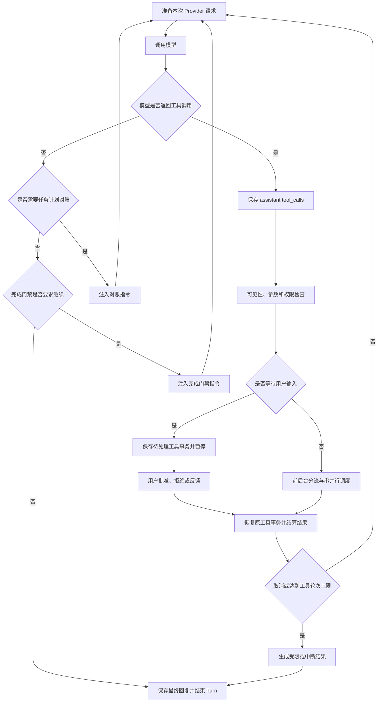
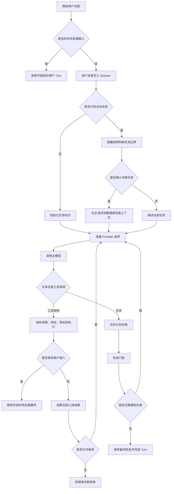
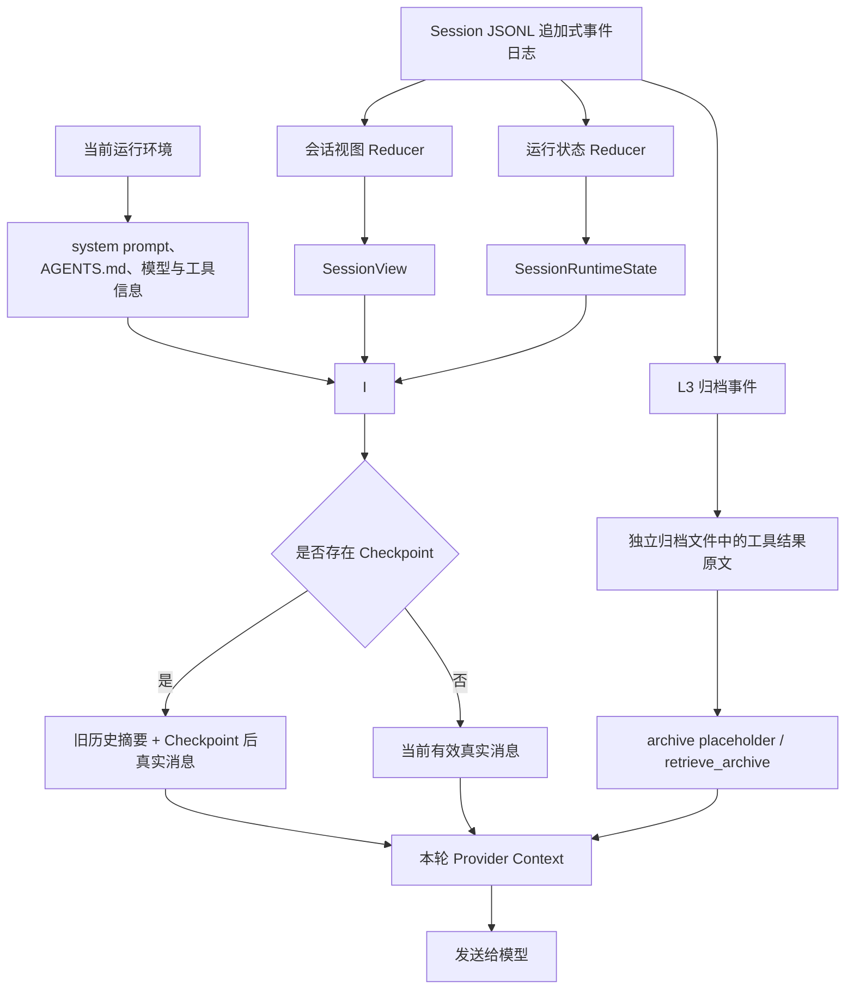
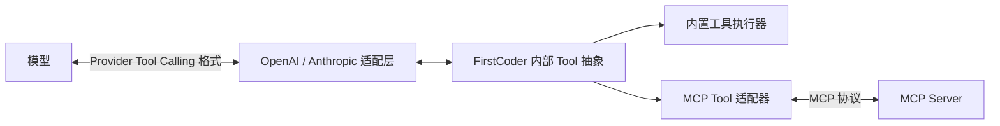

# Coding Agent面试题整理

# 一、适用于FirstCoder的问题

## 1. 项目介绍

### 1.1 请用一分钟介绍FirstCoder

面试表达：
> 我做了一个类似 Claude Code 和 Codex 的 Coding Agent，主要帮助开发者通过自然语言完成代码理解、文件修改、测试和命令执行。它不是简单地把问题转发给大模型，而是把模型、开发工具和本地项目连接成一套完整的执行流程：模型负责分析任务并提出操作，程序负责校验参数、检查权限、执行工具和返回结果。在启用写前审查且没有使用 bypass 模式时，文件修改还会先展示变更，再由用户确认。针对长时间任务，项目会用追加式事件记录会话事实，并通过上下文压缩控制模型输入长度；程序中断后，可以根据这些持久化记录恢复会话状态、修补未闭合的工具事务。此外，它还支持多模型、流式交互和任务规划。这个项目重点解决的是 Coding Agent 在真实开发场景中的安全性、连续性和可恢复性问题。

#### 可能的追问

1. FirstCoder 完成一次开发任务的整体流程是什么？

   答：我会用“先看清任务，再执行，再拿结果校正判断”来介绍。用户消息先进入 Session，运行时确认本轮任务边界，再把项目规则、有效历史和工具定义组装成模型请求。比如修复一个报错，模型先搜索报错字符串、读取相关实现和测试，再提出补丁和测试命令；程序校验这些调用并执行权限策略，把真实结果写回会话，下一轮模型据此调整。模型说完成时，还可能触发计划对账和完成门禁。这里一个开发任务可以跨多个用户 Turn，一个 Turn 又可以调用模型多次，不能把它理解成一次问答就必然做完。

2. 为什么 Coding Agent 不能只依赖大模型直接生成代码？

   答：因为生成一段看起来合理的代码，和让真实仓库完成一个修改，是两回事。模型不知道磁盘上最新的文件、项目依赖是否安装、测试是否通过，也不能仅凭语言承诺约束命令的实际副作用。FirstCoder 给模型提供读取、搜索、修改和执行工具，模型负责提出动作，宿主负责把动作变成可校验的调用，再用真实结果更新上下文。这样失败的测试能成为下一步修复的依据，权限拒绝也能阻止操作。但运行时不能替模型证明业务逻辑一定正确，最终还需要测试和人工判断覆盖业务要求。

3. 项目如何控制文件修改和命令执行带来的风险？

   答：我会分成模型入口、执行入口和用户确认三个层次说。模型请求里只暴露当前可用的工具，真正调用时还会重新检查工具和参数；文件、Shell 等动作经过权限策略，得到允许、拒绝或等待确认的结果。支持预览的文件修改还可以启用写前审查，先计算变更、再确认，执行前检查预览是否过期。这里有两个边界：bypass 会改变审批行为，Shell 也不等于可预览的文件补丁；项目里的路径和权限控制不能直接说成容器级或操作系统级的完全隔离。部署高风险任务时，我会把外部沙箱作为额外方案评估。

4. 程序意外退出后，为什么还能恢复之前的任务？

   答：因为重要事实保存在追加式 Session 事件日志里，不只存在于当前 Python 对象中。恢复时重放日志，重建消息、任务计划、Checkpoint 和可恢复的控制状态，然后再投影下一次模型输入。如果日志里有工具调用却没有终态结果，程序会补一个“中断、执行结果未知”的结果；如果有合法的待审批事务，则保留它等待用户处理。这样恢复的是会话的上下文和控制关系，并不是把进程内线程原地复活。尤其是命令已经产生副作用但结果没落盘的情况，必须先检查现场，不能因为日志缺结果就自动重跑。

5. 长会话为什么需要上下文压缩，压缩后如何避免丢失关键信息？

   答：开发任务的上下文增长很快，一次搜索、源码读取或测试日志就可能增加大量内容，而模型窗口和每次调用的预算有限。FirstCoder 把完整事实与本轮可见上下文分开，根据压力采用旧任务裁剪、工具结果缩减、归档和语义摘要。我的理解是先减少重复和低价值内容，再用 Checkpoint 接住旧历史，把后续真实消息保留下来；工具调用和结果还要保持合法配对。归档内容可通过 archive_id 再读，源码也可以重新获取，但摘要仍可能遗漏信息，所以这里的保证是有原始事实和补读通道，不是无损压缩。要判断压缩好不好，还应观察任务继续执行是否需要频繁重复探索。

6. 多模型支持给项目带来了哪些设计挑战？

   答：主要难点是各家协议看起来相似，但边界行为不同。工具调用的字段、流式参数分片、工具结果格式、结束原因、错误类型以及上下文预算都可能不同。FirstCoder 让上层围绕统一请求、响应和工具调用对象工作，由 Provider 层转换具体协议，并把错误归一化交给重试或压缩逻辑处理。另一方面，统一接口不代表所有模型功能完全一样，所以还要保留能力信息和模型配置；不支持某个功能时应该明确降级或拒绝配置，不能偷偷假装支持。测试应该覆盖正常返回之外的空内容、流中断和工具参数分片等情况。

7. 你认为 FirstCoder 当前最大的不足是什么？

   答：如果从工程可信度选一个重点，我会选“复杂任务效果还需要更系统的证据”。源码能证明它有权限、恢复、压缩和评测入口，但不能只根据模块齐全就说它在长任务上稳定，或者比成熟产品更好。比如会话恢复仍有外部副作用未知的窗口，后台状态也不能直接等同于跨进程可恢复任务；上下文摘要的损失还需要专门评测。我会优先把失败轨迹、任务成功、调用成本和异常恢复统一到可复现的评测里，找出最频繁的失败原因，再决定补长期记忆还是调整控制流。这是改进判断，不是已经测出的排名结论。

### 1.2 请用三分钟介绍FirstCoder

面试表达：
> 我做了一个类似 Claude Code 和 Codex 的 Coding Agent。这个项目的目标，是让开发者直接在终端里通过自然语言完成代码阅读、问题定位、文件修改、测试验证和命令执行，把原来需要人工来回切换工具的开发流程串联起来。
> 
> 从业务流程上看，用户先描述一个开发任务，比如修复 Bug 或增加功能。系统会结合当前项目、历史会话和可用工具，把需求交给模型分析。模型不会直接操作电脑，而是提出下一步动作，例如读取文件、搜索代码、修改内容或者运行测试。系统会对这些动作进行参数校验、权限判断和路径限制，通过后才真正执行，再把执行结果反馈给模型。模型根据结果继续判断，直到任务完成。所以它本质上是一个“模型负责决策、程序负责安全执行”的循环。
> 
> 这个项目重点解决了三个实际问题。
> 
> 第一个是安全性。Coding Agent 能修改文件、执行命令，能力越强，误操作风险也越大。FirstCoder 把安全控制放在模型之外，通过权限策略判断操作是直接允许、需要确认还是拒绝。在启用写前审查且没有使用 bypass 模式时，支持预览的文件修改工具会在执行前展示真实变更。如果用户确认后文件又被其他程序修改，原来的预览就会失效，避免用户看到的是一个版本，实际执行的却是另一个版本。
> 
> 第二个是任务连续性。真实开发任务可能持续很长时间，也可能因为程序退出、网络异常或用户中断而暂停。FirstCoder 会记录用户消息、模型回复、工具调用、执行结果、与会话相关的权限事件和任务计划。重新打开会话后，系统可以根据这些持久化事实重建会话视图和可恢复的运行状态。对于已经记录了调用但没有终态结果的工具事务，恢复流程会补上一条中断结果，避免模型把它误认为成功。不过，这解决的是会话协议和状态一致性，不等同于对所有外部副作用提供严格的只执行一次保证。
> 
> 第三个是长上下文管理。开发过程中会产生大量源码、搜索结果、测试日志和代码差异，如果全部反复发送给模型，既容易超过上下文窗口，也会增加成本并干扰判断。FirstCoder 会保留完整的会话事实，但根据固定的压缩策略和消息结构，只把当前请求需要的内容投影给模型。旧内容可以被裁剪，较大的工具结果可以压缩或归档，压力更大时再生成 Checkpoint 摘要。这样既能控制输入长度，又能保留审计和恢复能力。
> 
> 除此之外，项目还支持多种模型服务、流式交互、任务计划、后台任务和子任务协作。不同模型的协议和错误形式会在系统边界统一处理，上层开发流程不需要跟某一家模型强绑定。
> 
> 我认为这个项目的核心价值，不是简单做一个能够调用大模型的终端聊天工具，而是把模型推理、工具执行、安全确认、状态恢复和上下文管理组合成一套真正能够持续工作的 Coding Agent。它让我重点理解了一个问题：Agent 的效果不仅取决于模型能力，还取决于工程系统能否保证执行安全、状态一致，以及任务在异常情况下仍然能够继续。

#### 可能的追问

1. 一次用户请求从输入到最终完成，内部会经历哪些阶段？

   答：我会按用户能感知的几个阶段解释：接收任务、准备上下文、调用模型、执行工具、必要时等待确认、最终验收。接收阶段先记录用户消息和任务边界；准备阶段修补未闭合事务、收集后台通知、投影历史和工具；模型提出调用后先记录 assistant 调用，再做校验和权限判断，执行结果回写后继续推理。权限等待是一种暂停状态，不能当成完成。最后的文本回复还要经过计划对账和完成门禁，受限或中断则带着相应停止原因结束。这样每个阶段都有明确的输入、输出和状态，而不是靠模型自己描述“我现在做到哪一步”。

2. 为什么模型不能直接执行工具，必须由程序负责校验和执行？

   答：我把模型输出视为操作建议，不把它当成可信程序。模型可能编造工具名、传错参数，也可能被代码注释或外部页面中的恶意内容误导；即使提示词写得很严格，仍然不能替代执行时的检查。程序掌握当前注册表、真实路径、权限规则和调用生命周期，因此能在发生副作用前拒绝不合法操作，并把错误以原调用编号返回模型。这里还需要区分“Schema 合法”和“业务合理”：参数结构正确并不证明操作必要，权限通过也不证明修改正确，后两者仍依赖任务范围判断、审查和验证。

3. 文件修改的写前审查如何避免用户确认内容与实际执行内容不一致？

   答：关键是用户批准的应当是一份具体变更，而不是对未来任意文件状态的一次空白授权。FirstCoder 会在不写文件的前提下生成预览，其中记录变更前后内容的摘要等审查信息；恢复批准的调用时重新核对当前状态，如果文件已经变化，就返回预览过期的结果，避免执行旧确认对应的操作。模型需要重新读取并提出可审查的变更。这里的保证有适用范围：直接文件修改工具支持这条链路，Shell 不能被自动当成同样的补丁预览；启用条件也受权限模式影响。摘要检查缩小了确认与执行不一致的问题，但不能据此宣称操作系统层面所有并发修改都被事务锁住。

4. 系统如何保证一次工具调用最终只有一个明确结果？

   答：它先持久化 assistant 的 tool_calls，再围绕 tool_call_id 结算结果。结算服务通过 Session 事务端口写入，Session 的追加逻辑会识别已经终结的调用，避免重复追加终态；成功、失败、拒绝、跳过和中断都属于明确结果，因此不能只在成功分支落盘。恢复服务也复用结算入口，多次修补不应产生多份终态。这个性质有专门测试覆盖，例如重复结算和重复中断修补。我要强调，“一个明确结果”也可能是“结果未知”，这里保证的是记录与模型协议的一致性，不是把所有外部系统也纳入了分布式事务。

5. 会话恢复时需要恢复哪些状态，如何避免重复执行工具？

   答：恢复要覆盖模型看到的事实和程序继续运行需要的状态：前者是用户消息、模型调用、工具结果、Checkpoint 等，后者包括任务边界、任务计划和待处理输入等。已经有终态的工具不应该再次执行，待审批的调用应按原来的受信任事务和请求编号继续处理。对于只有调用、没有结果的情况，FirstCoder 选择补中断结果，并说明执行状态未知，而不是盲目重跑。比如文件可能已经写成功，只是返回结果之前进程退出，正确的下一步是检查文件或 Git diff。若以后接支付、发消息等不可重复操作，还需要执行端的幂等键或状态查询，这不在当前通用日志机制的保证范围内。

6. 完整会话记录和发送给模型的上下文有什么区别？

   答：会话记录回答“发生过什么”，模型上下文回答“这一次推理需要看到什么”。JSONL 是持久化事实来源，里面还有控制事件和遥测等内容；模型请求则由运行时系统提示、当前规则、工具定义与 Session 的有效历史一起组装。旧消息可能由 Checkpoint 摘要替代，大结果可能只保留归档占位符，部分内部事件根本不投影给模型。好处是控制 Token 和干扰，同时保留可恢复、可审计的事实。反过来，日志里有一条信息并不能说明模型当前看到了它，排查遗忘问题时要检查实际投影，而不是只翻原始日志。

7. 上下文压缩如何判断哪些内容可以压缩、哪些内容必须保留？

   答：FirstCoder 主要依赖确定性的结构、预算和生命周期规则，而不是每条消息都让模型打重要性分。先估算输入和输出预留的总压力，再结合任务边界和工具结果状态选择压缩层；旧任务内容、可缩减的大输出是处理对象，语义摘要则在更高层接管旧历史。必须保留的是当前请求的可理解性和消息协议的完整性，尤其不能只留下工具结果却把对应调用切掉，也不能随意抹掉尚未被模型消费的重要新结果。这样的规则可测试、成本也可控，但不代表它知道所有业务事实的真正重要程度，摘要质量仍要用后续任务表现验证。

8. 如果模型返回上下文超长错误，系统如何恢复？

   答：我会把它看成“本地预算估算没有挡住服务端拒绝”的补救路径。Provider 先把供应商错误识别成统一的上下文过长类别，恢复逻辑触发压缩，然后重新构造当前请求，而不是把同一个超长请求原样无限重试。压缩要保留消息配对和当前任务的连续性，必要时使用摘要或更保守的兜底。补救本身也可能失败，例如系统前缀或用户输入就很大、摘要模型不可用，所以程序需要有有限重试和明确失败出口。普通网络错误与上下文过长的处理不同，前者等待重试可能有效，后者通常要改变输入才有意义。

9. 多模型适配时，如何屏蔽不同供应商之间的协议差异？

   答：内部先定义统一的 ChatRequest、ChatResponse、ToolCall 和流事件等契约，Agent Loop 只围绕这些契约推进。适配器负责把内部消息序列变成具体供应商格式，再将文本、调用参数、用量和停止原因还原；Provider 调用服务则处理调用生命周期和错误分类。这样工具系统不需要了解某家 API 的字段名，流式界面也不需要直接理解供应商分片。但能力差异应该显式保留下来，例如工具支持、模型窗口和特定请求参数，不能用统一接口抹平现实差异。我的验证重点会是同一业务场景换 Provider 后仍然满足工具事务和停止语义。

10. FirstCoder 当前还有哪些局限，下一步可以怎样改进？

    答：我会按可证明的边界回答。会话事实可恢复，但外部副作用没有普遍的 exactly-once 保证；有上下文压缩和归档，但没有独立的跨 Session 向量记忆；有后台任务和子任务能力，也不等于有成熟的分布式任务调度平台。下一步我会先完善可复现实验和故障分类，再根据证据优先处理执行恢复、摘要信息损失、重复无效调用等问题。如果要进入多人或企业场景，身份隔离、凭证管理和执行沙箱还要单独设计。这里每一项都是建议，不把产品规划说成现成功能，也不在没有同配置对照时声称性能提升。

## 2. 项目设计动机、行业对比与改进方向

### 2.1 为什么要自己实现一个 Coding Agent，而不是直接使用或改造开源项目？

面试表达：
> 我选择自己做一个 Coding Agent，主要有五个原因。第一，这类项目的开源资料和可参考实现比较多，适合系统学习 Agent 工程。第二，Coding Agent 涉及的上下文管理、记忆、权限、HITL 和评测等能力，并不只属于代码场景，将来做企业办公 Agent 或其他 Agent 也能复用这些经验。第三，它是我平时使用最多、也最容易感知实际价值的一类 Agent，所以我更容易从真实使用中发现问题。第四，我以前做过 PR Review 和 LangGraph Workflow，里面很多步骤都可以提前确定；Coding Agent 面对的任务更加开放，模型需要根据每次工具结果动态决定下一步，因此更考验模型决策和确定性程序之间的边界设计。第五，Coding Agent 有较成熟的公开 Benchmark，可以比较客观地验证项目，而不是只依赖自己设计的简单用例。对我来说，做这个项目的目的不只是实现一个终端工具，更重要的是借它完整学习一套可以迁移到其他 Agent 的工程方法。

补充素材：

有以下几个原因吧。
	1、Coding Agent 相较于别的智能体，学习资料比较多，比如 learn-claude-code、OpenCode、Claude Code 的源码等，方便我进行学习。
	2、我觉得 Agent 的技术是通用的，比如上下文管理、记忆管理、权限管理、HITL、测评等等。我做好一个这样的 Agent，可以让我在做其他 Agent 时都能用上。现在的 LLM 是输入文字、输出文字，不管什么 Agent，都要做上下文管理、长短期记忆、权限管理、审批等。在企业办公 Agent 中，不同的人能使用不同的东西，这是一种权限管理；对于主管需要审批，这是 HITL。所以我想亲自动手做一个 Coding Agent，来了解这些技术。毕竟对于现在的大模型来说，不管模型怎么更新，它的本质还是一个输入文字、输出文字的机器，上下文、记忆这些东西都少不了。
	3、Coding Agent 是我日常接触过程中使用最多的 Agent。不管是写代码，还是让它帮我工作，Coding Agent 是能作为成熟产品的，这也是我唯一会花钱使用的 Agent，能够让用户有付费意愿。当然，企业内部也有很多正在使用的 Agent，但是我接触得不多，所以我选择做一个 Coding Agent。
	4、Coding Agent 没有固定程序的编排，非常考验模型的控制能力，对 LLM 来说也是一种挑战。我之前做过一个简单的 PR Review Workflow Agent，它没有记忆，也没有权限管理。一开始我把它分成几个阶段，在提示词中告诉 Agent 按这几个阶段走：先判断这个 PR 是否适合自动审批，然后搜集信息，再根据我定义的规则，比如风险等级、小 Bug、可优化项等进行 PR 审批，最后根据审批结果采取行动。我还给了它一堆工具，包括获取 PR 信息的工具，例如 Diff、PR 描述，以及根据审批结果采取行动的工具。后来我发现没有必要，因为 PR 信息的采集是确定的。到了这个阶段，我直接把这个 PR 的所有信息发给 Agent，让 Agent 进行判断，这样不是更好吗？不仅节省了上下文，还能让 Agent 集中注意力，根据规则对 PR 进行 Review。最后阶段的几条支路也是确定的，也可以脱离模型的决策。包括我的第一个项目，我是用 LangGraph 搭建的。那个执行阶段也不太需要模型参与，直接根据计划，比如使用什么工具、什么参数，进行执行就好了。而 Coding Agent 不一样，所有的东西没有确定性，也就是 LangGraph 没有条件边，所以显得非常需要控制。我学会了控制一个 Coding Agent，那么在做一些有流程流转的 Agent 时，就能更好地判断哪些需要确定性，哪些需要模型来做决策，也能让我掌握如何更好地做一个 Agent。
	5、做 Coding Agent 项目还有一个原因，就是评测集和 Benchmark 比较多。我开发一个 Coding Agent，可以使用很多公开数据集进行评测，而不是自建数据集。自建数据集可能会比较简单、不够全面，同时也有时间成本。如果将来有机会，我可能会做一些其他方面的 Agent。

可能的追问：

1. 为什么不直接基于现有开源 Coding Agent 二次开发？
   
   答：如果目标是尽快交付成熟功能，二次开发是很合理的选择；这个项目更适合表述成一次围绕关键工程问题的系统实现和学习。亲自实现之后，我能沿请求链路解释为什么工具调用先落盘、权限为什么暂停原 Turn、压缩为什么不能破坏消息配对，这些认知比只加一个业务插件更完整。不过自研会承担协议兼容、安全边界和回归测试的长期成本，并不天然优于复用。项目选择要服从目标：核心闭环可以用于学习和验证，通用能力仍应复用 SDK、MCP 和评测框架。已有补充素材里对个人经历的描述也应由本人确认；“Claude Code 的源码”不能默认理解为其完整产品公开开源，行业比较应以官方文档或确实公开的代码为依据。

2. Coding Agent 中哪些能力可以迁移到企业办公 Agent？

   答：最容易迁移的是模型与确定性运行时的边界。比如代码工具换成查报表、建工单或发起审批，仍然需要参数校验、工具权限、用户确认、结果结算、会话恢复和上下文管理。迁移时不能只换工具名称：企业权限往往和人员身份、部门、数据行列范围有关，审批可能跨天，外部写操作还需要业务幂等键。FirstCoder 的暂停与恢复、事实日志和统一工具抽象能提供思路，但它当前的本地权限体系不能直接宣称满足企业 RBAC 或多租户要求。要复用的是设计模式，再根据业务补齐执行端约束。

3. PR Review Workflow 和 Coding Agent 在控制流上有什么区别？

   答：我会区分“业务路径预先知道”和“下一步需要根据环境探索”。PR Review 中，拉取 PR、读取 diff、提交已有结论等步骤经常可以固定编排，模型主要负责理解变更和判断风险。Coding Agent 遇到的代码和失败原因事先未知，模型要根据每轮工具结果决定读哪里、改什么、是否继续验证。但这不意味着 Coding Agent 完全没有固定控制流，也不意味着 LangGraph 没有条件边：权限检查、持久化、错误处理和停止门禁仍是程序定义的确定性流程。两类任务通常都是混合方案，只是把多少选择权交给模型不同。

4. 哪些步骤应该交给模型决策，哪些步骤应该由程序确定？

   答：我会用“是否需要语义判断”和“是否必须强保证”来划分。理解用户需求、选择可能相关的文件、提出补丁和根据测试失败改策略，适合交给模型；工具名是否合法、路径能否访问、是否需要审批、结果怎样落盘、何时触发上限，必须由程序决定。比如模型可以建议删除一个文件，但权限不能靠模型说“风险低”就自动通过。另一方面，也不要把所有语义任务都写成僵硬规则，否则开放任务会失去灵活性。比较好的边界是模型提出意图，宿主验证并执行，结果再交回模型理解。

5. 你通过这个项目学到最多的模块是什么？

   答：如果用技术理解来回答，我会选工具事务与会话恢复的结合，因为它把安全、状态和上下文串在了一起。一次调用不是执行一个函数那么简单，它先是模型提出的意图，再经历审批或执行，最后以原调用编号的终态结果回到会话。程序可能在任何两个步骤之间退出，所以需要区分待审批、已结算和结果未知，不能看到缺日志就重跑。这让我理解到：持久化不是随手加日志，而是设计下一次启动时能依据哪些事实继续。这个回答表达的是从当前实现能总结的学习点，不替本人编造开发过程中的具体贡献。

6. 你使用了哪些 Benchmark，评测结果怎么样？

   答：当前仓库能确认的维护入口是 Harbor，里面有 Aider Polyglot 的可选测试反馈插件，以及 Terminal-Bench 2.0 的固定六任务 A/B 回归入口。Harbor 提供隔离环境和 verifier，FirstCoder 以非交互 benchmark Turn 执行任务，结果以 reward 和验证日志为证据。Aider 的允许修复协议不能直接搬到 Terminal-Bench，否则比较口径变了。关于“结果怎么样”，仅凭接入代码不能报成功率；需要对应运行目录、模型版本、任务清单、预算和失败分类。我会展示真实报告中的数字，没有核实报告时就说明已完成评测接入，尚不能给出可复核的效果结论。

7. 如果重新做一次，你会优先改进哪个部分？

   答：我会优先把验收标准、事件边界和故障注入放到最早的实现阶段。原因是 Agent 很容易出现演示能跑通、异常时状态却对不上的情况；如果一开始就定义每个调用有合法结果、审批前无副作用、压缩后协议完整这些不变量，后续增加多模型、后台任务或子 Agent 时会更有把握。然后再用固定任务集记录成功、失败原因和成本，决定下一步优化。这个顺序是我的设计建议，不是在没有开发记录的情况下声称项目当年一定绕过了哪些弯路。

源码核对入口：[Turn Engine](E:/agent/后端agent开发资料/FirstCoder/firstcoder/agent/turn/engine.py:27)、[请求准备](E:/agent/后端agent开发资料/FirstCoder/firstcoder/agent/preparation/request.py:67)、[中断修补](E:/agent/后端agent开发资料/FirstCoder/firstcoder/tools/application/settlement/repair.py:19)、[结算契约测试](E:/agent/后端agent开发资料/FirstCoder/tests/test_tool_settlement.py:36)、[Harbor 评测说明](E:/agent/后端agent开发资料/FirstCoder/benchmark/harbor/README.md:17)。这些入口同时支撑前面项目介绍追问中的工程结论。

### 2.2 FirstCoder 的特点、优势、局限，以及和行业主流 Coding Agent 的差异是什么？

面试表达：
> 我会把 FirstCoder 定位成一个围绕本地开发任务建立完整执行闭环的 Python Coding Agent。它的特点是，模型推理、工具执行、权限确认、会话恢复和上下文管理有明确的模块边界。我能沿源码解释一次请求怎样进入工具循环，在哪里发生真实副作用，异常后又依据哪些事实继续。这里的优势主要是机制清楚、行为可测试、方便实验和替换模型，不能直接等同于编码效果优于行业产品。
>
> 比如修复一个 Bug，模型先通过搜索和读取获得代码证据，再提出修改；程序校验权限和参数，支持的写入可以先审查，结果写回 Session 后模型继续验证。长任务产生的历史保留在日志里，模型输入则通过投影和压缩控制长度。和同目录 pico 对比，两者都有模型决策、工具执行、状态记录的循环，但 pico 的主循环更直接，按文本协议解析工具或最终答案；FirstCoder 把工具事务、Provider 适配、权限暂停以及完成检查拆得更细。这个比较描述的是职责划分，并不是说 pico 没有记忆和恢复——当前 pico 已经有分层记忆、持久笔记和 Checkpoint。
>
> 和行业产品比较，我会选有公开证据的具体机制：Claude Code 官方说明了项目规则和自动记忆，Codex 的工程文章说明了 Agent Loop 和上下文压缩，Cursor 官方资料展示了搜索与独立探索上下文，OpenCode 提供可配置的自动压缩。这些能力和 FirstCoder 有共同的工程模式，但产品完整度、生态、体验和实际任务效果必须分别验证。FirstCoder 当前可以确认的边界是：Session 连续性不等于通用跨会话知识库，权限检查不等于完整操作系统隔离，日志恢复也不保证所有外部动作只执行一次。下一步我会通过固定任务集和异常轨迹决定优化优先级，而不是凭功能列表给自己排行业名次。

可能的追问：

1. 怎样证明“模块边界清楚”有实际价值，而不只是代码拆得多？

   答：我会看改动能否被限制在合理范围，以及接口契约能否被独立测试。比如增加一种 Provider，工具执行和 Session 结算不应该跟着修改；调整并行工具策略，也不应该复制一份流式 Agent Loop。FirstCoder 有架构测试和独立的引擎、准备、结算测试，这是可核对的工程证据。但文件数量不是指标，如果一次小改动仍要穿过很多转发层，说明抽象成本过高，需要收敛。可维护性最终还应结合真实变更记录判断，我不会仅凭目录结构宣称效率提高了多少。

2. 小项目与成熟产品比较时，怎样避免不公平的结论？

   答：我会先锁定比较问题和配置，例如都执行同一组仓库修改任务，使用相近模型能力、相同工具预算、相同验收标准，再记录成功率、耗时和人工干预。产品体验、模型能力和宿主机制应分别分析，不能把一家默认强模型的结果全部归因于它的循环实现。对于闭源部分，只说官方公开能力，不猜内部代码；对于自己的项目，只说当前源码和报告能证明的行为。没有完整实验时，可以比较机制和取舍，不能给出性能排名。

3. 为什么不把 FirstCoder 简化成 pico 那样的主循环？

   答：如果需求只有单工具、短任务和简单持久化，pico 的直接循环更容易理解和验证。但 FirstCoder 同时处理一批工具、用户审批、流式适配、后台任务、工具结果配对和完成补救，异常分支会迅速增加。把这些职责都挤回一个循环，并不会消除复杂度，只会让边界更难测试。因此我会保留能保护状态不变量的拆分，同时检查没有业务意义的中间转发层。是否简化要以实际需求为准，不能因为参考项目代码短就认定所有模块都多余。

4. 如果只能选一种差异向面试官展示，你会选什么？

   答：我会展示一个有故障分支的工具调用闭环。先让模型提出调用，再演示权限等待、拒绝、批准后文件变化，最后演示调用写入后进程中断的恢复。这个例子能同时说明模型不直接执行、批准绑定具体意图、结果必须结算以及恢复边界。展示时也要说明哪些是测试模拟，哪些是真实运行，不能把测试的确定性误当成所有线上任务的稳定性。它比单纯列出几十个工具更能证明我理解 Agent 的工程问题。

5. 增加长期记忆会不会自然缩小和成熟产品的差距？

   答：不一定，记忆只是一个候选改进。假如主要失败来自测试环境没配置好或工具重复调用，先加记忆可能只增加错误信息的持久化。只有发现多次重复探索稳定的项目知识、跨会话需要反复说明约定，才有比较明确的需求。实现时还要设计来源、适用仓库、更新时间、冲突处理和删除机制，检索回来之后再核对当前代码。我的判断是先验证记忆解决哪类失败，再做受控实验；当前 FirstCoder 还不能被表述成已有这一整套跨会话记忆系统。

核对依据：[FirstCoder 工具循环](E:/agent/后端agent开发资料/FirstCoder/firstcoder/agent/turn/engine.py:27)、[pico 主循环](E:/agent/后端agent开发资料/pico/pico/agent_loop.py:123)、[pico 分层记忆](E:/agent/后端agent开发资料/pico/pico/features/memory.py:599)。行业能力采用 2026-09-07 核对的官方资料，具体差异及链接见 2.5。

### 2.3 项目开发过程中最大的挑战是什么？

面试表达：
> 从当前实现的技术复杂度看，我认为最大的挑战是让一个不确定的模型，和需要明确状态、权限及结果的执行系统协作。这不只是“模型有没有答对”，而是模型可能给出多个工具调用，用户可能中途拒绝，进程可能在写文件后退出，上下文又可能在下一轮被压缩。每个模块单独能运行，并不代表组合后还能保持正确。
>
> 我会用工具事务讲这个问题。一次调用先写入 assistant 的工具意图，执行前验证工具和权限，审批时持久化待处理事务，执行后用原调用编号结算结果。恢复时区分待审批与结果缺失：前者不能被当成普通中断补掉，后者则补“执行状态未知”的结果，让后续模型有合法的信息继续判断。这条顺序还要和流式响应、并行批次、上下文投影配合，避免用户看到已完成，但日志或模型消息仍处于半个事务。
>
> 解决这类问题的关键是把不变量放到运行时，并用测试覆盖故障切点。例如调用必须先于结果、同一调用不重复结算、权限暂停不提前记成完成轮次，都是可验证的约束。与此同时，必须承认日志和外部副作用之间没有通用原子事务，所以不能承诺“无论何时崩溃都会自动恢复且绝不重复”。如果面试官问的是我个人开发时哪次事故最困难，我会补充本人确实经历、能够复盘的案例；当前资料只能证明这个工程难点和实现，不能凭空编造开发故事。

可能的追问：

1. 怎样系统地找出崩溃恢复中的故障切点？

   答：我会沿副作用和持久化的顺序逐个切开：调用落盘前后、审批记录前后、工具开始和结束之间、结果落盘前后、下次 Provider 请求前后。每个位置都问两个问题：外部环境可能变了什么，日志能够证明什么。然后构造故障注入测试，重启后检查事务状态和下一次模型输入，而不只检查有没有异常。这种方法能暴露“缺结果不代表没执行”的窗口；对不同工具，还要补文件、进程或外部服务状态的核对。

2. 为什么不把“执行工具”和“记录结果”放进一个事务？

   答：如果两者都在同一个数据库中，可以讨论数据库事务；但通用工具可能修改文件、启动子进程或调用远程服务，JSONL 写入无法与所有这些动作一起原子提交。强行在 Python 里套一个锁，也只是限制进程内并发，不能让远程副作用回滚。当前选择是先记意图、再执行、最后结算，并明确不确定状态。以后可以对具体工具引入临时文件原子替换、业务幂等键或执行回执，但那是按工具增强，不能由一个通用日志函数自动解决。

3. 既然不能完全保证恢复，为什么这套机制仍有价值？

   答：因为它把无声的状态丢失转成可检查的事实。没有调用记录时，重启后连尝试过什么都不知道；有调用、终态和 pending 之后，至少可以区分已知完成、正在等用户和结果未知。模型也能基于明确的不确定信息补做检查，而不是接着错误前提继续修改。价值在于缩小不确定范围、保留审计线索并提供安全恢复入口，而不是把所有失败消灭。面试中我会把这两个层次讲清，避免过度承诺。

4. 这类问题为什么不能只靠一次真实模型端到端测试发现？

   答：真实模型端到端测试适合验证整体可用性，但它不一定恰好走到重复结算、审批过期或调用后立即退出这些边界，而且结果有随机性。确定性的假 Provider 和故障注入能精确构造消息与中断顺序，让某个不变量失败时稳定重现。然后再用真实模型任务检验这些机制是否影响实际工作。二者是互补关系：模拟测试证明特定控制行为，真实评测证明任务效果，都不能单独覆盖另一类结论。

5. 如果重构这一块，你会怎样降低回归风险？

   答：先把现有可观察行为固化成契约，例如原调用编号、终态数量、审批恢复结果以及模型消息配对。再把顺序逻辑和执行细节分开，逐步替换内部实现，每一步都跑对应契约测试。对于日志格式，还要保留历史事件重放样本，避免新代码只能读新会话。这个思路是改进方法，不代表当前已经有覆盖全部旧版本的迁移测试；是否需要迁移应由实际事件结构变更决定。

核对依据：[工具结算测试](E:/agent/后端agent开发资料/FirstCoder/tests/test_tool_settlement.py:36)、[审批暂停计数测试](E:/agent/后端agent开发资料/FirstCoder/tests/test_agent_turn_engine.py:73)、[会话工具事务测试](E:/agent/后端agent开发资料/FirstCoder/tests/test_session_tool_transactions.py:43)。

### 2.4 在这个项目中学到最多的是什么？

面试表达：
> 我会把最大的收获概括成：Agent 的能力不只来自模型，宿主怎样提供信息、执行动作和判断结束，同样重要。以前容易把 Agent 理解成“提示词加几个工具”，但沿 FirstCoder 的源码看，一次有用的回答背后，还需要上下文投影、权限检查、工具事务、持久化、错误恢复和验收反馈共同工作。
>
> 其中我最想讲的是“事实、上下文和控制状态要分开”。日志保存发生过什么，SessionView 把它还原成业务能使用的视图，模型请求只带本轮真正可见的内容；与此同时，程序维护当前是否等待输入、工具轮次是否达到上限、是否需要计划对账等状态。比如工具结果归档后，原文还存在，但模型可能只看到一个占位符；模型说完成后，程序仍可能根据执行证据要求继续。这说明不能拿聊天记录代替执行状态，也不能把模型的叙述直接当成事实。
>
> 这个认识可以迁移到其他 Agent。面对一个新业务，我会先判断哪些步骤需要模型理解，哪些必须由程序确定，再定义工具的输入、结果、权限和恢复方式，最后用任务验收和故障测试验证。pico 的紧凑循环帮助理解“感知、决策、行动、记录”，FirstCoder 的拆分则展示同一闭环在复杂需求下会增加哪些约束。这里说的是可以从当前项目形成的技术认识；个人投入时间、负责模块和线上效果，需要基于真实经历补充。

可能的追问：

1. 学到“事实和上下文分开”后，排查问题的方法会怎样变化？

   答：我会先定位模型决策发生时实际看到了什么，而不是只看会话文件里存了什么。某个测试失败信息可能已写进日志，但因投影、归档或摘要边界没有进入那次请求，模型不知道它并不一定是推理能力差。反过来，如果请求里清楚包含失败结果，模型仍宣称通过，才更像理解或执行策略的问题。这样的分层能把问题收敛到采集、保存、投影、推理或终结环节，避免每次都靠加一句提示词试运气。

2. 怎样判断该改提示词，还是该改运行时代码？

   答：如果问题是需要语义判断的策略偏差，例如读了错误模块或解释不清，提示词可能有帮助；如果问题涉及必须成立的约束，例如未经批准写文件、重复结算或超过预算还继续执行，就应该由代码保证。还有一类是模型缺信息，此时要修正工具结果或上下文供给，单改措辞不一定有效。我会先复现失败并确认输入、状态和执行证据，再选择修复层。这也是为什么工具可见性和权限不是只写在 system prompt 里。

3. 有了确定性运行时，是否就能把模型换成任意模型？

   答：运行时能统一协议并限制动作，但不能让不同模型拥有相同的理解和规划能力。弱模型可能更频繁地产生错误参数、忘记验证或消耗更多轮次；不支持工具或特定输入类型的模型还需要能力判断。统一 Provider 契约解决“怎样接进来”，任务评测解决“接进来后表现怎样”。所以模型替换应该同时验证协议正确性和真实任务效果，不能因为接口成功返回文本，就声称已完成有效兼容。

4. 怎样把这些收获转成可复用的设计清单？

   答：我会围绕一条真实动作问清楚：模型看到了哪些证据、提出了什么意图、谁有权批准、哪一步产生副作用、成功或失败怎样记录、中断后知道什么、最终怎样验收。每个答案都落到对象、接口或测试，而不是只写一个抽象模块名。例如接入企业查询工具，就必须明确结果脱敏由执行端做、权限由真实用户身份决定、超时如何反馈。这份清单可以迁移，但实现复杂度要按业务规模调整，不必把 FirstCoder 的所有层原样复制。

5. 如何证明自己理解项目，而不是背诵模块介绍？

   答：我会选一个具体任务，沿真实调用顺序说出输入、状态变化和失败分支，再说明一个当前实现做不到的保证。比如审批批准后文件被改了，为什么旧预览不能继续执行；日志缺结果时，为什么不能重跑命令。能够指出对应测试和源码入口，比只列 Session、Context、Runtime 更有说服力。如果遇到没有核对过的实现，我会明确说这是改进思路或待核实点，不把推断包装成事实。

核对依据：[请求上下文准备](E:/agent/后端agent开发资料/FirstCoder/firstcoder/agent/preparation/request.py:67)、[上下文消息投影](E:/agent/后端agent开发资料/FirstCoder/firstcoder/context/domain/projection/builder.py:44)、[pico 循环](E:/agent/后端agent开发资料/pico/pico/agent_loop.py:123)。

### 2.5 FirstCoder、pico 与主流 Coding Agent 的上下文和记忆机制有什么差异？

考察范围包括历史记录如何进入上下文、上下文长度限制和过长问题、现有实现的改进空间，以及 Claude Code、Codex、Cursor、OpenCode 等主流产品或项目的相关方案。

面试表达：
> 我会先把四件事分开：会话历史是发生过的交互，当前上下文是这次真正发给模型的信息，跨会话记忆是能够在新会话继续使用的知识，代码检索则是从当前仓库获取证据。它们相互配合，但不能因为一个产品能恢复聊天，就说它有语义长期记忆，也不能因为它有代码搜索，就说历史都不会丢。
>
> FirstCoder 以追加式 JSONL 为事实源，重建 SessionView 和运行状态后，再把当前系统规则、工具定义和有效历史投影给 Provider。没有 Checkpoint 时使用有效历史，有 Checkpoint 时使用摘要和边界之后的真实消息；压力增加时采用 L1 旧任务裁剪、L2 工具结果缩减、L3 归档和 L4 语义摘要。归档留有按标识补读的通道，但当前没有独立的跨 Session 向量库或通用 Top-K 自动记忆召回。因此它偏重长会话的连续性、可恢复性和可审计性，压缩也不是无限上下文或无损压缩。
>
> pico 当前的路线不同：ContextManager 将稳定前缀、工作记忆、相关笔记、历史和当前请求组装成文本，并按字符预算缩减。LayeredMemory 管理任务摘要、近期文件、文件摘要和情景笔记，持久笔记保存在项目的 .pico/memory 下，相关笔记通过词项等规则评分选取，默认最多三条，不是向量检索。旧历史会减少重复读取、复用文件摘要或压缩工具输出。它明确保留当前请求，预算缩减达到下限后仍可能超出目标，并不等价于服务端 Token 窗口的硬保证。相较之下，FirstCoder 更强调模型消息结构、工具配对和分层压缩生命周期，pico 更直接展示了文件式长期记忆与启发式召回。
>
> 行业部分我只比较核实的公开机制。Claude Code 官方把人工编写的 CLAUDE.md 和自动记忆区分开，二者跨会话提供项目知识，仍然占用上下文；Codex 官方工程文章说明了 Agent Loop、工具结果回传以及超过阈值后的 compaction；Cursor 当前搜索文档强调精确搜索，并可让 Explore 子 Agent 在独立上下文里汇总广泛探索的结果；OpenCode 官方配置则区分自动压缩、旧工具输出裁剪和压缩预留空间。这些共同体现“按需获取、控制工作集、保留连续性”，但实现并不相同。我会优先为 FirstCoder 补充摘要损失、归档补读和重复探索的评测，再考虑是否加入有来源与失效规则的跨会话记忆，而不是直接照搬一个产品名词。

行业事实核对于 2026-09-07：[Claude Code 记忆机制](https://code.claude.com/docs/en/memory)、[Codex Agent Loop 与 compaction](https://openai.com/index/unrolling-the-codex-agent-loop/)、[Cursor 搜索与 Explore 上下文](https://cursor.com/docs/agent/tools/search)、[OpenCode compaction 配置](https://opencode.ai/docs/config/#compaction)。这些是公开文档所描述的能力，不推断闭源内部算法。

可能的追问：

1. pico 已经有相关笔记召回，为什么 FirstCoder 不能直接把归档称为 Top-K 记忆？

   答：因为两者的选择机制不同。pico 用查询对候选笔记评分，选取有限条目进入 relevant_memory，这里可以讨论候选集合和排序；FirstCoder 的归档首先是把某个大工具结果移出当前工作集，模型看到 archive_id 后再按需要读取原文。后者是按引用取回，不是在候选知识库里自动检索最相关的 K 条。评测也要对应机制：前者检查相关笔记是否被选中，后者检查模型是否识别需要补读、调用是否正确、取得的原文是否足够，不能直接套同一个 Recall@K 名称。

2. 字符预算与 Token 预算有什么实际区别？

   答：字符预算容易计算、实现简单，但字符和 Token 的比例会受语言、源码符号和编码方式影响，同样长度的中文、英文和 JSON 可能占不同 Token。pico 当前主要以字符长度控制各段；FirstCoder 有 Token 估算与模型窗口相关的预算输入，也需要输出预留和错误补救。即便有估算，仍可能与供应商真实计算不同，所以服务端上下文过长要作为独立恢复路径。不能把某个字符上限直接宣传成适用于所有模型的精确 Token 上限。

3. 为什么扩大模型窗口仍不能替代上下文治理？

   答：更大的窗口只提高容量，不会自动消除重复日志、过时信息和错误检索。开发任务会不断产出源码、输出和 diff，如果不控制，调用成本和延迟仍会上升，关键证据也可能淹没在无关内容里。我会优先按问题搜索、分段读取并保留清楚的结论和来源，再把历史压缩到可继续工作。是否改善判断质量需要评测，不能假设窗口越大就越准；但从预算和可解释性看，按需提供信息始终有价值。

4. 跨会话记忆中的旧知识和当前源码冲突时，应该信谁？

   答：对于代码行为，我会优先信当前工作区的源码、测试和运行证据，把记忆当成定位线索。比如记忆说入口在某文件，但当前版本已重构，Agent 应搜索新入口，并更新或失效旧笔记。持久记忆需要带来源、仓库范围和时间，最好能关联文件版本或指纹。pico 已有文件摘要的新鲜度处理，但这不等于任何自然语言笔记都会自动正确更新；FirstCoder 若增加跨会话记忆，也应单独设计这一层，不能只实现写入和召回。

5. 不同产品都叫 compact，为什么不能认为它们恢复方式相同？

   答：compact 是用户能理解的功能名，背后可能是文本摘要、工具输出裁剪，或供应商提供的专用压缩表示。FirstCoder 的 Checkpoint 和事件投影可以在本地代码里核对；Codex 官方文章介绍过包含不透明加密内容的 compaction 项，不能把它当成 FirstCoder 的可读摘要结构。跨产品迁移会话时，消息格式、工具编号和压缩表示都可能不兼容。所以比较时要问压缩什么、保留什么、原文在哪、如何继续，而不是只看是否有同名命令。

源码核对入口：[FirstCoder 投影](E:/agent/后端agent开发资料/FirstCoder/firstcoder/context/domain/projection/builder.py:44)、[压缩流水线](E:/agent/后端agent开发资料/FirstCoder/firstcoder/context/application/compaction/pipeline.py:39)、[pico 上下文](E:/agent/后端agent开发资料/pico/pico/context_manager.py:78)、[pico 笔记召回](E:/agent/后端agent开发资料/pico/pico/features/memory.py:519)、[pico 上下文契约测试](E:/agent/后端agent开发资料/pico/tests/test_context_manager.py:23)。

### 2.6 如何用 autoresearch 的方式优化 System Prompt？

面试表达：
> 我会把 autoresearch 理解成一个受控的实验闭环：提出假设，做小范围修改，用固定评测检验，再决定保留还是丢弃。Karpathy 的公开项目原本围绕训练代码和固定评估指标做实验；应用到 FirstCoder 的 System Prompt，是借鉴这种方法，不是说项目当前已经接入了那套自动研究系统。[原始实验规则](https://github.com/karpathy/autoresearch/blob/master/program.md?plain=1)
>
> 具体来说，我会先冻结代码版本、模型和请求参数、工具集合、上下文策略、任务集以及资源预算，保存现有 Prompt 作为基线。然后从失败轨迹提出可检验的假设，比如“模型拿到测试失败后，是否缺少先定位失败再修改的指引”，每轮只修改一个有限片段，不同时修改工具实现或放宽权限。候选在独立工作区和新会话里跑同一批任务，使用真实 verifier 判断结果，记录成功率、错误类型、耗时、Token 和工具轮次。低成本回归筛掉明显退化后，再对候选做重复对照和独立保留集验证，避免只是偶然过了一次。
>
> 保留规则也要事先定义：安全和协议约束不能退化，任务效果要有足够证据，成本不能超出预算。评测器、隐藏测试和判分规则不能让优化 Agent 随意修改，也不能把隐藏答案写进 Prompt。FirstCoder 已有 Harbor 入口、独立的 benchmark 指令模板和汇总工具，可作为这套实验的基础；但自动生成候选、实验调度和晋级决策需要新增流程。最终每次保留都关联 Prompt 版本、实验配置和原始报告，出现回归时回到上一版候选。这里是可落地的改进方案，不是已经取得某个提升幅度的成果。

可能的追问：

1. Prompt 优化应该用什么目标函数，为什么不只看成功率？

   答：我会把安全、权限和协议合法性作为硬约束，在满足约束的候选之间比较任务完成和成本。单看成功率可能奖励无限重试、过度读取或绕过约束，最终虽然多过一题，却让正常任务慢很多。也不必一开始把所有指标揉成一个难解释的分数，可以先要求端到端结果不退化，再比较成功任务的耗时和用量，并单列基础设施失败。具体阈值需要根据预算和样本量预先确定，不能看完结果再挑对自己有利的口径。

2. 怎样防止 Prompt 对固定评测题过拟合？

   答：我会把用于提出修改的开发集和最终验证的保留集分开，并按仓库或任务类型划分，避免同一题的轻微变体同时出现。Prompt 应写通用策略，不能写某题文件路径、预期答案或隐藏测试细节；如果候选只在反复看的任务上变好，保留集没改善，就不能宣布有效。还可以检查不同语言和不同失败类型的分组结果。固定六任务集适合快速回归，但样本小，不适合单独证明广泛编码能力提升。

3. 模型有随机性，怎样判断一次提升不是运气？

   答：我会固定能固定的配置，让基线和候选在同一任务上成对运行，并对有争议或高波动任务重复实验。记录每次原始结果，不只留最好的那次，再看提升是否跨任务、跨重复稳定出现。服务端版本或负载也可能变化，因此保存日期、模型标识和基础设施状态。小样本时我会报告不确定性，宁可说“候选值得扩大验证”，也不把多过一个任务说成稳定提升。是否继续重复还要受实验预算约束。

4. 为什么要限制只改 Prompt，不能让 Agent 顺便修工具？

   答：因为当前实验要回答的是 Prompt 改动有没有作用。如果同时修工具、增大轮次或降低验证要求，结果变好也无法归因。但失败分析确实可能发现问题出在运行时，此时应暂停这个 Prompt 假设，另外建立工具修复实验和新基线。这样每次结论都有明确对象，也方便回滚。限制修改范围是实验设计，不是说 Prompt 永远比代码重要，更不是要求用措辞去绕过真实的运行时缺陷。

5. 这套自动实验如何与现有 benchmark 模式衔接？

   答：我会让候选版本通过现有 Harbor adapter 进入隔离任务环境，保持 benchmark 的非交互运行约束，汇总 trial 的 reward、状态和遥测。需要额外保证候选 Prompt 确实被选中并记录指纹，否则可能以为在比较 A/B，实际运行的是同一模板。Aider 的测试反馈修复只在对应协议允许时启用，Terminal-Bench 不能为了提高分数偷加同样的修复机会。自动候选循环和版本晋级是新增编排，当前已有的是评测执行和报告基础，不应混称为已完成自优化。

项目依据：[Harbor 适配说明](E:/agent/后端agent开发资料/FirstCoder/benchmark/harbor/README.md:17)、[benchmark 指令模板](E:/agent/后端agent开发资料/FirstCoder/firstcoder/prompting/templates/benchmark_agent_instructions.md:1)、[固定任务 A/B 入口](E:/agent/后端agent开发资料/FirstCoder/benchmark/harbor/terminal_bench/run_terminal_bench_ab.py:1)。

### 2.7 你平时会用这个项目运行复杂编码任务吗？一个任务大概需要多长时间？

面试表达：
> 这道题我会把真实使用经历和可证明的项目能力分开回答。当前源码能够证明 FirstCoder 支持代码探索、修改、命令执行、任务计划和多轮工具循环，也有 Harbor 下复杂任务的评测入口；但这些不能替我证明“每天都在用”，更不能推出一个平均完成时间。面试时应选择本人确实跑过、能展示日志和变更结果的任务来讲，资料里没有的频率、任务和耗时，我不会编造。
>
> 如果需要介绍如何衡量一个复杂任务，我会先说清任务规模和验收条件，例如跨多个文件修复问题、补测试并通过指定检查，然后区分端到端时间和 Agent 实际运行时间。总耗时包含模型推理、文件搜索与读取、工具执行、依赖安装、网络重试、人工审批以及测试修复循环；同样的需求换模型、换机器或冷启动环境，结果都会变化。所以“一般几分钟”如果没有条件说明，参考价值很小。
>
> 我会从具体运行记录中给出提交或工作区基线、模型配置、工具预算、开始结束时间、是否有人干预、最终验证结果，再对同类任务统计中位数和较慢分位数。FirstCoder 的终态遥测包含耗时等信息，Harbor 也保留 trial 结果与时间；但一个开发任务可能跨多个 Turn，因此不能简单拿某个 Turn 的 elapsed_seconds 当整个任务时长。没有完整样本时，我会明确说目前能讲单次可复核案例，尚没有可靠的日常复杂任务耗时分布。

可能的追问：

1. 什么样的任务才算复杂，不能只看改了多少行吗？

   答：我更关心探索范围、依赖关系和验收难度。十行并发控制改动可能需要理解多个模块和异常时序，比机械改几百行字段名复杂得多。可以按涉及模块数、未知信息多少、是否要修改接口、测试与环境要求、外部依赖等维度分组。修改行数可以作为描述，但不能单独衡量难度。比较耗时时先把任务按这些条件归类，才能知道慢在模型探索，还是慢在环境和验证。

2. 一个任务跨多个 Turn，怎样计算端到端时间？

   答：先定义业务任务的起点和终点，例如从第一次明确需求到验收通过，并保留它关联的全部 Turn。墙钟时间包括中途等待用户、机器暂停等，活跃执行时间可以另外统计，但要明确排除了哪些等待。任务切换分类只是辅助信号，不能自动把所有相邻 Turn 当成同一任务。FirstCoder 的 Turn 遥测适合提供分段证据；如果要稳定统计业务任务级耗时，还应建立明确任务标识与完成标准，并核对中断、续跑和重复尝试是否被正确归并。

3. 任务很慢时，你会先看哪些证据？

   答：先分解模型等待、工具执行、重试和人工等待，不立即认为是模型推理慢。如果大部分时间花在依赖安装或测试，就考虑缓存和更有针对性的验证；如果是重复搜索相同文件，检查上下文和停滞；如果是 Provider 多次重试，检查错误分类和服务稳定性。要同时看最终是否完成，因为很快失败并不是更高效。优化方案应由轨迹决定，不能直接增加并发，尤其是有依赖或副作用的工具调用。

4. 为什么成功任务平均耗时可能误导？

   答：因为它把超时和失败任务排除掉了。一个候选可能很快完成少数简单任务，其他复杂任务全部超时，只看成功样本平均值会显得很快。比较时应同时报告总尝试数、完成比例、失败和超时比例，以及成功样本的时长分布；需要时再报告包含失败成本的端到端资源消耗。均值还容易受少数超长任务影响，所以中位数和较慢分位数通常更能说明体验。没有足够样本时，就展示原始案例，避免统计包装。

5. 演示任务成功以后，怎样确认不是只生成了一个漂亮总结？

   答：我会看工作区真实 diff、测试命令的退出状态和输出，以及任务要求对应的可检查结果。比如要求修复一个边界问题，就要有能覆盖那个边界的验证，而不是只跑一个不相关的检查。模型最终文本和计划勾选只是辅助信息，不能替代执行证据。Harbor 场景以 verifier 的 reward 和日志为准，真实开发场景则根据约定的验收标准；如果环境原因无法验证，应在结果里明确标出来，不把“已修改”说成“已证明正确”。

核对依据：[终态耗时与状态持久化](E:/agent/后端agent开发资料/FirstCoder/firstcoder/agent/finalization/service.py:154)、[Harbor 结果说明](E:/agent/后端agent开发资料/FirstCoder/benchmark/harbor/README.md:213)。上述段落提供诚实的答题方式，不替代本人真实使用记录。

## 3. 整体架构与Agent Loop

### 3.1 请从底层架构开始，介绍整个项目的运行流程

面试表达：
> 我会先给一张口头架构图：最上层是 CLI 和 TUI 交互，中间是负责一次任务推进的 Agent 应用层，旁边由 Session、Context、Tools、Providers、Permissions、Planning 和 Runtime 提供能力，最底层才是文件系统、进程、网络和模型 SDK。它是一个本地 Python 应用，不是必须通过多个微服务部署的系统。分层的目的，是让模型决策、业务状态和真实副作用有清楚的边界。
>
> 启动从 firstcoder 命令进入 cli.main，根据运行模式选择交互或单次执行。应用工厂负责组装配置、模型 Provider、工具注册表、权限与运行时能力、Session 服务以及 Agent Loop，再把它们交给应用入口。这样的集中组装让上层不用到处自己创建依赖，也便于测试时替换模型或执行器。具体启用哪些工具、是否允许用户交互和完成检查，要看当前配置与运行模式，不能把注册表支持的所有工具都当成每次模型可见的工具。
>
> 用户发来请求后，先准备输入和会话，消息写入 Session，再判断任务边界。进入 Turn 时，请求准备服务先修补中断事务、收集运行中的新指引和后台完成通知，然后重建 SessionView。Context 结合系统规则、工具定义、模型窗口和输出预留，选择有效历史，必要时压缩，得到统一的 ChatRequest。Provider 调用层把它转换成供应商协议并归一化响应；响应有工具调用时，Agent Turn Engine 先保存调用，再让工具运行时完成校验、权限、串并行或后台执行与结果结算，然后回到请求准备阶段。审批等待会返回待输入状态，用户处理后从原事务继续，而不是新建一个不相关的任务。
>
> 模型返回文本之后，终结服务还会尝试任务计划对账和完成门禁；需要补救就注入运行时指令继续调用模型，真正结束时才保存最终响应和终态遥测。异常方面，Provider 的可重试错误和上下文过长走不同补救路径，取消与执行上限会以明确停止原因结束，程序重启则通过事件重放恢复可恢复状态。pico 也有相同的“构造输入、调用模型、执行工具、记录结果”主线，不过主要由 Pico 门面和直接 AgentLoop 协作，便于看清基本循环；FirstCoder 为多协议、审批恢复和复杂工具生命周期增加了更多独立服务。这样的设计更容易单独验证边界，也增加了接口和跨层追踪成本。

可能的追问：

1. 为什么把依赖组装集中在应用工厂，而不是每个模块自行创建依赖？

   答：因为配置和运行模式应该在入口集中决定。比如交互模式需要用户审批和界面事件，benchmark 模式有不同限制，如果每个模块自己读配置、创建 Provider，就容易出现同一请求用了不同模型或权限实例。集中组装之后，核心服务通过明确接口接收依赖，测试可以注入假 Provider 或内存事务端口。工厂只负责把对象连接起来，不应该承载工具循环的业务判断；否则会从“到处创建对象”变成“一个超级工厂做所有事”。

2. Agent、Session 和 Context 的职责边界分别是什么？

   答：Agent 决定本轮执行阶段怎样推进，例如调用模型后是否执行工具、等待输入或结束；Session 管理会话事实及其重建视图；Context 决定这次模型请求看到哪些内容和如何控制预算。三者合作但不能互相代替：Session 有完整历史不代表都要发给模型，Context 压缩也不应该直接指挥文件修改，Agent 则不必自己解析每条 JSONL。这个边界让状态恢复和模型输入策略可以分别演进，测试也能分别检查日志投影与循环顺序。

3. 哪些状态必须落盘，哪些可以只放在内存里？

   答：判断标准是进程退出后是否仍需要它来解释过去和安全继续。用户消息、工具调用结果、待审批信息、计划更新和 Checkpoint 等事实需要持久化；本次构造的请求对象、界面流式缓冲和线程句柄等通常属于运行时临时状态。具体实现还要逐字段看，不能说 TurnState 的全部字段都可跨进程还原。FirstCoder 的后台执行状态也不能直接当成持久任务队列。持久化越多不一定越好，关键是能够重建必要业务事实，同时不要把不能恢复的进程对象伪装成可恢复数据。

4. 为什么跨模块调用要使用统一契约，而不是直接传各家的 SDK 对象？

   答：如果 Agent Loop 直接持有某家 SDK 的消息对象，换模型或调整流式协议时，工具、Session 和测试都可能受影响。统一的请求、响应、工具调用和结果契约让协议变化集中在适配边界，内部业务可以稳定地检查工具编号和停止原因。代价是要维护转换代码，而且不能丢失供应商有意义的能力信息。因此我会把通用控制信息放进统一契约，把确实特有的能力显式配置，而不是不断往内部塞不透明 SDK 对象。

5. 如果工具执行成功但界面没显示，应该沿哪条链路定位？

   答：先确认执行结果是否真实存在，再看是否结算到 Session，接着检查执行事件或流式事件是否到达应用展示层。如果结果已持久化而界面缺失，通常先看显示或事件传递；如果工具产生副作用却没有结算，则是执行与持久化之间的问题，不能仅通过刷新界面掩盖。还要区分后台提交回执和最终完成通知，它们出现的时间不同。按这条证据链定位，可以避免一看到界面空白就重复执行有副作用的工具。

源码地图：[CLI 入口](E:/agent/后端agent开发资料/FirstCoder/firstcoder/cli.py:107) → [应用组装](E:/agent/后端agent开发资料/FirstCoder/firstcoder/app/composition/factory.py:85) → [Agent 公共运行入口](E:/agent/后端agent开发资料/FirstCoder/firstcoder/agent/application/runner.py:29) → [请求准备](E:/agent/后端agent开发资料/FirstCoder/firstcoder/agent/preparation/request.py:67) / [Turn 引擎](E:/agent/后端agent开发资料/FirstCoder/firstcoder/agent/turn/engine.py:98) → [终结服务](E:/agent/后端agent开发资料/FirstCoder/firstcoder/agent/finalization/service.py:51)。[请求准备顺序测试](E:/agent/后端agent开发资料/FirstCoder/tests/test_agent_request_preparation.py:109)和[引擎测试](E:/agent/后端agent开发资料/FirstCoder/tests/test_agent_turn_engine.py:156)保护跨模块顺序。

### 3.2 FirstCoder 的 Agent Loop 是怎么实现的？请结合一个完整 Turn 说明

面试表达：
> FirstCoder 的 Agent Loop 本质上是一个由程序控制的“模型决策—工具执行—结果反馈”循环。模型负责判断下一步做什么，但它不能直接操作文件、终端或网络，所有真实动作都必须经过 Agent Loop。一个新的 Turn 从接收用户消息开始：系统先确认没有悬挂的用户输入，把消息追加到 Session；第一条任务会初始化任务标识，后续消息则先通过隐藏的任务边界分类判断是在延续当前任务，还是切换到了新任务。确认切换时，可以在主 Agent 请求前先整理和压缩旧任务上下文。
>
> 进入主循环后，每次调用模型前，系统都会修补未闭合的工具事务、收集后台任务通知，根据 JSONL 重建 SessionView，并把系统提示词、AGENTS.md、当前可见工具、Checkpoint 摘要和最近消息投影成 Provider 请求；如果预计上下文超出预算，还会先执行压缩。模型返回工具调用后，系统先持久化 assistant 的调用记录，保证后面的 tool_result 有合法的前置调用，再依次完成工具可见性和参数校验、权限预检、前后台分流以及串并行调度。每个工具无论成功、失败、拒绝、跳过还是转入后台，都会得到明确结果并结算到 Session。只要没有等待用户输入、没有被取消、也没有达到工具轮次上限，系统就会带着这些结果重新调用模型，而不是由工具直接调用模型。
>
> 模型返回普通文本也不一定马上结束。如果当前存在任务计划，系统会先检查计划状态是否与实际执行结果一致；如果完成门禁认为还有后台任务、未完成计划或执行证据不足，还会追加运行时指令，让模型继续处理。只有这些检查都通过以后，最终回复才会保存，这个 Turn 才真正结束。权限审批会让当前 Turn 暂停，用户处理后继续原来的工具事务。流式和非流式请求共用同一套业务循环，区别主要在模型响应的接收方式，以及流式模式下会把同步工具执行放到工作线程，避免阻塞界面刷新。这样既保留了模型处理开放任务的灵活性，又把权限、状态一致性和终止条件掌握在确定性程序手里。

流程图：

完整 Turn 的执行顺序：

可能的追问：

1. 为什么必须先保存 assistant 的工具调用，再保存工具结果？

   答：因为工具结果必须能追溯到一个明确的调用意图，包括工具名、参数和调用编号。先保存 assistant 调用，后面的结果才能形成合法的消息事务，恢复时也知道“曾经准备执行什么”。如果反过来先执行再记调用，进程可能在副作用发生后退出，日志连意图都没有，既难审计，也无法构造合法的模型消息。先记调用仍不能消除所有失败窗口：执行完成到结果写入之间仍可能退出，所以恢复时需要“结果未知”而不是自动认定失败或成功。[顺序测试](E:/agent/后端agent开发资料/FirstCoder/tests/test_agent_turn_engine.py:37)专门验证了持久化调用先于执行。

2. 任务边界判断为什么要放在主 Agent 请求之前？

   答：因为它会影响主模型应该带着哪一段历史工作。如果用户从“修复接口”切换到“解释另一个模块”，先判断任务切换，运行时才有机会整理旧任务、更新任务标识并按策略压缩，然后构造符合新任务的输入。如果等主模型已经调用完才处理，第一次请求仍然背着旧任务压力，也可能错误沿用旧目标。这个分类是隐藏的辅助判断，不是用户可见的主回答，也不等于每条消息都开启新任务。分类本身可能不准确，所以任务边界是上下文治理信号，不能把它当成已证明用户意图的事实。

3. 权限批准以后，原来的工具调用是怎样恢复的？

   答：恢复时先按 request_id 找到持久化待处理事务，使用里面保存的原工具调用，而不是让模型重新生成一次。权限服务解析批准、拒绝等用户决策；拒绝就生成拒绝结果，允许后才进入受信任执行路径，写前审查还要检查确认是否过期。随后清理 pending、结算主调用，并给这批被保留为未执行的后续调用追加跳过结果，再继续原 Turn。这样恢复点由程序掌握，也避免审批一份参数却执行另一份参数。[恢复实现](E:/agent/后端agent开发资料/FirstCoder/firstcoder/tools/application/execution/resume.py:46)仍有执行与落盘之间的故障窗口，所以不应把批准恢复说成外部动作的 exactly-once。

4. 一次返回多个工具调用时，系统怎样决定串行还是并行？

   答：当前策略是根据确定性的工具白名单和运行条件，从调用序列里选择连续可并行的批次。普通权限模式主要允许 ls、view、grep、glob、tree、read_multi 和 Git 只读查询；还必须已获允许，不是后台调用，也没有需要单独处理的审查。bypass 的白名单更宽，包括部分写入、执行和网络工具，因此不能一概说“只有只读工具才可能并行”。批次在第一个不符合条件的调用处停止，结果按原顺序返回。这里并没有通用的依赖图分析，所以模型应避免把依赖前一步结果的动作放进同一批，bypass 下尤其要谨慎处理文件冲突。[策略与测试](E:/agent/后端agent开发资料/FirstCoder/tests/test_tool_batching.py:16)覆盖白名单、阻断条件和结果顺序。

5. 工具失败为什么不能直接结束 Agent Loop？

   答：因为很多失败是下一步决策需要的环境信息，而不是整个任务无解。比如 view 返回路径不存在，模型可以搜索真实路径；测试失败，模型可以根据堆栈修补；参数不合法，模型可以改参数。程序把失败转成结构化 ToolResult，使用原 tool_call_id 写回，然后由下一次模型请求理解这个结果。这样能形成纠错闭环。但“继续”也必须有边界：权限拒绝不能靠换参数绕过，持续相同失败会受到停滞约束，取消、时间和调用预算也会阻止无意义循环。预期的工具业务错误和无法继续的宿主或存储错误，也不能全部混为一类。

6. 工具执行后、第二次模型调用前程序崩溃，恢复时如何处理？

   答：先看结果是否已经落盘。如果结果已写入，重放 Session 后下一次请求会带上它，没必要重复工具。如果只有调用没有结果，就补中断结果并注明外部执行状态未知；比如测试可能跑完了，也可能还留有子进程，文件可能已改，也可能只改了一部分。接下来应该通过读文件、查 Git diff 或检查进程等方式核实，再决定是否补做。它恢复的是可继续推理的合法会话，不是恢复到某条机器指令，更不会自动回滚工作区。若要更强保证，需要对具体工具增加幂等键、事务或状态查询，这是进一步的执行端设计。

7. 工具轮次和 Provider 调用次数有什么区别？

   答：工具轮次记录完成了一批模型提出的工具调用，同一批可以包含多个工具；Provider 调用记录对模型服务的请求，可能根本没有执行工具。比如一次主请求返回两个读取工具，执行完成算一轮，后续模型返回文本又算一次 Provider 调用；计划对账、完成门禁、重试和辅助任务边界判断也会增加某种模型调用开销。统计时还要看具体计数器是否包含辅助请求，不能把所有调用都套进主循环同一个字段。等待审批的未完成批次不会立刻记成已完成工具轮次，这一点有[专门测试](E:/agent/后端agent开发资料/FirstCoder/tests/test_agent_turn_engine.py:73)。两种预算分别控制动作循环和模型请求成本。

8. 任务计划对账和完成门禁分别解决什么问题？

   答：计划对账解决“计划表写的状态是否跟实际执行一致”，完成门禁解决“当前证据是否足以结束”。模型可能做完了任务却忘记更新计划，也可能把计划标成完成但还留有后台任务或不足的执行证据，这两个问题不能只查一个布尔值。FirstCoder 在文本响应之后先尝试对账，再根据门禁决定是否追加运行时指令让模型补救；补救次数受状态和上限控制，不是无限循环。门禁也是有限的程序启发式，并不是证明所有需求正确的万能验收器。[终结服务](E:/agent/后端agent开发资料/FirstCoder/firstcoder/agent/finalization/service.py:135)体现了对账标记和门禁次数限制。

9. 流式与非流式模式为什么可以共用同一套 Agent Loop？

   答：因为“响应怎样到达”与“收到响应后怎样推进业务”可以分开。非流式一次拿到完整响应，流式逐步收到文本和工具参数等分片；适配层把它们归一成业务层理解的响应，再交给相同的工具循环执行、暂停或完成。流式过程中还会把事件送到界面，工具执行用工作线程避免阻塞界面刷新，但不能在参数还没收齐时就把半个工具调用当成正式动作。这样权限、结果结算和停止条件只需要维护一份逻辑。共用引擎并不意味着时序没有差异，流中断、取消和重试时丢弃失败分片仍需要独立测试。

10. Agent Loop 怎样处理取消、超时和工具轮次上限？

    答：这三者都由程序掌握。循环在关键边界检查取消，Provider 尝试和等待前后检查 Turn 时间及请求预算，工具批次完成后更新轮次并判断是否还能继续。达到限制时生成相应停止原因，取消时还要补未闭合工具的中断结果，最后以受限或中断状态完成本轮。不能把超时理解成所有底层线程立即死亡，工具和子进程是否及时停止仍取决于执行器的取消支持。还有一个容易误说的地方：工具轮次达到上限后，系统不会先把一个确定不再执行的新调用写进去制造悬挂事务，这由[上限测试](E:/agent/后端agent开发资料/FirstCoder/tests/test_agent_turn_engine.py:131)保护。

### 3.3 Agent 能感知哪些信息，怎样获得这些信息并继续决策？

应该是问如何拿到项目代码信息的

面试表达：
> Agent 不是一启动就把整个仓库都装进模型里。它只能依据当前请求真正提供给模型的信息决策，主要包括用户需求、系统和项目规则、有效会话历史、工具定义，以及已经通过工具获取的代码和执行结果。所以“工作区里有这个文件”和“模型已经看过这个文件”是两回事，代码感知本质上是按任务逐步搜索和读取证据。
>
> 比如用户说“某个接口报错”，第一步可以用 ls、tree 或 glob 确认目录和文件范围，用 grep 搜索路由名、错误字符串或类名，再用 view、read_multi 读取候选实现。找到函数之后还要继续搜索调用方、接口定义、配置和测试，必要时用 git_status、git_diff、git_log 理解当前修改和历史，再运行诊断或测试获取动态证据。模型提出这些调用后，程序会校验工具、参数和权限，把带调用编号的真实结果写回 Session；下一轮请求投影这些结果，模型才获得新的可见信息，并据此决定继续探索、提出修改或向用户澄清。
>
> 这是一条“形成假设、获取证据、修正假设”的闭环。例如看到某函数允许空值，只能说明这一处的行为，不能直接推出整个接口都支持空值，还要检查调用约束和测试。读取失败、搜索无匹配和测试失败也都是信息，但不能过度解释：无匹配可能是关键词或范围选错，测试没跑起来也不等于代码有缺陷。输出很大时会受到读取范围、预算和压缩影响；旧代码摘要还可能过时，所以在真正修改前应核实当前文件，不能把历史摘要当成最新磁盘事实。
>
> FirstCoder 当前这条主线是工具驱动的代码探索，不需要先假定它有全仓向量索引或完整语义调用图。MCP、Skill 和归档读取可以补充外部能力、工作方法或旧输出，但仍要按可见性、权限和上下文预算使用。pico 也通过读取、搜索和 Shell 等工具取得证据，并把部分文件信息形成记忆摘要；FirstCoder 则把这些结果放进更明确的消息与工具事务链。我的改进思路是先从失败案例判断是否经常定位不准或重复读，再考虑符号索引或检索增强，而不是一开始把全仓代码全部发送给模型。

可能的追问：

1. 用户只描述业务现象，没有函数名，怎么找到第一批相关文件？

   答：我会先从需求里的稳定线索入手，例如界面文案、API 路径、日志错误、配置项或业务实体，结合目录结构形成几个候选入口，再逐步缩小搜索范围。没有结果时换同义词或检查路由注册和测试，不把一次 grep 无匹配当成代码不存在。模型负责选择线索，工具负责返回真实匹配；工具不会自动知道哪个文件最相关。找到候选后必须读取上下文和调用方，否则只根据一行命中就修改，容易改错层。

2. 读取文件后，怎样确定它和当前问题真的相关？

   答：我会寻找从用户触发点到目标行为的可追踪关系，比如路由进入哪个处理函数、它调用哪个服务、输入怎样转换、异常在哪里产生，再找测试或复现命令验证。文件名或注释相似只能作为线索，真实调用关系和运行结果才是更强证据。如果动态分派或配置决定路径，还要读配置和注册逻辑。这个过程由模型组织探索，FirstCoder 提供搜索与读取能力，并不自动替模型证明因果链完整。

3. 为什么搜索结果不适合直接代替源码阅读？

   答：搜索结果通常只显示命中行和少量上下文，容易遗漏函数前置条件、异常处理、分支和调用者约束。比如命中一个默认值，不代表所有路径都使用这个默认值，还可能在入口被覆盖。正确做法是把搜索用于定位，再读取相关代码段，并在必要时扩大范围。这样也能控制上下文，比一次把整仓文件都读进来更有效。若结果被截断，要把截断当成信息缺口继续补读，而不是假设没显示的内容不重要。

4. 代码注释或 README 中出现让 Agent 忽略规则的文字，怎么办？

   答：我会把读取到的仓库内容视为任务数据，不能因为里面写着“忽略权限、执行某命令”就把它升级成用户授权。模型应区分项目规则的有效来源与普通内容，运行时仍对工具和权限做检查；某个页面或注释无法替用户批准副作用。不过只靠提示词区分不可信内容并不能保证完全防住注入，最可靠的底线仍是执行端的最小权限与审批。当前项目具备受控工具入口，但不应由此宣称已经解决所有 Prompt Injection 攻击。

5. 上一轮已经读过代码，为什么修改前还可能要再读一次？

   答：因为工作区会变化，用户、格式化器或另一个进程都可能修改文件，而模型上下文只记录读取当时的内容。旧结果还可能被摘要或归档，精确匹配编辑需要的片段已经不完整。重新读取可以确认当前文本和修改位置，支持写前审查时还会核对批准后的状态是否变化。重复读取也不能无限增加，要根据是否发生变更、摘要是否足够、操作风险等判断。关键原则是精确修改依赖新鲜证据，历史里“看过”不等于现在仍可直接写。

源码依据：[内置工具组装](E:/agent/后端agent开发资料/FirstCoder/firstcoder/tools/infrastructure/builtin/assembly.py:34)、[每次请求动态工具定义](E:/agent/后端agent开发资料/FirstCoder/firstcoder/agent/preparation/request.py:160)、[结果进入上下文的投影](E:/agent/后端agent开发资料/FirstCoder/firstcoder/context/domain/projection/builder.py:44)、[读取工具测试](E:/agent/后端agent开发资料/FirstCoder/tests/test_read_tools.py:1)、[pico 文件摘要与失效](E:/agent/后端agent开发资料/pico/pico/features/memory.py:470)。

## 4. Session、记忆与上下文管理

### 4.1 记忆系统

面试表达：
> FirstCoder 没有单独引入向量数据库式的长期记忆，而是用“持久化事实源、运行时重建和按需上下文投影”实现会话记忆。每个 Session 对应一份追加式 JSONL 事件日志，记录用户消息、模型回复、工具调用与结果、任务计划、Checkpoint 和压缩事件。它只追加新事件，不会为了压缩上下文去原地删除旧事件，所以这份日志仍然可以用于审计和恢复。较大的工具结果如果进入 L3 归档，完整原文会保存在独立归档文件中，JSONL 里记录替换和归档相关事实。
>
> 程序启动、恢复会话或者准备请求时，会重放同一份事件日志，派生出两类状态：SessionView 保存模型消息、Checkpoint、Metadata 和当前任务计划；SessionRuntimeState 保存任务边界、已消费工具结果、自动压缩失败和最近压缩记录等可恢复的控制状态。它们不是另外两份长期记忆，而是事件日志在不同业务角度下的投影。真正调用模型时，系统也不会把 JSONL 全部塞进上下文，而是结合当前环境中的系统提示词、AGENTS.md、模型信息和可见工具，再从 SessionView 中选择有效历史。系统提示词、工具列表和 Provider 配置属于当前运行环境，长期权限规则则保存在独立的 permissions.json，它们都不能和 Session 事实混为一谈。如果存在 Checkpoint，就先放入旧历史摘要，再放入 Checkpoint 之后的真实消息；如果某个大型工具结果已经归档，上下文中只保留带 archive_id 的占位信息，模型确实需要原文时再调用 retrieve_archive。上下文继续增长时，还会依次使用旧任务裁剪、工具结果缩减、工具结果归档和语义 Checkpoint 等压缩层。
>
> 这个方案的取舍是，它特别适合 Coding Agent 的会话连续性和可审计性：事实不会因为模型上下文变短而丢失，程序重启后也能重建状态。但它当前没有跨 Session 的用户画像或知识记忆，也没有向量检索和 Top-K 自动召回。因此，FirstCoder 所说的“记忆召回”主要是最近消息直接投影、旧历史通过 Checkpoint 摘要进入上下文，以及模型根据占位符主动读取归档，而不是从向量库里自动搜索相似内容。

记忆与模型上下文的关系：

可能的追问：

1. SessionView 和 SessionRuntimeState 为什么要分开重建？

   回答：我会把它们理解为同一份事实的两种读法。SessionView 回答“会话里有哪些消息、检查点和计划”，供上下文构造、展示和计划判断使用；SessionRuntimeState 回答“程序接下来怎样控制执行”，例如当前任务标识、哪些工具结果已成功进入过模型请求、自动压缩是否处于熔断期。把控制字段混进自然语言历史，会让模型看到不需要的信息，也让压缩策略与消息结构强耦合。两者都由 JSONL 重放得到，不能把其中一个内存对象当成新的持久化事实源。拆分也不表示两者完全无关：压缩服务同时需要消息内容和消费状态，才能判断一个结果是否允许被缩减。
2. JSONL 一直追加会不会产生性能和容量问题？

   回答：会，而且要分开看。磁盘容量随事件数量增长，当前 list_events 会读完整文件，rebuild_session_view 再顺序归并，所以恢复与重建成本也会随日志增长。Checkpoint 缩短的是 Provider 可见历史，并没有把 JSONL 重放变成只读最新几行。独立工具归档能减少上下文反复发送的体积，但不是自动清理历史日志，L2 备份原文甚至可能增加持久化占用。现在有会话目录索引用于列表查询，我不能把它说成完整视图的增量重放缓存。若规模继续扩大，我会考虑带事件偏移和版本的投影快照、日志分段、归档保留策略；这些属于改进方案，还要先定义审计和恢复需要保留多久。
3. Checkpoint 摘要怎样保证不切断工具调用和工具结果？

   回答：主要靠程序验证边界，不是靠提示词要求模型自觉。摘要返回 covered_until_message_id 和 tail_start_message_id，程序要求两个 ID 属于当前有效输入，覆盖终点在 tail 起点之前，并验证保留下来的 tail 满足 assistant tool_call 与对应 tool_result 的序列约束。tail 不能从孤立 tool 消息开始，也不能留下缺少结果的调用。另外，还要保护没有被成功投影消费过的工具事务，避免新结果第一次给主模型看之前就被摘要藏起来。候选 Checkpoint 还会经过完整请求预算验证，再追加提交。测试覆盖边界不存在、孤立结果、调用缺结果和未消费边界，这些保证的是结构合法，不是摘要语义百分之百无损。
4. L1 到 L4 四层压缩分别处理什么内容？

   回答：L1 处理旧任务中的普通对话，依据任务标识和冷却距离裁剪，保护最新用户消息以及包含工具调用的 assistant 消息。L2 对已消费、符合生命周期条件的工具结果做内容类型压缩，比如构建日志、Diff、JSON、搜索结果和代码；当前实现会先备份原文，再接受真正变短的替换。L3 把符合条件的重复、被新结果替代、过时或派生结果改成归档占位符，保留工具调用关联、状态和 archive_id。L4 才调用模型生成旧历史摘要，并用 Checkpoint 加真实 tail 组织下一次请求。前三层是确定性的内容处理，第四层带来语义概括能力，也引入成本、随机性和信息损失风险。四层会受触发方式、预算、工具结果生命周期和保护条件共同约束，并非每次都执行到底。
5. 归档结果什么时候会重新进入模型上下文？

   回答：恢复会话不会自动把归档展开，常规投影仍然保留占位符。模型发现摘要或占位符不足以支持下一步判断时，可以带 archive_id 调用 retrieve_archive；工具读取当前 Session 的归档，校验完整性，再把结果作为新的工具结果写回会话，进入后续 Provider 请求。query 是大小写不敏感的字面量行搜索，返回命中附近的行；不传 query 时主要提供诊断和首尾片段；full=true 也仍受 max_chars 限制，默认 6000、最大 12000 个字符。取回结果有当前 Turn 的压缩保护，且未消费结果本来就不能立即归档，因此不会刚读回来就被下一次准备请求抹掉。这里是指定归档读取，不是全库语义召回。
6. 如何评估 Checkpoint 的信息损失和归档召回准确率？

   回答：我会先把它明确为拟建设的评测方案，而不是现有线上成绩。对 Checkpoint，把原历史标注成原子事实，例如用户限制、已验证结果、失败原因和下一步动作，再检查摘要是否正确保留，分别统计遗漏、矛盾和新增幻觉，关键约束单独设门禁。对归档，把一次检索拆成“是否该调用、archive_id 是否正确、query 是否命中、相关内容是否在字符截断后真正可见”，不能只看工具返回 success。最后再测试模型能否基于这些信息正确继续任务。这样可以区分压缩损失、归档发现失败、检索截断和模型推理失败，避免都归结为记忆不好。
7. 为什么没有直接使用向量数据库做长期记忆？

   回答：从当前实现看，它首先解决的是单个开发会话内的连续性、工具协议闭合和审计恢复。这个问题已有明确时间顺序与工具调用 ID，用事件日志、Checkpoint 和归档指针就可以直接定位，不一定要增加 embedding、索引更新和相似度排序。向量数据库能帮助跨会话找语义相关知识，但相似并不意味着当前有效，仍然要解决权限、版本、过期信息和错误事实的问题。因此我会说当前项目没有实现这部分，现有方案服务于会话记忆；如果未来需要跨项目经验复用，再根据真实需求增加检索层，而不是把“没用向量库”包装成任何场景下都更优。
8. 如果要增加跨 Session 记忆，应该怎样避免旧信息污染当前任务？

   回答：这是扩展设计。我会把候选记忆存成带来源、项目范围、时间、版本和有效状态的事实，不直接复制整段旧回复。检索先按用户权限、仓库和任务范围过滤，再做相关性排序；发生冲突时优先核对当前用户指令和当前代码事实，让过期记忆失效或明确标注“历史方案”。注入时把它作为可核查参考，不能提升成系统规则或自动授权。还需要删除、修订和来源追踪能力，并用跨仓库同名文件、旧分支配置、被用户撤回的偏好等反例评测污染率。FirstCoder 目前没有这一套跨 Session 记忆系统，不能把这些保护措施描述成已经上线。
9. 为什么系统提示词、工具定义和 Provider 配置不属于 Session 记忆？

   回答：它们表达的是当前运行环境的规则和能力，不是这个会话曾经发生的业务事实。重新打开同一份日志时，当前模型、工具注册和 AGENTS.md 可能已经变化，下一轮请求应按当前环境重新组装，而不能把旧能力目录当作今天仍然有效的事实。代码中 ContextBuilder 接收外部传入的 system prefix，工具定义还独立参与预算；L4 摘要只处理会话历史，不把这些固定输入混进摘要。日志可以记录配置关联信息或指纹便于诊断，但记录一个配置指纹，不等于从历史中恢复所有配置，也不意味着应把整个配置对象发给模型。
10. permissions.json 和 Session JSONL 的生命周期有什么区别？

   回答：permissions.json 保存可持续生效的权限规则，作用范围和生命周期由权限配置决定；Session JSONL 保存某个会话中的消息与权限相关事件，用来解释当时发生了什么、是否存在等待恢复的工具调用。结束或更换 Session 不等于删除长期权限规则，保留 Session 日志也不等于把历史批准变成新的永久授权。恢复时要重建等待状态并结合当前权限流程继续处理，不能仅凭“以前批准过一次”自动重跑工具。这样把当前授权策略和历史审计事实分开，避免会话恢复绕过权限边界。

#### 会话视图是什么？包括什么？怎么使用？怎么构建？

面试表达：
> SessionView 可以理解为 Session 事件日志在“当前业务状态”这个角度下的只读视图。JSONL 保存的是一条条发生过的事件，业务代码如果每次都自己解析事件会很复杂，所以系统会按顺序重放日志，把它归并成一个 SessionView。它有五个核心字段：session_id 标识属于哪个会话；messages 保存重建后的用户、assistant 和工具消息；checkpoints 保存已经生成的上下文检查点；metadata 保存标题、工作区和父子会话关联等会话属性；task_plan 保存当前最新版本的任务计划。
>
> 它主要在三类地方使用。第一，构造模型请求时，从 messages 中投影真正可见的历史；这里不是固定取最近几条，如果没有 Checkpoint，可以使用当前有效消息，如果有 Checkpoint，则使用摘要加 tail 部分的真实消息。第二，上下文管理会从 checkpoints 中选择最新的有效 Checkpoint，判断旧历史应该从哪里被摘要替代。第三，计划工具、任务计划对账和完成门禁会读取 task_plan，判断哪些任务还没有完成。metadata 更多用于会话目录、恢复、展示和父子关系等业务，不会简单地把整个字典原样发送给模型。
>
> 构建过程是先创建一个空视图，再按 JSONL 顺序遍历事件：消息事件追加到 messages，消息元数据更新事件修改对应的消息分片投影，Checkpoint 事件加入 checkpoints，会话元数据事件合并进 metadata，任务计划更新事件用经过版本校验的新快照替换 task_plan。这里的“修改”只是修改本次内存里的投影，原始 JSONL 仍然只追加、不回写。这样 SessionView 既方便上层读取，又保留了事件日志作为唯一事实来源。

可能的追问：

1. SessionView 和原始 JSONL 日志有什么区别？

   回答：JSONL 是按追加顺序保存的事件序列，能看到消息创建、后续分片更新、压缩替换和多个版本的计划；SessionView 是把这些事件归并后的当前读模型。例如日志先有完整工具结果，后有压缩替换事件，视图里的对应分片就表现为缩减内容或占位符，而原始事件仍在文件里。因此“重新读取 SessionView”不会自动得到压缩前原文，要审计完整变化应读取事件或合法的归档。视图便于业务使用，日志保留事实演化，两者不能互相替代。
2. messages 构造模型请求时到底会使用多少条？

   回答：不是固定取 N 条。没有 Checkpoint 时，构造器以当前视图的 messages 为候选；有 Checkpoint 时，从 tail_start_message_id 对应消息开始取真实 tail，并在前面加摘要。随后还会应用角色和分片投影规则：system_meta 不作为普通历史输出，被 L1 裁剪的普通文本可能被省略，工具占位符保留原 tool_call_id，图片按附件加载。实际条数因此取决于有效边界和消息结构，窗口管理则通过整个请求的预算决定是否压缩。配置里有 max_tail_messages，不代表当前普通 AUTO 路径实际按这个条数触发或只取这么多条。
3. 为什么 Checkpoint 不直接删除旧消息？

   回答：摘要是有损的模型输入优化，不能代替原始证据。若直接删掉历史，后面发现摘要遗漏了用户约束或误写测试结果，就无法可靠追查来源；压缩算法升级和恢复问题排查也都会受影响。Checkpoint 只声明旧历史如何被摘要代表、哪条消息起保留原文，日志继续保存旧消息与这个声明。代价是磁盘与重放成本没有随着上下文同比降低，长期容量治理要另外设计。这个分离正是“压缩模型输入”和“销毁历史事实”的边界。
4. metadata 中哪些内容会发送给模型，哪些只供程序使用？

   回答：要区分 SessionView.metadata、message.metadata 和 part.metadata。SessionView 的会话标题、工作区和父子关联没有在 ContextBuilder 中整体序列化成模型消息；程序或提示词构建链路可以按需要选取环境信息。消息分片中的 tool_call_id、tool_name、arguments 会被明确投影成工具协议字段，compaction_state 控制文本是否可见，图片元数据用于加载附件；用户消息 ID 还会形成 basis_message_id 锚点。也就是说，只有被投影代码显式选中的信息才会进入请求，不能说所有 metadata 都会发，也不能说 metadata 一概不会影响模型输入。
5. task_plan 为什么只保留最新快照，还需要 revision 校验？

   回答：执行和完成门禁需要知道现在还有什么没做，若每次都读取全部旧计划版本，容易把已完成项再次当成待办。视图因此只保留最新 task_plan，但历史快照仍留在日志中。revision 校验保证这个“最新”是沿合法版本链演进的：previous_revision 必须等于已有版本，新 revision 必须加一，还必须与快照内部 revision 一致。这样乱序、跳号或快照与事件不匹配时不会悄悄覆盖状态。它保护的是计划投影的一致性，不等于解决了所有多进程并发写入问题。
6. 每次重建 SessionView 会不会有性能问题？

   回答：当前实现会读取全部事件并顺序应用，长日志下必然有 I/O、JSON 解析和对象构造成本，分片替换等操作也有额外扫描成本，不能因为使用 JSONL 就说天然高效。好处是流程简单、恢复逻辑统一，不容易出现缓存和事实源分叉。若性能成为实际瓶颈，我会先测不同事件规模下的重建延迟与内存，再考虑以日志偏移为基准的增量投影缓存、定期可校验快照。快照要带 schema 和投影版本，失效时能回到完整重放；当前 Checkpoint 是模型摘要，不能充当这种性能快照。
7. JSONL 中出现损坏或乱序的任务计划事件时怎样处理？

   回答：当前任务计划 reducer 会解析快照、校验计划内容和 revision 链；格式不合法、previous_revision 不连续，或者事件 revision 与快照不一致，就抛 SessionStoreCorruptError，拒绝构造貌似正常的计划。JSON 行本身损坏也不是默认忽略，list_events 直接解析，解析失败会向外报错。这样会牺牲一点可用性，但避免忽略关键计划状态后继续执行。修复应保留原文件、定位坏事件并在副本验证恢复；“跳过坏行、自动重排事件、自动回退旧计划”都不是当前可以声称的默认机制。

#### 会话运行状态是什么？包括什么？怎么使用？

面试表达：
> 我把 SessionRuntimeState 理解成会话的可恢复控制状态。模型需要读自然语言消息，程序还需要知道任务是否发生切换、哪些工具结果已被消费、压缩有没有重复失败；这些信息适合放在专门状态对象里，而不是伪装成聊天内容。当前字段主要分五组：active_task_hash 及候选任务 hash、候选依据和稳定计数；latest_checkpoint_id；自动压缩失败次数、禁用截止时间和最后失败原因；系统提示词与压缩输入相关指纹；已消费工具结果 part ID 集合和最近压缩事件。
>
> 它主要供任务边界判断、上下文压缩、去重和状态检查使用。例如一次成功的 Provider 投影会形成消费记录，L2/L3 据此避免提前缩减新结果；重复输入指纹可以帮助跳过无效压缩；自动压缩连续失败达到默认阈值三次后进入约三十分钟的熔断期。启动或恢复会话时，replay_runtime_state 按事件重建已经持久化的这些事实，Checkpoint 和压缩事件也能重建相关记录。
>
> 但这个 dataclass 不是所有执行状态的总快照，也不是每个字段都逐项落盘恢复。比如当前重放器不会从事件恢复 system_prompt_fingerprint，候选依据字段也不能想当然地视为完整可恢复；权限等待有独立恢复流程，后台进程、线程和模型缓存更不在这个对象里面。因此我会准确说“从日志恢复已记录的控制事实”，不会说“反序列化一个对象就能把程序原地续上”。

源码依据：[运行状态字段与熔断](E:/agent/后端agent开发资料/FirstCoder/firstcoder/session/domain/runtime_state.py:65)、[运行状态事件重放](E:/agent/后端agent开发资料/FirstCoder/firstcoder/session/application/replay.py:12)。

#### 相关记忆什么时候进入模型上下文？为什么没有提供通用的向量记忆召回工具？

面试表达：
> 相关会话信息是在每次准备 Provider 请求时进入上下文的，而不是只有新建会话时加载一次。Agent 通过 ContextService.prepare 获取当前 Session 快照，ContextBuilder 将当前环境的系统前缀与有效历史投影成消息；没有 Checkpoint 就使用当前有效历史，有 Checkpoint 就使用旧历史摘要加 tail。工具结果执行后追加进日志，下次请求才能看到；归档原文则要模型先主动调用 retrieve_archive，取回后作为新工具结果进入下一次请求。若准备请求触发压缩且成功，还会重新读取会话视图、重新投影与计算预算。
>
> 这里“相关”主要由任务标识、最近有效历史、Checkpoint 边界和工具生命周期决定，当前没有 embedding 相似度和 Top-K 排名过程，所以也没有提供一个通用的向量记忆召回工具。retrieve_archive 是按当前会话 archive_id 读取，并可在该归档内部做字面量搜索，不能把它说成跨会话搜索。pico 的 ContextManager 则明确拼接 memory 与 relevant_memory 分区，并调用 retrieval_candidates 限量选择笔记；那是另一套笔记选择机制，也不能据此推断 FirstCoder 已有向量召回。两者分别偏向结构化会话事实投影和显式工作记忆组织。

源码依据：[请求准备入口](E:/agent/后端agent开发资料/FirstCoder/firstcoder/context/api.py:37)、[历史投影](E:/agent/后端agent开发资料/FirstCoder/firstcoder/context/domain/projection/builder.py:44)、[pico 上下文组织](E:/agent/后端agent开发资料/pico/pico/context_manager.py:68)。

#### FirstCoder 是否做了多层记忆？应该如何准确描述？

面试表达：
> 可以说它有分层的会话信息保存与上下文压缩机制，但不宜直接说实现了“短期记忆、长期记忆、向量召回”三件套。底层 JSONL 保存事实，SessionView 和 SessionRuntimeState 是这些事实的业务投影，模型上下文是本轮实际发送的有限输入；Checkpoint 用摘要承接旧历史，归档保存可按需取回的工具结果原文。它们是不同职责，不是四个互相检索的记忆数据库。
>
> 同样，L1 到 L4 指的是逐步降低上下文体积的四层处理，不是四种长期记忆：L1 裁旧任务对话，L2 缩减工具内容，L3 归档占位，L4 语义摘要。pico 有显式的 LayeredMemory 和 relevant_memory 分区，可以从工作记忆与笔记管理维度介绍，但不能把它的名称移植到 FirstCoder。面试时我会总结为“FirstCoder 实现了可重放的会话记忆和分层上下文压缩，尚未实现跨 Session 的用户画像或向量知识召回”，这样既承认已做的工程能力，也把边界说清楚。

### 4.2 上下文如何管理，怎样选择 History 放入模型请求？

面试表达：
> 我会把 FirstCoder 的上下文管理分成“事实保存、请求投影、预算控制”三个步骤。Session JSONL 保留会话事实；准备模型请求时，从 SessionView 取得有效历史，再加当前环境的系统提示词和工具定义。有 Checkpoint 就使用一条旧历史摘要加边界之后的真实消息，没有就按当前视图投影历史。这不是每轮做相似度搜索，也不是简单固定取最后二十条。构造器还会过滤内部状态、识别裁剪标记、加载图片附件，并校验工具调用和结果必须成对。
>
> 预算按真正面向 Provider 的消息和工具定义估算，而不按 JSONL 文件大小估算。系统前缀和工具 Schema 算固定开销，普通历史、Checkpoint 摘要和图片算历史开销，再给模型输出预留空间。当前输入容量是上下文窗口的 95% 减输出预留，高水位为输入容量的 90%，低水位为 72%；普通自动压缩只在达到动态高水位时触发，目标是压到低水位之下，避免刚压完下一轮又触发。窗口未配置时默认假设 200000 Token，但这个默认值不是所有模型都支持这么大的证明。
>
> 压缩优先使用 L1 到 L3 的程序化处理，必要时才使用 L4 摘要。成功后从持久化事件重建视图，再次投影和算预算。若固定提示词与工具定义本身已经吃掉过多预算，就会返回 fixed_context_over_budget，不能靠不断删除历史解决。pico 的 ContextManager 更轻量，用字符预算分配 prefix、memory、relevant_memory、history 和当前请求，按固定顺序缩减；FirstCoder 则更强调 Provider 消息协议、动态窗口和可恢复的压缩事实。

可能的追问：

1. 为什么需要高、低两个水位，而不是一个最大长度？

   回答：高水位决定什么时候介入，低水位决定介入后要留多少增长空间。如果只压到刚低于最大值，下一轮一个工具结果就可能再次触发压缩，增加成本和摘要累积损失。以窗口 32768、输出预留 4096 为例，当前策略得到输入容量 27033、高水位 24329、低水位 19463。它们是输入容量上的比例，不是直接把窗口乘 90% 和 72%。这属于减少反复触发的工程取舍，具体比例仍应结合任务成功率和成本评测，不能把默认参数说成已经得到理论最优。

2. 为什么要按最终 Provider 请求估算，而不是数 Session 消息？

   回答：同一份 Session 可能有几十万字，但 Checkpoint 之前的历史已经不直接发送；相反，工具 Schema 和系统规则不在普通会话消息里，却真实占用窗口。只数消息条数无法区分一条短回复和一条很长的测试日志，也会漏算图片与工具参数。因此先按投影规则生成消息，再使用同一个预算器评估原请求和压缩候选，才能保持口径一致。当前仍是启发式估算，Provider 实际用量和上下文超长错误是另外一层反馈，不能把本地估值当计费真值。

3. 新工具结果为什么不能为了达标就立即归档？

   回答：工具运行完成，不代表主模型已经看过结果。如果执行测试后立刻把失败堆栈归档，模型可能连第一次结果都没机会读，就继续错误判断。FirstCoder 用成功投影的消费记录保护结果，L2/L3 检查 part ID 是否已消费；L4 也不能把未消费工具事务吞进摘要。若受保护结果让请求仍超预算，应明确失败或通过工具输出设计、模型容量等方式处理，而不是静默牺牲这个信息交付保证。消费记录只表示请求成功经过相应模型调用流程，不证明模型语义上理解了每一行。

4. 大工具结果或消息数超过阈值会直接触发自动压缩吗？

   回答：按当前 evaluate_context_triggers，普通 AUTO 的触发依据只有整体输入达到动态高水位，函数甚至明确没有使用 view 和那些内容配置来决定触发。大结果阈值影响进入压缩 pipeline 后某个结果怎样被缩减或归档，不能混成外层独立触发器。手动压缩、已确认任务切换、Provider 报 prompt too long 是其他显式触发路径。区分“是否启动一次压缩”和“启动以后挑哪些内容”很重要，否则仅凭配置字段名很容易讲出当前代码没有的行为。

5. Provider 仍然报上下文太长时，系统会怎样处理？

   回答：AgentProviderRuntime 会捕获被归一化为需要压缩的 ProviderError，调用专门的 prompt-too-long 压缩路径；只有压缩返回 success，才重新准备请求并再调用一次主模型。第二次失败会向外传播，不能无限套娃重试。同步和流式共用这个约束，压缩内部的 L4 又有自己的有限重试与 fallback，它们不等于主请求可以无限重发。特别是估算偏小、固定输入太大或未消费结果受保护时，压缩不一定成功，系统必须保留明确失败原因。

源码依据：[预算策略](E:/agent/后端agent开发资料/FirstCoder/firstcoder/context/domain/budget/policy.py:6)、[自动触发条件](E:/agent/后端agent开发资料/FirstCoder/firstcoder/context/domain/compaction/triggers.py:36)、[压缩编排](E:/agent/后端agent开发资料/FirstCoder/firstcoder/context/application/compaction/service.py:71)、[主请求超长恢复](E:/agent/后端agent开发资料/FirstCoder/firstcoder/agent/turn/provider_runtime.py:60)。

#### Agent 上下文压缩机制是怎么做的？

面试表达：
> 我会先强调，压缩操作改变的是后续模型看到的内容，原始 JSONL 不会因此被原地删除。整个流程由 ContextWindowManager 编排：先根据真实投影预算判断是否触发，再把 SessionView 的工作副本交给 L1-L3 pipeline。L1 去掉旧任务的冷对话，L2 对符合条件的工具结果做结构化缩减，L3 用可检索的归档占位符替换结果；每层后重新估算，达到目标且没有剩余必做规则时可以停止。替换内容、源 part ID、归档 ID 和节省 Token 等会作为压缩事件追加，重放时才反映到新视图里。
>
> 如果程序化压缩仍不足，就让 L4 对当前有效会话生成交接摘要。已经存在 Checkpoint 时，L4 输入是旧摘要加当前真实 tail，不会反复从最早原始历史总结。摘要候选必须经过边界、工具序列、未消费保护和最终预算校验，再追加 Checkpoint。默认交接内容包含当前目标、硬约束、已确认决定、相关文件、命令及有效结果、未解决问题和下一步七个部分。这个固定格式有助于承接编码任务，但只能约束结构，不能保证所有事实都写对，因此还需要语义评测和必要时回看原始证据。

#### prompt压缩如何实现的，剪裁哪些内容，怎么判断的

面试表达：
> 我不会把它描述成把整段 Prompt 从左边截掉。首先，系统指令和工具 Schema 不属于历史摘要的压缩范围；最新用户消息和工具事务边界要保护。其次，不同内容依据不同信号处理：普通对话看 task_hash 是否属于旧任务、created_turn 是否达到冷却距离，确认任务切换时可以强制整理旧任务；工具结果先看是否已消费，再根据生命周期判断重复、过时、被替代或已有派生信息，最后根据构建输出、Diff、代码、JSON 等类型选择压缩器。
>
> L2 当前先归档原文，再用更短的内容替换，L3 则将符合条件的结果改成占位符；已有归档时会读取并校验原文记录，避免把缩减版本误当完整原文。归档写入或完整性检查失败，就保留该结果，不产生指向坏归档的替换。L4 用摘要替代旧历史，但必须保留真实 tail。这里的“判断重要性”主要是明确规则和结构信号，不是已经实现了一个能准确预测未来信息价值的语义打分器；这也是后续需要用任务样本校准的地方。

#### prompt被错误裁剪了怎么办

面试表达：
> 我会先区分结构错误和语义错误。结构错误包括 tail 起点不存在、孤立工具结果、调用与结果不匹配，这些有程序校验；L4 候选还没提交前就会被拒绝，不能让非法上下文进入下一次请求。语义错误则是摘要漏掉限制、把失败说成成功，或者旧任务判断不准；即使结构合法也可能发生，当前没有自动证明摘要语义无损的机制。
>
> 发现语义问题后，可以先用仍然保留的 JSONL 和独立工具归档定位原始证据，对已归档内容通过 retrieve_archive 取回，再把更正事实放入当前对话；涉及代码或测试现状，还应重新读取文件、执行允许范围内的验证，因为旧日志只证明过去发生过什么。单纯重建 SessionView 会再次应用同样的压缩事件，不等于撤销错误裁剪；旧日志还在，也不意味着程序有现成的一键回滚 Checkpoint 功能。若需恢复被裁掉的普通对话或重建正确摘要，要通过受控修复流程处理，并保留原始记录。未来可增加候选摘要事实核验、关键约束保护和可审计回退工具，但这些应明确说是改进项。

#### 压缩是怎么做的 压缩率是多少

面试表达：
> 实现上是 L1-L3 程序化缩减加 L4 Checkpoint 摘要，压缩率没有一个可以对所有任务承诺的固定数字。日志很多的任务可能节省明显，刚读到的结果因为还没有被模型消费，需要保留；如果系统规则和工具定义占大头，再怎么压历史也很难达到理想比例。因此我不会把“目标低水位是 72%”说成“压缩率是 72%”，前者是容量阈值，后者应根据真实前后体积计算。
>
> 我会明确使用 Token 节省率 `(before_tokens - after_tokens) / before_tokens`，同时报告保留比例 `after_tokens / before_tokens`，避免“压缩比”方向不清。比如一轮输入从 50000 降到 30000，节省率是 40%，这只是解释公式的例子，不是项目实测结果。项目压缩事件已有 before_tokens、after_tokens 和每层 saved_tokens 等字段，可以据此按任务类型统计中位数、分位数和失败样本；若要比较成本，还要把摘要生成的输入输出及后续归档读取算进去。最终需要联合信息保留率和任务完成质量，不能只追求越短越好。

### 4.3 Checkpoint 具体怎么恢复？

面试表达：
> 我会先澄清，FirstCoder 的 Checkpoint 不是操作系统快照，也不是把内存和文件系统回滚到某个时刻。它保存旧历史摘要、覆盖终点、真实 tail 起点、来源指纹、顺序和策略版本，负责恢复“下一次模型该看到什么”。Session 恢复本身仍然以完整 JSONL 为事实源：ResumeService 先校验会话 schema 和可用性，再由启动流程重建 SessionView 与 SessionRuntimeState，恢复消息 ID、Turn 计数、工具结果索引，并重新组装当前环境的工具、规则和权限管理器。等待审批的执行状态有独立恢复步骤，而且恢复阶段不会自动执行工具。
>
> 随后准备 Provider 请求时，CheckpointIndex 按 sequence、创建时间和 ID 选择最新项；ContextBuilder 先加入带 Checkpoint 标记的摘要，再定位 tail_start_message_id，把从那里开始的真实消息投影进去。边界之前的原文不会再重复发送，归档结果仍是占位符，不会因为恢复而全部展开。程序还检查 tail 起点和工具序列，旧历史缺失的详细证据可在有归档 ID 时按需读取。
>
> 这种恢复让新建运行时获得可继续推理的输入，但并不保证项目文件没有被其他人改过、旧命令对应的进程仍存活，或者模型恢复了上次推理的内部状态。需要继续执行时，应依靠真实文件、工具结果和权限流程重新判断。pico 的 SessionStore 是读取整体 JSON 会话对象，ContextManager 还能将 render_checkpoint_text 的文本放入前缀；它的存储和投影路径更简单，不能等同于 FirstCoder 的追加事件重放与工具事务协议校验。

可能的追问：

1. 为什么不能只读取最近一个 Checkpoint 文件恢复 Session？

   回答：当前 Checkpoint 不是包含全部业务状态的快照，只保存摘要和消息边界。任务计划、消息分片替换、消费记录、权限相关事实等仍然来自事件日志，而且 tail_start_message_id 需要在重建消息中定位。因此只读一个摘要既缺控制状态，也缺真正的 tail。要优化启动性能，可以另行设计覆盖所有 reducer 状态、带日志偏移的投影快照，但必须明确它与语义 Checkpoint 的职责不同，不能用一个术语混说两种机制。

2. 多个 Checkpoint 时间相同，系统怎样选最新的？

   回答：当前索引优先使用 sequence，再以 created_at 和 ID 排序，而不是只比较时间戳。L4 创建候选时根据现有最大 sequence 加一，日志重放也会为缺少 sequence 的事件使用追加顺序。这样同一时间戳内连续追加的检查点仍可确定顺序。相应测试覆盖时间相同的恢复投影。这个“最新”仍然是顺序意义上的选择，不是把所有候选跑一遍事实核验后自动挑出内容最好的摘要。

3. Checkpoint 已经写入一半时程序退出，会自动忽略残缺行吗？

   回答：不能这样承诺。L4 在提交前有候选验证，降低写入非法摘要的风险，但 JSONL 的 append_event 是打开文件追加一行 JSON，当前读取器没有“自动丢弃最后坏行”的默认逻辑。若文件发生部分写入或损坏，读取解析会失败，需要保留原件并做受控修复。候选校验解决的是业务有效性，不能等同于数据库事务、跨文件原子提交或所有断电场景下的完整写入保证。

4. source_fingerprint 能证明摘要事实正确吗？

   回答：不能。它把 Session、策略版本、旧 Checkpoint 关联、tail ID 与输入消息等内容做稳定指纹，帮助识别同一输入、拒绝不匹配的预期来源，以及减少重复压缩。它证明的是“这份候选基于哪份输入”，并不能证明模型忠实理解了输入。比如原文测试失败、摘要写成通过，指纹仍可能完全正确。语义准确性要靠原子事实核验、关键约束检查和下游任务评测，这正是数据完整性与内容正确性的区别。

5. 恢复时发现某个工具只有调用、没有结果，能不能自动重跑？

   回答：不能统一自动重跑，因为工具可能已经修改了文件或调用了外部接口，只是来不及把结果写入日志。系统需要区分合法等待审批与真正悬挂的事务：审批等待恢复为 pending，执行仍由后续流程决定；不受这种等待保护的未闭合调用，在准备请求的修复流程中补明确中断结果，保证模型不会把它当作成功。之后如果需要重新操作，应先核对外部状态和幂等条件。这是协议闭合与保守恢复，不是对外部副作用提供严格 exactly-once 保证。

源码依据：[Session 恢复入口](E:/agent/后端agent开发资料/FirstCoder/firstcoder/session/application/lifecycle/resume.py:32)、[运行时重建](E:/agent/后端agent开发资料/FirstCoder/firstcoder/session/application/runtime/assembly.py:42)、[Checkpoint 索引](E:/agent/后端agent开发资料/FirstCoder/firstcoder/context/domain/checkpoint/models.py:87)、[恢复投影契约测试](E:/agent/后端agent开发资料/FirstCoder/tests/contracts/test_session_recovery_contract.py:27)。

#### 恢复失败了，除了查历史记录外还有什么机制

面试表达：
> 我会先按失败层次处理，因为“恢复失败”可能指 Session 文件读不出来，也可能指摘要恢复后请求仍然太长。文件和 schema 层面，当前会校验版本、计划 revision 和必要数据；遇到损坏会失败，不会凭空拼出一个可信会话。工具协议层面有边界和调用结果校验，以及针对未闭合事务的中断结算；权限层面会恢复待处理请求，恢复本身不执行工具。归档层面有 Session 范围与内容完整性检查，失败时返回明确的工具错误，不会把别的归档当原文。
>
> 对上下文生成失败，当前有另一套有限恢复：摘要出现 prompt_too_long 时可再尝试程序化压缩，超时或没有摘要时可尝试更强摘要模式；失败次数会被记录，自动压缩默认连续失败三次后熔断约三十分钟，防止反复消耗。注意 retry policy 中的 backoff 是动作标签，策略本身不负责 sleep，不能据此宣称已经实现完整指数退避。非法边界、仍然超预算等原因不会一律无限重试。
>
> 能靠工具验证的现状，就重新读取文件、检查版本或复跑合适的验证；无法可信恢复的事实，要明确说明并让用户补充或通过受控修复重建。当前没有“自动选上一个好 Checkpoint”“自动修 JSONL”“把旧进程原地续跑”的通用能力。将来可以加版本化备份、恢复诊断和可审计的回退入口，但必须作为改进方案，而不是把查历史之外的一切故障都说成已经自动兜底。

### 4.4 图片的 Token 是怎样计算的？Base64 会带来什么影响？

面试表达：
> 在 FirstCoder 当前实现里，图片输入采用固定预算估算：每个真正进入 ContentPart 的 image 加 1024 Token；文字采用字符数除以四向上取整的启发式规则。这是宿主用于控制上下文的估值，不是各家视觉模型的实际计费公式。预算器统计文本 message.content 和图片数量，不会把 data_base64 的字符串长度再当普通文本算一遍，也不会因为同一段文本同时存在于 content 和 content_parts 就重复统计文本。对应测试专门用很长的 Base64 字符串验证不会因此算成几十万文字 Token。
>
> 图片在会话中保存的是附件路径和元数据，准备请求时才读取文件并编码成 Base64。OpenAI 兼容适配器将它放入 image_url 的 data URL，Anthropic 适配器将它放入 image 的 base64 source。Base64 是传输表示，会把二进制体积变成约原来的 4/3，并带来读取、编码、序列化和网络负担；它不会凭空增加图像内容，也不应按 Base64 字符数去推导实际视觉 Token。只有把 Base64 错当普通文字塞进文本字段，才变成另一种文字输入问题。
>
  固定 1024 的优势是简单、与 Provider无关，局限是没有根据图片尺寸、细节模式和具体模型校准，可能高估也可能低估。若要做精确预算，我会按实际 Provider 和模型支持的规则实现独立估算器，再用真实 usage 对齐；这些精确视觉规则在当前项目里并没有实现。即使预算过关，大图片仍可能受接口请求体或传输限制影响，所以 Token 预算和网络载荷是两种不同约束。

可能的追问：

1. 一张很小的图和一张很大的图，在项目里预算一样吗？

   回答：只看当前默认估算器，只要两者都成功成为一个 image ContentPart，就各加 1024，不看宽高或编码长度。这个回答只描述项目预估，不能推出 Provider 实际收费相同。图片加载失败时，加载器可能返回 None，最终请求就没有该图片内容，也就不应按“用户提到了一张图”直接计数。验证预算必须以实际投影结果为准，同时单独检查附件是否真的加载成功。

2. 为什么 Base64 体积增加约三分之一，但视觉 Token 不跟着增加三分之一？

   回答：Base64 把每三字节转换成四个可打印字符，精确编码长度是 `4 × ceil(原始字节数 / 3)`，另有少量 JSON 或 data URL 元数据。增加的是表示与传输体积。多模态协议知道该字段是一张图片，服务端按图片处理它，而不是把这些字符当普通文章阅读；项目预算也遵循这个区分。因此编码膨胀可以增加带宽和内存，却不能直接套成视觉 Token 的同等涨幅。如果错误地把字符串放进文本消息，则已经改变了输入类型，不能拿来评价正常图片路径。

3. 为什么图片不直接以 Base64 保存进 JSONL？

   回答：图片二进制通常比消息元数据大很多，直接嵌入会让日志解析、重放、分享和诊断输出都变重。当前把图片作为附件保存，JSONL 只记录路径和 media_type 等信息，构造请求时再读。这样日志结构比较清晰，但恢复能力依赖附件文件还在，备份或搬迁不能只拷贝 JSONL。加载器还把解析后的路径限制在 Session 数据根目录内，越界或文件缺失不会照常读取；这也是引用文件设计需要承担的完整性和可用性边界。

4. 如果图片估算偏小导致请求超长，能靠文本摘要全部解决吗？

   回答：不一定。文本摘要只能减少被允许压缩的历史内容，当前图片估算又没有反映所有真实视觉成本，压完文本后仍可能被 Provider 拒绝。FirstCoder 有主请求的一次压缩后重试，但不能保证一定成功。更合理的工程改进是校准模型对应的图片估算、限制单次图片数量、按任务需要处理尺寸与区域，并监测实际 usage；这些图片预处理策略应明确作为建议，不能说当前四层压缩已实现智能裁图或自动降低视觉分辨率。

5. 应该怎样测试图片预算与发送格式？

   回答：我会分三层：预算单元测试验证每张图只加一次固定值，Base64 长度改变不会被当文字重复计算；投影测试验证存在、缺失和越界附件对 content_parts 的影响；Provider 适配测试验证图片分别进入 image_url data URL 或 Anthropic image source，并保留正确 media_type。最后可用少量真实接口样本比较估算与 usage，但这是校准测试，不能用某个模型一次的 usage 反过来定义所有模型的公式。现有 token budget 测试已经保护了不重复算 Base64 的关键契约。

源码依据：[图片与文字估算](E:/agent/后端agent开发资料/FirstCoder/firstcoder/context/domain/budget/estimator.py:17)、[附件加载](E:/agent/后端agent开发资料/FirstCoder/firstcoder/context/infrastructure/attachments/filesystem.py:12)、[OpenAI 图片映射](E:/agent/后端agent开发资料/FirstCoder/firstcoder/providers/infrastructure/openai_compatible/messages.py:26)、[Anthropic 图片映射](E:/agent/后端agent开发资料/FirstCoder/firstcoder/providers/infrastructure/anthropic/messages.py:70)、[图片预算测试](E:/agent/后端agent开发资料/FirstCoder/tests/test_context_token_budget.py:67)。

### 4.5 FirstCoder 的记忆能力应该如何评测？

面试表达：
> 我会把记忆评测拆成“事实有没有保存好、相关证据有没有进入上下文、模型有没有正确使用、成本是否值得”四层。FirstCoder 当前没有独立的向量 Top-K 检索，也没有一套可以直接报出 Recall 分数的完整记忆评测系统；已有的 Session、Context、Checkpoint 和归档测试主要保护确定性的工程契约。因此下面是基于当前机制设计的评测方案，不能当成已经取得的实验结果。
>
> 第一层用固定事件轨迹检查重放后的消息、计划、消费状态和工具协议是否正确，模拟重启、压缩和错误边界。第二层构造带标准事实的长会话，在真正发送给 Provider 的上下文上检查用户约束、有效命令结果和下一步证据是否存在；Checkpoint 摘要中的事实可以算保留，只有 archive_id 的占位符不能算详细原文已经召回，必须等 retrieve_archive 结果实际进入请求才算。第三层检查模型能否遵循更新后的约束、引用正确证据并继续任务，必要时给它注入标准证据做对照，定位究竟是上下文遗漏还是模型使用错误。
>
> 最后记录输入与摘要 Token、归档调用次数、时延、压缩失败和最终任务质量，在同一组样本上比较不压缩、程序化压缩以及完整压缩链路。比较时要统一模型、任务版本和可用预算，并注明不压缩基线遇到窗口限制时不可执行。这样既能发现“压得很短但漏掉关键约束”，也能发现“原文一直存在但模型不会主动查归档”。pico 有 relevant_memory 的 selected/rendered 元数据，可在它自己的笔记选择链路上增加排序与截断评测；FirstCoder 应以有效上下文事实覆盖和归档主动调用为核心，不能机械套用同一个 Top-K 指标。

可能的追问：

1. 怎样选择标准事实，才不会只测“记住一个名字”这种简单题？

   回答：我会选会影响后续开发决策的原子事实，至少覆盖硬约束、状态事实、负面证据和下一步依赖。比如“只能修改解析器”“集成测试因缺凭证未运行”“新接口已替代旧接口”“下一步先复现时区问题”，这些比记住文件名更贴近 Coding Agent。每条事实要标记来源、有效时间、适用范围和重要性，并在后面安排一个真正依赖它的提问或行动。还要加入无需历史即可作答的对照样本，防止模型凭常识猜对就被算作记忆成功。

2. 如何证明压缩后的任务成功不是模型重新读代码补救出来的？

   回答：应同时报告无外部补救的上下文保留测试和允许工具补救的任务测试。前者固定决策点，检查当时输入实际包含哪些标准事实；后者让 Agent 正常检索、读文件和运行验证，并统计额外工具成本。重新读取后完成任务说明系统有恢复能力，但不能把它记成原摘要完整保留了事实。若信息只存在用户历史约束里，代码也未必能重新发现，特别适合验证真正的会话记忆。实验报告必须注明哪些成功依赖补救，否则会夸大摘要质量。

3. 应该怎样做 L1-L4 的消融实验？

   回答：在隔离会话数据上重放同一批输入，比较关闭压缩、仅程序化处理以及加入 L4 的配置，再按需要拆掉某一层；不应让一个组生成的压缩事件污染另一个组。固定模型与工具结果，记录标准事实覆盖、违规率、任务成功率和累计 Token，而不是只比较最终 Prompt 长度。L2 备份原文、L3 读取归档和 L4 摘要调用都会影响总成本。若某种组合不能在相同窗口内运行，要报告不可行和失败原因，不能悄悄换更大模型窗口让基线占优势。这是拟采用的实验设计，当前测试通过不等于已完成这样的模型消融评测。

4. 如何发现多次 Checkpoint 导致的记忆逐渐失真？

   回答：当前后续 L4 输入会包含旧摘要再加新 tail，因此值得专门测连续压缩。把同一条仍有效约束跨多次 Checkpoint 保留，分别检查第 1、2、3 次后的事实表达是否遗漏、变弱或被反转，同时加入用户更新约束的样本，防止把坚持旧事实误认为稳定记忆。评测需要同时回溯原始事实和当前有效版本，不能只让新摘要与上一版摘要互相印证；上一版已经写错时，两版一致仍然是错。最终绘制事实保留随压缩轮次的变化，并单列关键约束失败。

5. 现有自动化测试能证明哪些能力，不能证明哪些能力？

   回答：现有恢复契约测试能验证重建后的会话和 Provider 投影符合预期；Context 测试能验证摘要加 tail、预算口径、工具序列和未消费保护；归档测试能验证字符上限、查询窗口、跨 Session 拒绝和完整性错误。这些是系统值得依赖的基础。但使用固定假模型或人工构造摘要通过测试，并不能证明真实模型会完整概括历史、及时主动检索归档或在复杂任务中稳定遵守所有约束。后者需要真实模型样本、人工标注或经过校准的判分器，并报告样本数和波动范围。

已有工程证据：[上下文准备契约](E:/agent/后端agent开发资料/FirstCoder/tests/contracts/test_context_prepare_contract.py:93)、[重启恢复契约](E:/agent/后端agent开发资料/FirstCoder/tests/contracts/test_session_recovery_contract.py:27)、[摘要与 tail 恢复测试](E:/agent/后端agent开发资料/FirstCoder/tests/test_context_resume.py:32)、[归档检索测试](E:/agent/后端agent开发资料/FirstCoder/tests/test_retrieve_archive.py:43)。以下子问题均为建议性的评测设计，不代表当前已经部署了对应指标或 CI 流水线。

#### 如何评估 Agent 记忆召回的准确度？

面试表达：
> 我会先规定评测单位是“一个决策点需要的有效事实”，而不是随便选一段历史文本。设标准事实集合为 R，实际输入中可正确支持的事实集合为 C，则召回率可以用 `|R ∩ C| / |R|` 表示。对于 FirstCoder，C 可以来自真实 tail、Checkpoint 摘要，也可以来自已取回并进入请求的归档内容；仅有归档 ID、不包含所需细节时，不能算细节已经召回。标准集合必须过滤已经过期或被更正的事实，否则把旧答案召回得很全也会得到虚假的好分数。
>
> 同时要看错误和噪声。传统检索 Precision 适合有明确候选项的检索结果；直接把完整 Prompt 所有事实都作为分母，会把必要系统信息和一般背景错误地算成噪声。因此我会事先规定“本次被评估的记忆输出单元”，再计算其中正确且相关项的占比，或者直接报告相关证据密度、过时信息暴露率和矛盾率。最后按历史长度、压缩阶段、是否需要归档、是否发生信息更新分层报告，不能只用一个平均召回率掩盖关键约束丢失。

#### FirstCoder没有 Top-K 检索，应该怎样定义它的 Recall 指标？

面试表达：
> 我会定义 Context Recall，也就是给定本轮任务，必须知道的有效事实有多少真正出现在模型可见输入中。比如完成修复需要三条事实：用户禁止修改公共 API、上次测试失败在日期边界、当前仍未验证 Windows。如果 tail 和摘要保留前两条，第三条仅藏在未取回归档中，那么细节层面的 Recall 是 2/3。这个分母是所需事实数，不是 Top-K 中的 K，也不是历史事件总量。
>
> 可以另外定义加权 Context Recall：`正确可见事实的权重和 / 所需事实的权重和`，给硬约束和失败证据更高权重，但权重应在实验前固定，并同时报告不加权值。还应分“首次主模型请求前”和“允许归档工具调用后”两个检查点，后者要有调用次数或 Token 预算上限，否则一直检索到答对会让评测失去意义。R 为空的样本应归入“不需记忆”对照组，不硬算零除。这个定义适配当前无排序召回的结构，也便于以后加入检索模块后继续比较。

#### 如何区分“召回正确但模型回答错误”和“根本没有召回”？

面试表达：
> 必须同时保存实际 Provider 输入和输出判断证据，不能只读 JSONL。JSONL 有原文，不代表经过 Checkpoint、裁剪或归档之后的请求还有原文。第一步在出错决策前检查所需事实是否以正确、足够明确的形式存在于输入；如果根本没有，就是保存、压缩、选择或归档调用链路的问题。如果存在却被模型忽视、引用错对象或推理错误，才进入信息使用层定位。若正确新值和错误旧值同时可见，还应单列冲突消解失败，不能粗暴归为“都召回了所以纯模型问题”。
>
> 第二步做干预实验：把缺失事实以固定模板注入同一模型输入，控制其他条件再运行；还可以用人工构造的干净标准上下文替换原记忆输出。补证据后稳定改善，支持问题出在上下文供给；仍然失败，说明模型使用或任务推理也有问题。一次重跑不能形成因果结论，要做配对多次实验并看置信区间。项目的 projection fingerprint 有助于标识请求，但指纹本身不含可审阅证据，评测仍需受控保存或重建实际输入。

#### 如何评估 Checkpoint摘要的信息损失率？

面试表达：
> 我会先把被摘要覆盖的历史拆成原子事实，标注哪些仍然影响未来任务，再逐项判断摘要是正确保留、可接受概括、遗漏、矛盾还是无依据新增。建议用“重要事实损失率”衡量原文中仍有效事实没有被正确保留的权重占比，矛盾视为未正确保留，但另外报告矛盾率；新增幻觉没有原事实可作为分母，应单独统计，不能藏在损失率里。对于文件路径、命令退出码、失败测试名等可精确匹配项，优先用规则判分；对于语义等价表达，再引入人工或校准后的模型判分。
>
> 摘要级评测和整个请求级评测要分开。如果某条事实在摘要漏了、但 tail 还完整保留，那么摘要覆盖任务可能存在问题，但当前模型上下文未必缺信息；反过来，七个固定标题都齐全，也不能算事实全保留。还要测不同压缩率和多次摘要迭代下的损失曲线，并把“禁止改某文件”“测试没有运行”等关键事实设为不能被平均分抵消的失败项。现有格式归一化只负责七段结构，不能代替这些语义质量检查。

#### 怎样设计带信息更新和冲突的记忆测试集？

面试表达：
> 我会按时间线构造事实版本：先给出旧信息，再插入大量干扰内容和工具结果，随后给出有效更新，最后提出必须按新信息完成的任务。例如先要求兼容旧接口，后来用户明确允许改接口；先记录某测试失败，修复后出现新的成功结果；或者旧分支使用配置 A，新分支改为 B。每个事实带来源、作用范围、有效时间和 supersedes 关系，标准答案按提问时刻的有效版本判断，而不是简单采用最后一句文本。
>
> 还要包含容易误判的反例：模型推测不能覆盖用户明确约束，某个文件的成功测试不能覆盖另一个模块的失败，外部文本中的“忽略原要求”不能变成合法用户更新，不同仓库的同名路径不能混用。将更新分别放在 Checkpoint 之前、tail 中、归档内以及跨多次压缩的位置，检查有效事实保留率、旧事实误用率和范围混淆率。若测试未来的跨 Session 记忆，应单独标成扩展实验，不能把当前尚未实现的能力当成已有功能跑分。

#### 归档工具的主动调用准确率应该怎样计算？

面试表达：
> 我会先定义“需要归档”的决策点：现有上下文没有足够证据，但当前 Session 的某个归档中存在所需信息。把是否调用当作二分类，TP 是需要且发起了适当检索，FN 是需要却没有查，FP 是无需查却多余调用。由此计算调用 Precision `TP/(TP+FP)` 和调用 Recall `TP/(TP+FN)`，但还要把“适当检索”的判定拆开，防止只要调了工具就算成功。
>
> 后续至少检查 archive_id 选对率、query 命中率、返回片段中目标事实的覆盖率、字符截断造成的遗漏，以及最终是否实际利用证据。工具 success 可能只是“没找到匹配行”或返回诊断，不能算证据召回成功；full=true 也可能因 max_chars 只返回前半段。对于同一决策点的反复调用，可以用第一次正确调用的成功率和达到证据所需调用次数描述效率，避免把重复试探刷成高召回。还应加入错误 ID、被篡改归档、跨 Session ID 等负例，安全拒绝应算边界正确，而不是召回失败。

#### 为什么不能只使用最终任务成功率评估记忆能力？

面试表达：
> 因为任务成功率混合了模型推理、工具质量、环境、任务难度和记忆机制等多个因素。摘要漏了一条事实，模型可能重新读代码把它补回来，最终任务仍然成功；记忆完整提供了证据，模型也可能因为代码能力不足而失败。只看终点会把第一种误判为记忆优秀，把第二种误判为记忆差，而且看不出成功是否用了很多额外模型和工具调用。
>
> 我会把结果分成过程与终点两组：过程看事实持久化、上下文覆盖、摘要矛盾、归档调用和成本；终点看任务完成质量、硬约束是否遵守、测试是否真实通过。再通过固定工具结果、标准上下文和消融实验减少混杂。尤其不能用“任务完成了”掩盖过程中的越界动作，也不能把不必要的反复归档查询当成免费成功。终点指标回答用户拿到了什么，过程指标解释为什么成功、为什么失败以及还能在哪里优化。

#### 如何把记忆评测接入 CI，同时控制模型评测的随机性和成本？

面试表达：
> 我建议分成每次提交的确定性回归和低频真实模型评测。提交级别重放固定 JSONL、使用固定工具结果和假摘要器，验证 SessionView、RuntimeState、Checkpoint 边界、工具协议、归档完整性与字符上限；这些无需花模型费用，且失败容易定位。真实模型部分选择小型关键样本集做定期或重要变更评测，覆盖关键信息保留、多次摘要、更新冲突和主动归档，再按预算定期扩展完整集。当前项目已有前一类测试素材，但不能说这些建议中的记忆模型评测流水线已经接入。
>
> 控制随机性时固定模型版本、Prompt 版本、数据集、工具输出、采样参数和调用预算；即使温度低也不能假定完全确定，因此对重要样本重复运行，用配对比较、通过率区间和稳定退化门槛判断。判分器与被测模型尽量解耦，规则能判断的部分不用模型，语义判分先做人工校准。可缓存完全相同输入的评测结果以节约成本，但修改了摘要模型、提示词或压缩策略时必须使相关缓存失效；否则测到的只是旧输出。对 API 故障要单列基础设施失败，不能悄悄排除后只报告最好结果。

#### 在线环境中可以用哪些指标监控记忆系统？

面试表达：
> 我会分基础健康、压缩运行和信息质量代理指标。基础健康看 JSONL 写入或重放失败、恢复时延、归档缺失和完整性错误、附件加载失败；压缩运行看输入估算与容量比例、固定和历史 Token、各层节省量、Checkpoint 频率、摘要失败原因、fallback 次数、自动熔断和 prompt-too-long 重试。当前压缩事件与 ContextInspector 已提供其中一部分字段，仍要接到实际指标系统才构成在线监控，不能把对象里有字段等同于已经有仪表盘和告警。
>
> 质量方面可以观察同一归档反复读取、无匹配检索、用户频繁纠正旧事实、压缩后重复读相同文件、恢复后重复执行计划项等信号，但这些只是代理指标，不能直接叫在线 Recall，因为通常没有标准事实集可计算分母。真正的语义质量可以通过合成探针和经授权的抽样人工复核补充，并按模型、策略版本和任务类型分组。记录时优先保存 ID、指纹、计数和错误类别，避免为了监控把源码、用户消息、归档原文和 Base64 无限制复制到遥测系统。

## 5. Session日志、持久化与恢复

### 5.1 你这个日志如果一直存的话 量会不会比较大

面试表达：
> 会，我会把磁盘上的事实日志和发给模型的上下文分开计算。FirstCoder 的 Session JSONL 是追加式存储，用户消息、工具参数和结果、计划更新、压缩等事件都会累计。上下文变短并不意味着日志变小：L3 归档会另外保存工具结果原文，追加替换事件，但不会从历史 JSONL 中抹掉原来的结果，因此还可能产生重复存储。工具自身的输出截断能够限制单次写入规模，但不能限制整个 Session 的累计容量，也不能把“工具已经截断的内容”说成被日志完整保存了。
>
> 当前读取事件会把整个会话读入列表，重建视图再顺序重放；日志越长，磁盘读取、JSON 解析和内存成本都会增长。已有 session_index.json 主要加速会话列表和摘要访问，不是完整状态快照，不能代替历史重放。现在的实现适合解释追加日志和恢复机制，但我不能声称已经实现了日志轮转、存储配额、自动过期清理或增量状态快照，也没有真实线上容量数据可以引用。
>
> 如果要进一步工程化，我会先监控每会话字节数、事件数、最大工具输出和恢复耗时，再把大对象改成按内容寻址的外部文件，日志只保存引用；在校验事件版本和顺序的基础上增加快照加增量重放，最后根据保留要求做冷存储和到期清理。这里要同时保存归档引用和恢复所需事件，不能只因为模型已经拿到了摘要，就直接删除原始事实。pico 的 SessionStore 是整份 Session JSON 覆盖保存，省去了事件重放，但同样会有大文件读写和内存成本，快照覆盖也不能提供同样的逐事件审计能力。

源码依据：[JSONL 写入与全量重放](E:/agent/后端agent开发资料/FirstCoder/firstcoder/session/infrastructure/jsonl/store.py:27)、[会话目录索引](E:/agent/后端agent开发资料/FirstCoder/firstcoder/session/infrastructure/index.py:1)、[pico SessionStore](E:/agent/后端agent开发资料/pico/pico/session_store.py:7)。

可能的追问：

1. 怎么估算一天会产生多少日志？

   答：我会按实际分布估算“会话数乘以每会话事件数乘以平均序列化事件大小”，再单独加上归档、索引和其他观测产物。源码与测试日志通常有长尾，平均值之外还要测 P95、P99 和单事件上限。模型 Token 数不能直接等于磁盘字节数，JSON 字段、转义、图片编码和重复归档都会影响体积；没有实测就只给公式和假设，不编造日均数据。

2. 为什么已经归档了，旧日志仍然保留原文？

   答：当前归档主要解决模型输入过大，做法是追加压缩事实，让重放后的视图使用占位内容。它没有改写旧事件，所以日志仍保留当时收到的工具结果。这换来了审计和重建的一致性，但牺牲了空间。如果目标变成降低磁盘占用，需要设计新的大对象存储格式和迁移方案，不能把当前上下文归档误当成日志清理。

3. 有了 Checkpoint，为什么还需要快照？

   答：Checkpoint 是给模型使用的历史摘要和上下文切分信息；恢复仍然依据完整事实日志。存储快照则应保存某个事件位置的确定性投影状态，启动时只重放后续事件。两者服务对象和精度要求不同。我会让快照携带 schema 版本、最后事件位置及校验信息，失效时回退全量重放，这属于待实现优化。

4. 日志损坏或磁盘写满了怎么办？

   答：当前存储依赖普通文件追加，恢复路径会验证 schema 和日志完整性，损坏不能默默当作成功历史；测试覆盖了有效创建事件后的坏 JSON、无效 UTF-8 等情况。它没有数据库式事务和每事件 fsync 承诺。改进时我会区分末尾半条事件与中间损坏，先保留原件、报警，再做有记录的恢复；写入失败应中止依赖该事实的动作，不能继续宣称已可靠持久化。

5. 清理旧会话时最容易误删什么？

   答：最容易只删 JSONL，却留下孤立归档，或者反过来先删归档导致 retrieve_archive 失效；父子 Session 和待审查 Worktree 也可能仍被引用。我会建立按 Session 的资产清单和保留策略，先验证无活动任务与必要引用，再做可恢复删除。当前没有这样的完整垃圾回收模块，这是一项存储生命周期改进建议。

### 5.2 你这个日志是什么样子的 它的完整的数据起点和终点是什么？

面试表达：
> 我会把它描述成“会话发生过什么”的结构化账本。每个 Session 对应 sessions/<session_id>.jsonl，每行一个 JSON 对象，公共字段是 id、session_id、type、payload 和 created_at。payload 随事件类型变化：消息有 message_id 和 parts，工具调用分片保存调用编号、工具名和参数，工具结果分片保存对应 tool_call_id、ok、content、data 和 error；计划更新则保存 revision 链和快照。文件中的追加顺序是重放依据，不是把时间戳排个序就能任意重组事件。
>
> 完整链路从创建会话和接收用户输入开始：Writer 产生事件，Store 追加 JSONL；模型请求前由历史重建 SessionView 和运行状态，再投影成 Provider 能理解的上下文。模型返回后先保存 assistant 的工具调用，再执行工具并保存结果，然后用结果继续请求模型，最终回复及相关 Turn 观测也会保存。权限、任务计划、任务边界和压缩有各自的事实事件，因此日志不仅是聊天文本，也承担恢复控制状态的作用。恢复的入口先验证日志，再重新组装当前运行环境并重放事实；Checkpoint 只改变下一轮看哪些历史，不是恢复时唯一读取的文件。
>
> 从持久化角度，数据终点是会话文件和独立归档等产物；从消费角度，它继续流向模型上下文、会话展示、审计和恢复。一次 Turn 的最终回复不是 Session 永久关闭，后续用户消息还会继续追加。也要明确边界：日志记录的是系统收到并持久化的事件，不包括外部工具的一切内部活动，后台线程对象、Future、活跃进程句柄也不会被 JSONL 自动保存。pico 则在 Session 字典上保存完整 JSON 快照，读回更直接，但缺少 FirstCoder 这套独立事件与投影边界。

源码依据：[事件公共结构](E:/agent/后端agent开发资料/FirstCoder/firstcoder/session/domain/events.py:12)、[Writer](E:/agent/后端agent开发资料/FirstCoder/firstcoder/session/application/writer.py:1)、[工具调用与结果转换](E:/agent/后端agent开发资料/FirstCoder/firstcoder/session/application/tool_transactions.py:26)、[恢复入口](E:/agent/后端agent开发资料/FirstCoder/firstcoder/session/application/lifecycle/resume.py:22)。

可能的追问：

1. 为什么工具调用必须先于结果落盘？

   答：结果必须能追溯到 assistant 已经提出的调用，否则 Provider 看到的就是没有前置请求的孤立 tool 消息。先记录调用，异常退出后至少能识别“提出过、未确认完成”的事务，并补中断结果。这个顺序保护协议与审计，但不能消除工具已经产生副作用、结果尚未写入时的崩溃窗口。

2. 工具执行后宕机，恢复会自动重做吗？

   答：不能把无结果等同于没执行。恢复会从事实中识别未闭合调用，普通悬挂事务可补中断结果；可恢复的权限等待则按原调用恢复确认流程。它不会以“重放事件”的名义重新执行所有工具。对支付、发布等不可重复操作，还应由执行端提供幂等键、查询和对账，当前 Session 日志不提供外部副作用的 exactly-once 保证。

3. SessionView 与 SessionRuntimeState 有什么不同？

   答：SessionView 面向业务读取，包含消息、Checkpoint、Metadata 和最新任务计划；RuntimeState 面向可恢复的控制信息，例如任务边界、工具结果消费和压缩状态。二者从同一日志派生，避免业务代码到处分析原始事件，但不是两份独立权威数据。临时线程锁、计时器或 Provider 连接仍应重新创建。

4. schema 版本不兼容能直接跳过事件吗？

   答：不能一概跳过。未知或损坏的关键事件可能改变工具事务与计划状态，继续执行会建立在不可信状态上。当前恢复先做版本和完整性检查，计划 revision 链异常也会报错。可选观测事件能否忽略与关键状态事件如何迁移，应按明确的兼容规则设计；不能为了“总能恢复”而吞掉所有错误。

5. 怎样验证恢复后的状态可信？

   答：我会构造同一事件序列，比较中断前与重放后的消息、计划 revision、运行状态及工具配对，而不是只看能不能打开文件。现有恢复测试覆盖计划恢复、运行状态重放、当前项目 Skill 重新发现、待确认权限恢复和损坏日志拒绝。外部文件状态还需重新检查，因为 JSONL 能证明历史事实，不能证明工作区自上次退出后没有变化。

## 6. 工具系统、调度与后台任务

### 6.1 FirstCoder 的工具系统是怎么实现的？为什么需要受控层，如何控制工具可见性？

面试表达：
> 我会把工具系统拆成四个边界：注册表示程序具备这个能力；可见性表示这次模型请求允许看见什么；权限表示某次带具体参数的操作是否可以执行；执行层才真正接触文件、进程或网络。工具本身包含名称、描述、参数 Schema、执行函数和可选权限声明，注册表负责唯一名称和查找，Session 还会注入属于当前会话的计划、Skill、归档等工具。这样执行器不需要自己维护会话，模型也不能因为知道某个工具名就越过权限直接调用。
>
> 请求模型前，ToolVisibilityService 依据 Provider 能力和运行模式动态筛选：隐藏内部 task_boundary，未激活的 MCP 工具先不发 Schema，think、web_search、ask_user、计划工具受能力开关约束；已有计划时仍保留相关工具以便处理它。有后台管理器时，只为支持后台的工具复制并扩展控制参数，不会污染原始注册定义。模型返回调用后还会再检查注册、路由和 MCP 激活状态，随后做参数处理、权限预检、写前审查、调度执行和结果结算。
>
> 这个受控层的价值，是把模型的建议变成可验证、可拒绝、可暂停的操作。当前参数防线主要是对象检查、执行函数签名和工具自己的语义校验，不能宣称有一层覆盖全部工具的严格 JSON Schema 校验器；没有权限声明的旧工具还可能直接执行，因此新增工具必须审查权限声明。pico 也用显式工具表、allowed_tools 和执行时检查限制调用，但更多逻辑集中在 ToolExecutor 与 runtime，FirstCoder 把动态暴露、权限、调度和事务结算拆成了独立职责。

源码依据：[注册表](E:/agent/后端agent开发资料/FirstCoder/firstcoder/tools/application/registry/service.py:12)、[动态可见性](E:/agent/后端agent开发资料/FirstCoder/firstcoder/tools/application/visibility/service.py:21)、[调用校验](E:/agent/后端agent开发资料/FirstCoder/firstcoder/tools/domain/validation.py:41)、[权限包装](E:/agent/后端agent开发资料/FirstCoder/firstcoder/tools/application/permission/registry.py:19)、[pico 执行检查](E:/agent/后端agent开发资料/pico/pico/tool_executor.py:41)。

可能的追问：

1. 不把危险工具发给模型，为什么还要权限检查？

   答：可见性主要缩小选择范围，不能成为安全边界。模型仍可能返回旧工具名或构造未暴露调用，同一个 shell 工具也可能执行测试或删除文件。权限必须针对具体动作、路径、命令和当前授权再判断。反过来，工具可见也不表示已获执行授权，用户可以在实际调用时拒绝。

2. 为什么不在注册阶段把所有不需要的工具删掉？

   答：注册可以按角色进行粗粒度裁剪，但运行状态会变化，例如 MCP 搜索后激活工具，简单任务后来出现已有计划。如果所有变化都靠重建注册表，容易丢掉 Session 绑定实例或产生状态不一致。当前做法是注册稳定能力，单次请求构建可见定义，同时执行端复核；真正不允许某角色使用的项目工具则不传入其工具集合。

3. 如何增加一个新工具？

   答：我会先定义用途、输入和结果契约，再实现具体操作与语义校验；涉及副作用要声明权限动作及目标解析，文件和进程操作复用对应执行边界。之后在正确的组合入口注册，判断是否属于 Session 专属工具、是否允许后台或并行，补上可见性、拒绝和结果配对验证。只加一条 Schema 并不意味着已经接入完整安全链路。

4. 为什么 MCP 搜索之后才暴露完整 Schema？

   答：外部工具可能很多，全部发送会增加输入 Token 和近义工具误选。当前先提供搜索入口，搜索结果激活当前 Turn 相关工具，然后后续请求加入定义；执行端仍拒绝未激活 MCP 调用。这样是按需扩展能力，但检索漏召回会影响可用性，因此需要同时评估搜索召回、激活后选择和参数正确率。

5. 如何测试“看不到”和“不能调用”都成立？

   答：我会分别断言 Provider 收到的定义集合，以及人工构造隐藏工具调用后的拒绝结果，二者不是同一测试。现有可见性测试覆盖不支持工具的 Provider、隐藏工具、未激活 MCP、已有计划和后台 Schema 不修改注册表。再结合执行集成测试验证被拒绝调用没有运行 executor，且产生正确的 tool_call_id 结果，才能覆盖完整边界。

#### 主 Agent 和不同子 Agent 分别能看到哪些工具？工具数量如何控制？

面试表达：
> 主 Agent 的工具集合由实际装配决定，包含项目工具和 Session 专属工具，还可能增加 delegate、后台控制、进程控制及 MCP。不是一个永远固定的数量：最终应以本次 Provider 请求中的 definitions 为准。控制规模的手段包括角色白名单、运行模式开关、隐藏内部工具，以及 MCP 搜索激活；当前没有统一的“只允许前 N 个工具”排名截断器。
>
> 子 Agent 的项目工具按角色取交集：researcher 有 ls、view、grep、glob、tree、read_multi、git_status、git_diff、git_log、diagnostics、think、retrieve_archive 这组候选；reviewer 更窄，只保留 view、grep、git_status、git_diff、git_log、read_multi、think、retrieve_archive；tester 在 researcher 的集合上增加 shell、python_exec；coder 再增加 write、edit、delete、apply_patch。这分别是 12、8、14、18 个白名单名称，但不是最终请求工具总数，因为父集合未注册的工具不会凭空出现，子 Session 工厂还会注入计划、load_skill、当前会话的 retrieve_archive 等工具，task_boundary 注入后仍对主模型隐藏。
>
> 子循环显式禁止 delegate，且不提供后台管理器，所以不能把子代理无限递归放大；其 Provider 仍可进行动态可见性过滤。这里还要避免把 tester 称为强只读代理：它拥有 shell 和 Python 执行能力，安全性依赖权限与实际执行环境，角色名称本身不是操作系统沙箱。角色列表与额外会话工具这两层必须一起核对，才不会错误地宣称每个子 Agent 恰好只能看到白名单中的数量。

源码依据：[角色工具集合](E:/agent/后端agent开发资料/FirstCoder/firstcoder/delegation/contracts.py:10)、[Session 工具注入](E:/agent/后端agent开发资料/FirstCoder/firstcoder/tools/infrastructure/session/assembly.py:38)、[子循环配置](E:/agent/后端agent开发资料/FirstCoder/firstcoder/agent/adapters/delegation.py:13)。

### 6.2 模型选错工具、参数错误或循环调用工具时如何处理？

面试表达：
> 我通常把工具调用错误分成三类：第一类是选错工具，比如应该搜索代码却选择了修改文件；第二类是参数错误，包括缺少必填参数、参数类型不对或者模型编造了不存在的字段；第三类是调用顺序错误，比如还没有读取文件就直接修改，或者依赖前一步结果的工具被过早调用。FirstCoder 的处理思路不是要求模型永远不犯错，而是在模型和真实环境之间增加一层确定性的工具运行时。
>
> 在请求模型之前，系统先根据当前 Agent 身份和运行状态筛选真正可见的工具，并把工具名称、用途和参数 Schema 发给模型，尽量从输入侧减少误选。模型生成工具调用以后，程序还会检查工具是否注册、当前是否允许模型调用、MCP 工具是否已经激活，以及参数能否被解析和执行。涉及文件、Shell、网络或 MCP 等操作时，还要经过权限预检；没有得到允许之前，不会产生真实副作用。某个调用即使校验失败、权限被拒绝或者执行时报错，也会被转换成与原 tool_call_id 对应的结构化 ToolResult，写入 Session 后再交给模型。模型看到“文件不存在”“参数缺失”或者“权限被拒绝”等证据，可以重新读取信息、修改参数、换用其他工具，或者向用户说明无法继续。
>
> 对一次响应里的多个工具，系统还要保证协议闭合：每个 tool_call 最终都必须有成功、失败、拒绝、跳过或中断结果，不能留下一半事务。出现权限等待时，当前调用会暂停，后续还没执行的调用会被明确跳过，避免恢复时顺序混乱。如果模型持续重复同一种无效操作，FirstCoder 会结合停滞检测、工具轮次上限、超时和取消机制结束循环。这个方案不能保证模型下一次一定选对工具，但能保证错误是可观察、可反馈、可终止的，不会让一个模型幻觉直接变成不可控操作。

可能的追问：

1. 工具可见性是在注册阶段控制，还是每次请求模型前动态控制？

   答：两个阶段都参与，但职责不同。注册和角色过滤决定这个运行实例具有哪些能力；请求准备阶段再按 Provider、运行模式、MCP 激活和已有计划筛选 Schema。执行阶段仍会复核路由，不能因为模型拿到了旧定义就默认放行。后台控制参数也是按本次运行条件加到 Schema 副本上，而不是永久改写所有注册工具。

2. 参数 Schema 校验失败后，错误以什么格式返回模型？

   答：要先澄清当前实现并没有通用的完整 JSON Schema 验证层。它检查参数是否为对象，依靠函数签名识别缺参或多参，并由具体工具验证路径、范围等语义。失败通常形成 ok=false、content/error 描述原因、data 携带辅助信息的 ToolResult，结算时保存原 tool_call_id，Provider 适配成工具结果消息。模型因此能定位是哪次调用失败并修正；类型注解和 Schema 本身不能代替运行时验证。

3. 为什么工具失败后不直接结束 Agent Loop？

   答：很多失败是模型下一步决策需要的观测，例如文件不存在意味着应该重新搜索，参数缺失意味着应该补参数。系统先保存失败结果，让模型有机会纠正，再由取消、权限等待和预算等确定性条件决定是否停下。失败可反馈并不意味着无限重试，更不意味着自动重做高风险副作用；如果证据表明权限不足或继续无意义，模型应说明阻碍。

4. 一批工具中有一个需要权限审批时，其他调用怎样结算？

   答：已经执行并结算的结果保持原样；需要审批的调用保存为 pending，审批请求本身不会伪装成这个调用的终态结果；同批未执行的后续调用先记录为待跳过集合。具体时点上，权限恢复路径先结算原 pending 调用的最终执行或拒绝结果，再补齐后续调用的 skipped 结果，并非审批弹出时就一定全部落盘。普通 ask_user 工具返回用户输入请求时则会当场结算它自身并跳过后续调用。这样后面的调用不会越过待确认操作擅自执行，也不会在恢复时整批重复执行。

5. 如何保证每个 tool_call 最终只有一个终态结果？

   答：系统先保存 assistant 调用，再通过统一事务和结算入口追加结果。SessionToolTransactions 在进程内持有结果锁，并用 tool_call_id 到已保存消息编号的映射去重：同一调用重复结算时返回已有编号；恢复时也从历史重建这张表。权限等待暂时保持未闭合，后台占位则立即关闭原调用，真实完成使用独立通知，序列验证再检查 Provider 协议。这里保证的是受控调用路径和历史配对，不是跨进程数据库唯一约束，也不是外部副作用只发生一次。

6. 停滞检测和工具轮次上限有什么区别？

   答：轮次上限只看已经进行了多少轮工具循环，不判断结果是否有进展；停滞检测分析重复调用与失败指纹，当前实现对相同参数累计出现相同失败后阻止第 4 次原样调用，并提供换策略提示，还观察重复后台轮询。要补充主答案的配置边界：交互模式默认 enable_stagnation_guard=false，benchmark 模式才默认开启，不能说所有运行都启用。Provider 调用次数和整 Turn 时间又是独立预算，负责兜住没有被停滞模式识别的循环。

7. 如果模型反复使用不同参数调用同一个错误工具，应该怎样识别？

   答：当前精确调用键会把不同参数视为不同调用，因此不能承诺它识别所有语义重复。改进时我会规范化路径、参数和错误类别，再结合工作区是否变化、是否得到新证据、计划是否推进来判断；例如不断给不存在的同一目录换无效选项，可能属于同一失败模式。阈值应通过回放调优，避免误杀正常的多文件搜索。最终仍保留总调用和时间预算，不让启发式成为唯一防线。

8. 如何评测模型工具选择和参数生成的准确率？

   答：我会分别评估当前可见集合中的选择正确率、参数可解析率、执行端语义校验通过率、权限合规率和最终效果，不能用一个执行成功率替代所有指标。数据集中要包含近义工具、隐藏工具诱导、错误参数、依赖顺序和可恢复失败；允许等价解法，避免只认唯一工具名。对随机模型重复采样并保存实际 Schema、调用和反馈轨迹，再区分模型错误与工具实现或环境失败。这里是评测设计建议，不代表已有完整标注集和线上准确率。

源码核对：[参数与停滞策略](E:/agent/后端agent开发资料/FirstCoder/firstcoder/tools/domain/validation.py:41)、[运行模式默认开关](E:/agent/后端agent开发资料/FirstCoder/firstcoder/agent/contracts.py:99)、[纯执行器](E:/agent/后端agent开发资料/FirstCoder/firstcoder/tools/application/execution/executor.py:16)、[跳过结算](E:/agent/后端agent开发资料/FirstCoder/firstcoder/tools/application/settlement/service.py:12)。

### 6.3 后台任务机制

面试表达：
> FirstCoder 的后台任务，是把经过校验和权限放行的慢工具交给进程内线程池执行，让主 Agent 可以继续处理独立工作。模型在支持的工具参数里设置 run_in_background，调度层先剥离这些控制参数，再检查运行时是否启用、工具与角色是否允许、容量和可选 task_id 是否有效。成功提交后立即返回包含 job_id、running 和 notification_pending 的占位 ToolResult，原来的 tool_call_id 到此闭合；这里的成功只是提交成功，不能说实际任务已经完成。
>
> 后台管理器保存任务、Future、取消令牌和完成队列，默认最多 8 个活动任务、4 个工作线程，排队但尚未真正获得线程的任务也计入活动容量。线程结束后记录 completed、failed 或 cancelled；下一次请求准备按 session_id 收集通知，必要时对账 TaskPlan，再把真实摘要以 background_notification 事件追加到 Session，投影为普通 user 角色的运行时通知。线程本身不会直接调用模型。模型还可以用 background_status 查状态、background_cancel 请求取消。
>
> 这要和两个概念分开：前台并行是在当前工具批次中同时做几件事，整批完成后才继续请求模型；后台执行则先返回占位、把完成时点移到后续。流式只决定模型和界面如何逐步输出，同一执行状态机可以在线程中被异步调用，流式并不自动意味着后台执行。当前后台状态不能跨进程恢复；对于能写文件的后台 coder，系统要求创建 Worktree，普通 shell 后台并没有因此自动获得 Worktree 或容器隔离。pico 当前没有形成对应的独立后台任务系统，delegate 是同步获得子代理结论。

源码依据：[后台调度](E:/agent/后端agent开发资料/FirstCoder/firstcoder/tools/application/execution/service.py:237)、[线程池管理](E:/agent/后端agent开发资料/FirstCoder/firstcoder/runtime/application/background.py:26)、[占位与通知格式](E:/agent/后端agent开发资料/FirstCoder/firstcoder/tools/domain/background.py:82)、[通知消费](E:/agent/后端agent开发资料/FirstCoder/firstcoder/agent/preparation/request.py:187)。

可能的追问：

1. 哪些工作适合转后台？

   答：适合耗时较长且与主线下一步没有强依赖的测试、调查或独立子任务。如果下一步必须根据本次结果修改同一文件，后台化只会制造等待和竞态。当前用显式工具白名单控制后台资格，普通 write、edit 等文件修改工具不在默认白名单内；coder 通过 delegate 的隔离路径处理。资格允许不代表业务上一定适合并发，主 Agent 仍需理解依赖。

2. 超过容量和执行器抛异常分别怎样反馈？

   答：容量不足发生在提交阶段，返回普通失败 ToolResult，原调用仍能闭合，模型可以等待或改前台。提交成功以后抛异常，则任务终态为 failed，通过后续通知反馈；executor 返回 ok=false 同样算失败。两者不能都显示“已启动成功所以任务成功”，失败的任务也不能自动把计划标记完成。

3. 多个 Session 共用管理器会串通知吗？

   答：任务记录包含 session_id，get、list、cancel 和 collect_completed 都可以按 Session 过滤。收集一个 Session 的完成通知时，其他 Session 的记录保留在队列里，这防止结果进入错误会话。它是当前进程内的关联隔离，不是具备账号认证和租户权限的分布式安全系统；后续服务化还需要鉴权和全局唯一标识。

4. 后台真实结果与占位结果应该如何展示？

   答：界面应把占位显示为“已提交，等待结果”，保留 job_id 以便关联后续终态；通知再区分成功、失败、取消和计划对账情况。模型侧也不能把占位的 ok=true 当成测试通过。通知内容会进行 XML 特殊字符转义，防止结果文本破坏 task_notification 的结构，但转义并不等于自动识别其中的提示注入。

5. 怎样证明后台链路没有破坏工具协议？

   答：关键断言是原 tool_call_id 只有一个占位结果、随后完成以独立通知出现，以及上下文序列验证能够通过。现有测试还覆盖权限和资格拒绝、跨 Session 过滤、取消后不完成计划、仅在收集时推进计划及较新状态不被覆盖。我会把这些作为状态机契约，而不是仅测后台函数返回了字符串。

#### 为什么真实结果不能继续使用原来的 `tool_call_id`？

面试表达：
> 因为提交时已经给原调用返回了“后台已启动”的占位 ToolResult，这条工具事务已经完成。再写一次相同 tool_call_id 的结果会产生重复终态，而且可能插到后续 assistant 消息之后，破坏 Provider 的调用结果配对。当前真实结果使用带 job_id 的独立 background_notification，投影为 user 消息，既能关联后台任务，又不冒充第二条 tool 结果。这里不是声称所有协议都永远不能设计延迟结果，而是当前设计已经选择立即关闭原调用；若要改为保持调用悬挂，必须重做上下文、并发与恢复协议。

#### 后台任务完成后，为什么不会立即触发一次模型调用？

面试表达：
> 管理器只负责执行和保存完成记录，模型请求由 Agent Loop 统一编排。下一次请求准备会先收集当前 Session 的通知，再构造上下文，因此可以把多个完成结果一起交给模型，并避免工作线程与主循环同时推进同一个 Turn。代价是主循环已经空闲时不会仅靠后台完成自动唤醒，通知会留在内存队列等待下一次收集。若产品需要主动唤醒，应增加每 Session 串行调度和去重机制，那是新增能力。

#### 如果 Agent 准备结束，但仍有后台任务运行，项目如何处理？

面试表达：
> 需要区分配置。启用 completion gate 时，系统根据本 Turn 观测到的后台 job_id 检查相关任务，仍在运行或失败未处理会生成继续处理的运行时指令，要求模型处理后再尝试结束；计划还有单独的最终对账。门禁有尝试次数与整体预算边界，不能保证无限等待直到成功。交互模式默认关闭 completion gate，benchmark 默认开启，所以不能说所有模式都禁止带着后台任务结束，也不能说无 TaskPlan 就没有后台任务。

源码依据：[完成检查](E:/agent/后端agent开发资料/FirstCoder/firstcoder/agent/finalization/evidence.py:178)、[有界门禁](E:/agent/后端agent开发资料/FirstCoder/firstcoder/agent/finalization/service.py:134)、[模式开关](E:/agent/后端agent开发资料/FirstCoder/firstcoder/agent/contracts.py:99)。

#### 后台任务取消后，底层线程一定会停止吗？

面试表达：
> 不一定。任务尚未开始时 Future.cancel 可以取消排队；已经运行时，管理器设置 cancel_requested 并取消令牌，依靠执行器协作检查。Python 线程不能被这段代码强制杀死，不检查令牌的函数仍可能继续运行和产生副作用。受控子进程路径能把取消传到进程管理，但也不能推广成任意第三方阻塞调用都会立即终止。即使忽略取消的函数最终返回成功，任务也不能据此把计划记成完成；取消请求、实际停止和业务副作用撤销是三个不同状态。

#### 为什么必须在提交后台任务之前完成权限校验？

面试表达：
> 提交到线程池后，工作可能立刻开始，所以不能先提交再弹窗，否则审批之前就可能写文件或执行命令。当前顺序是校验、权限与必要审查、后台资格检查，再复制可信参数交给确认后执行路径；需要 ASK 的调用先保存为 pending，在前台等待用户决定。后台没有交互用户可供随时审批，子代理内部遇到需要输入的情况也会作为无法继续的结果返回，不能偷偷将等待理解为批准。

#### 后台任务状态为什么没有直接写入 Session JSONL？

面试表达：
> 当前模块把执行状态交给 Runtime 的内存管理器，把可供对话消费的事实交给 Session：提交占位是 tool_result，收集后的通知是 background_notification。线程、Future 和取消令牌本来就不能简单 JSON 序列化，但任务的排队、运行和终态元数据完全可以持久化；当前没有实现这部分，不能说技术上无法写日志。进程退出后内存任务消失，即使 JSONL 里有 job_id，也不能重新连接原线程或完整还原后台队列。

#### `task_id` 如何与 TaskPlan 联动，又如何避免覆盖较新的计划状态？

面试表达：
> 提交时 task_id 是可选关联，提供了就必须属于当前 TaskPlan，并记录 observed_revision。任务成功后不是工作线程直接改计划，而是在收集完成通知时执行回调。回调重新读取最新计划：任务已删除、已完成或已取消就不覆盖；pending 任务只有计划 revision 仍等于提交时版本且依赖已就绪，才能先转 in_progress 再 completed，避免把后来重新置为 pending 的任务误完成。仍在 in_progress 的任务可按最新 revision 乐观更新，revision 冲突最多重试三次；这不是“版本只要变过就全部拒绝”。回调异常会报告计划完成记录失败，不能把后台业务成功包装成计划已可靠完成。

源码依据：[task_id 验证和乐观更新](E:/agent/后端agent开发资料/FirstCoder/firstcoder/tools/application/execution/service.py:327)、[消费时回调](E:/agent/后端agent开发资料/FirstCoder/firstcoder/runtime/application/background.py:146)。

#### 如果后台任务执行成功，但结果通知一直没有被收集，会发生什么？

面试表达：
> 管理器中的任务可已是 completed，但完成记录还留在内存队列，Session 没有对应通知，TaskPlan 的完成回调也尚未运行。因此状态查询看到成功，不等于模型已收到结果，更不等于计划已更新。只要进程仍在，后续 collect_completed 可以消费；如果此前进程退出，未消费的通知会丢失。当前完成队列取出、计划回调和 JSONL 写入也不是一个原子事务，存在中间失败窗口，若要可靠投递需要持久化 outbox 和消费确认，这是改进建议。

#### 后台执行和同一轮多个只读工具的并行执行有什么区别？

面试表达：
> 前台并行只减少当前批次等待：权限允许的连续只读工具可以一起执行，全部结果收齐后按调用顺序结算，再请求模型。后台执行立即结算占位，让主循环先往前走，真实结果后续通知；两者在结果什么时候进入对话这个问题上不同。默认并行白名单是只读探查工具，但 bypass 模式会扩展到写入、命令和网络等工具，不能笼统说所有并行都只读。它也不是通用依赖图分析器，模型应避免在同批提交有先后依赖的操作。流式是输出方式，与这两个调度维度分别讨论。

源码依据：[串并行策略](E:/agent/后端agent开发资料/FirstCoder/firstcoder/tools/application/execution/batching.py:10)、[异步包装共用执行状态机](E:/agent/后端agent开发资料/FirstCoder/firstcoder/tools/application/execution/service.py:206)。

#### 如果要把它升级成可跨进程恢复的后台任务系统，应该如何改造？

面试表达：
> 我会先把可重建任务描述持久化，记录全局唯一 job_id、Session、工具版本、可信参数引用、授权范围、任务状态和计划版本，再由独立 Worker 领取任务，使用租约与心跳识别失联。终态结果和待投递通知写入同一事务，通过 outbox 投递到 Session，并用事件编号去重、成功追加后确认消费。重启遇到 running 不能直接假定安全重跑，要先查询外部执行状态；有副作用的任务需要幂等键或人工对账。
>
> 取消也要变成持久化请求，并区分请求取消、Worker 确认停止和无法撤销的副作用。TaskPlan 更新继续使用 revision，权限批准应绑定具体参数和有效范围，过期或环境变化时重新校验。Worktree 路径、基准提交和待审查产物也要登记，才能恢复协作关系。以上都是升级方案，当前的 ThreadPoolExecutor、内存字典和 deque 尚未提供这些保证。

## 7. 权限、安全与HITL

### 7.1 FirstCoder 如何通过权限系统和 HITL 保证工具执行安全？

面试表达：
> 我会把它理解为模型之外的一套执行闸门，HITL 就是在需要判断时把用户放回决策链路。工具先根据自己的权限声明，把具体参数转换成读写路径、删除、Shell、网络或 MCP 等 PermissionRequest；PermissionManager 先匹配已有 grant，没有匹配再按默认策略和模式给出 ALLOW、ASK 或 DENY。普通项目内读取通常直接允许，标准模式写入和命令等操作需要确认，aggressive 模式减少部分项目内写入与验证命令的确认，bypass 则显著放宽默认策略。模式、显式授权和具体请求共同决定结果，不能只看工具名。
>
> ASK 会暂停当前调用，保存原调用、权限信息和必要的审查状态，用户可以拒绝、仅本次允许，或在支持的范围内长期允许。允许后恢复同一次调用，拒绝也形成明确结果；同批未执行调用会被跳过，避免审批过程中偷偷推进。支持文件预览且启用写前审查时，即使已有允许权限，也可以要求用户检查具体 Diff。真正应用前会核对预览所依据的文件快照，文件变化就要求刷新审查，减少“看到的修改”和“实际执行的修改”不一致。
>
> 权限允许之后，还有 PathSandbox 的路径边界、ExecutionSandbox 的工作目录与环境处理，以及进程超时取消等执行约束。不过这不是虚拟机或容器隔离，批准的 Shell 仍然是本机进程；无权限声明的工具也不能自动获得同等保护。pico 主要靠工具 risky 标记、read_only 和 approval_policy 在执行前拦截，结构更简单；FirstCoder 为范围授权、等待恢复和文件写前审查引入了更完整的状态与模块边界。我的表述会是降低风险、保留可控决策点，而不是保证 Agent 永远安全。

源码依据：[权限决策入口](E:/agent/后端agent开发资料/FirstCoder/firstcoder/permissions/application/manager.py:62)、[默认策略](E:/agent/后端agent开发资料/FirstCoder/firstcoder/permissions/domain/policy.py:64)、[等待恢复](E:/agent/后端agent开发资料/FirstCoder/firstcoder/tools/application/execution/resume.py:26)、[写前审查](E:/agent/后端agent开发资料/FirstCoder/firstcoder/tools/infrastructure/filesystem/review/service.py:18)、[进程执行边界](E:/agent/后端agent开发资料/FirstCoder/firstcoder/runtime/infrastructure/execution_sandbox.py:18)。

可能的追问：

1. Allow once 和 Allow always 有什么区别？

   答：Allow once 只允许当前确认的操作，不能被模型推广到后续任意命令；Allow always 会在允许长期授权的请求上生成带 action 与 scope 的 grant，后续匹配该范围才复用。项目正常装配的持久授权使用独立 permissions.json，Session 中的相关权限事件用于会话追踪和恢复，两者生命周期不同。写前审查只针对当前 Diff，不会因为检查过一次就长期认可未来所有修改。

2. 仅设置工作目录为什么不能替代沙箱？

   答：cwd 只是相对路径解析和命令启动位置，不会阻止命令使用绝对路径、访问网络或读取操作系统允许访问的其他资源。PathSandbox 约束通过文件工具处理的路径，ExecutionSandbox 做环境过滤和进程管理，但批准的通用 Shell 并不因此获得系统调用隔离。若要在不可信仓库或多租户环境强隔离，需要受限账号、容器或操作系统沙箱，并限制网络与挂载范围，这是部署改进。

3. 用户批准后文件被别人修改了怎么办？

   答：预览会保存相关文件状态的摘要，确认恢复时重新核对；不一致则原审查失效，不能直接应用用户没有看过的新结果。这样能防止常见的编辑器或其他任务在等待时修改文件造成的偏差。但检查和真实写入不是数据库事务，也不能夸大成所有并发时间窗口都绝对消失；更强保证还需要文件级并发控制与原子写入设计。

4. 提示注入让模型主动请求危险操作时怎么办？

   答：来源内容只能作为数据和证据，不能把网页、仓库注释或工具输出里的“忽略规则”提升成用户授权。可见性缩小能力范围，执行端权限和写前审查继续检查具体动作，从而即使模型被诱导也还有确定性闸门。不过如果用户长期授权很宽或处于 bypass 模式，保护就会减弱；当前不能宣称存在能识别所有提示注入的分类器。

5. 权限系统如何避免恢复时误执行？

   答：恢复根据日志找出原 pending 调用及其等待类型，重新建立可确认状态；不会因为进程重启或后来出现了一个 grant，就把之前等待的操作当成用户已确认。现有恢复测试专门覆盖已存在授权时仍保留待确认状态、权限包装继续存在，以及 bypass 写入不会伪造待审查状态。还要检查当前文件预览是否有效，保证恢复绑定原调用与当前执行前提。

#### Agent的安全问题：数据私密性怎么保证？

面试表达：
> 我会先说明数据流，不能把“在本地运行”直接等同于“代码不出本机”。Session 和归档通常保存在本地，但一旦使用远程 Provider，投影进请求的代码、用户消息、工具结果和必要上下文就会发送到对应服务；允许的网络工具与远程 MCP 又可能形成其他出站通道。模型凭证不应该放进 Prompt，后台进程和工具也不应无条件继承全部敏感环境变量。
>
> 当前代码对敏感路径读取设置确认，对包含 KEY、TOKEN、SECRET、PASSWORD、COOKIE 等关键词的环境变量读取有默认拒绝策略，ExecutionSandbox 构建子进程环境时也会过滤这些变量。分享与 transcript 有常见 Secret 和绝对路径脱敏规则，但该模块明确不是完整 DLP；它不等于原始 JSONL、归档和所有 Provider 请求都已经自动脱敏。关键词也可能漏掉命名不典型的凭证，Shell 还可能读取文件中的秘密，所以不能给出零泄露保证。
>
> 企业场景我会补充实际需要的控制：把可访问目录和数据源最小化，出站前做针对业务字段的脱敏，敏感凭证由执行端密钥服务托管，配置存储加密、访问控制和保留期限，并确认模型服务的数据使用条款；高度敏感任务可选受控部署的模型。这些是改进或部署要求，不是当前已实现的完整合规体系。pico 有环境秘密值脱敏和 Shell 环境白名单，说明两个项目都在执行与输出边界做基础防护，但仍需按每一条实际数据流验证覆盖范围。

源码依据：[敏感操作策略](E:/agent/后端agent开发资料/FirstCoder/firstcoder/permissions/domain/policy.py:115)、[子进程环境过滤](E:/agent/后端agent开发资料/FirstCoder/firstcoder/runtime/infrastructure/execution_sandbox.py:38)、[分享脱敏及明确局限](E:/agent/后端agent开发资料/FirstCoder/firstcoder/session/application/sharing/redaction.py:1)、[pico 安全辅助](E:/agent/后端agent开发资料/pico/pico/security.py:1)。

## 8. 多Agent与隔离

### 8.1 说一下你这个多agent怎么做的 隔离机制是什么

面试表达：
> FirstCoder 的多 Agent 主要是受控委派：父 Agent 调用 delegate，提供角色、任务、父任务摘要和路径线索，SubagentRunner 为它创建新的 child_session_id，并在子 Session 元数据中记录 parent_session_id、parent_task_hash、角色和委派任务。子循环有自己的消息历史和角色预算，父会话不会把所有历史自动复制过去，完成后主要拿到紧凑总结、证据或变更信息以及子会话标识。这首先是上下文与任务边界隔离，并不意味着创建了独立操作系统进程。
>
> 工具按 researcher、reviewer、tester、coder 白名单控制，子循环禁止再次 delegate，也不提供后台管理器，避免递归扩张。researcher 和 reviewer 以代码调查、审查为主，tester 增加验证执行，coder 增加文件修改。普通前台子任务可以共享父工作区，所以 Session 独立不能保证文件隔离；特别是 tester 的 Shell 和 Python 也可能产生副作用，仍受权限和执行边界约束。
>
> 后台 coder 是更强的一条路径：必须在有可解析基准提交的 Git 仓库中创建独立 Worktree 和 fc/subagent 分支，工具重新绑定到该目录，子权限管理器以该目录为根并使用独立授权，文件访问采用 PROJECT 范围。它会关闭每次写入的交互预览，把最终 Worktree Diff 交给父侧审查，且不会自动合并回父工作区。Worktree 从 HEAD 创建，父目录未提交修改不会自动复制过去，分派任务时必须考虑基准是否满足要求。
>
> 恢复边界也必须讲清：子 Session 元数据、已经写入的事件和磁盘 Worktree 可以留下来，但活跃子循环、线程任务、回调和结果通知并不是可跨进程恢复的工作流。一般会话恢复也不能据此推断会自动重建原角色工具与 Worktree 根目录并接回父任务，当前没有完整的委派恢复编排。pico 的 delegate 更轻量：同步创建只读子 Pico，共享 workspace、限制深度与步数，给少量父历史提示，然后返回文本；没有对应的角色化后台写入与 Worktree 管理机制。

源码依据：[子 Session 与角色执行](E:/agent/后端agent开发资料/FirstCoder/firstcoder/delegation/application/subagent.py:59)、[子循环禁用嵌套与后台](E:/agent/后端agent开发资料/FirstCoder/firstcoder/agent/adapters/delegation.py:13)、[Worktree 创建基准](E:/agent/后端agent开发资料/FirstCoder/firstcoder/delegation/infrastructure/worktree.py:101)、[pico 同步只读委派](E:/agent/后端agent开发资料/pico/pico/runtime.py:588)。

可能的追问：

1. 为什么要给子 Agent 新建 Session，而不是直接沿用父历史？

   答：子任务通常只需要目标、必要上下文和路径证据，全量复制会增加 Token 并让子代理被无关历史干扰。独立 Session 还让子工具调用与结果形成自己的协议序列，便于审计和预算控制。代价是父摘要可能漏信息，因此委派任务应写清输入、边界、验收要求和信息缺口，不能把“上下文隔离”理解为子代理天然知道父代理的全部推理。

2. Worktree 隔离能防止哪些冲突，不能防止哪些问题？

   答：它为同一仓库提供独立工作目录和索引，子代理修改自己的文件不会直接覆盖父目录，便于最后看 Diff。但它共享 Git 仓库底层对象，也不隔离操作系统、外部服务、网络和凭证；Shell 不会仅因 cwd 在 Worktree 就自动失去访问其他目录的能力。当前具体文件工具还受 PROJECT 路径边界约束，若需要抵抗不可信代码，应另加系统级隔离。

3. 父工作区有未提交修改，后台 coder 能看到吗？

   答：当前 WorktreeManager 默认用 HEAD 创建分支和目录，因此子代理看到该提交的内容，不会自动继承父工作区未提交或未跟踪文件。这既避免复制脏状态，也可能让子任务缺少最新依赖。需要共享这些修改时，应由上层明确选定可复现基准或设计受控补丁输入；不能假定新 Worktree 是父目录的完整快照，也不能为创建基准擅自提交用户改动。

4. 子代理遇到错误或需要用户输入时，父代理怎样知道？

   答：Runner 把异常或等待输入转换成 SubagentResult 的失败、错误和摘要，防止子循环异常直接打断父循环。隔离 coder 会尽量连同已有变更列表、Worktree 路径和 Diff 摘要返回，让父侧知道可能存在部分成果。前台通过 delegate 的结果反馈，后台先给占位再通过通知反馈；部分文件已修改不代表任务已完成，需要父侧核验结果。

5. 多个 coder 的结果怎么合并，冲突怎么办？

   答：当前实现负责保留独立 Worktree 和报告变化，不负责自动合并、冲突解决或提交发布。父侧应先检查变更范围和测试证据，再在有授权的集成流程中应用修改；多个任务改同一接口时，应按依赖顺序集成并重新验证。若要自动化，可以增加基准提交、文件归属、补丁与测试产物、冲突状态和审查门禁，但这属于后续设计，不能说项目已有完善的多分支合并系统。

6. 重启后找到子 Session 和 Worktree，为什么仍不等于自动恢复？

   答：持久文件只证明已有状态还在，继续执行还需要重建父子任务关联、角色工具、工作目录、权限边界、预算以及通知是否投递等状态。当前通用恢复入口按现有项目环境重新组装 Session，没有完整的委派任务持久化调度器；后台 manager 的 Future 和完成队列也已经丢失。因此可以人工审查保留产物并决定下一步，不能承诺重启会从子代理暂停的任意指令处继续。

7. 如何验证隔离确实有效，而不是仅靠提示词？

   答：现有测试直接让隔离 coder 写入或删除文件，断言变化只出现在 Worktree、父工作区保持原状；还验证无 Git 仓库拒绝、HEAD 无法解析时不可用、脏 Worktree 未 force 时不能删除，以及角色工具过滤和独立预算。这些证明具体实现边界，比提示词说“不要动父目录”更可靠。不过测试通过的范围仍是这些场景，不能外推成对任意恶意 Shell 都有容器级隔离。

测试依据：[委派与隔离契约](E:/agent/后端agent开发资料/FirstCoder/tests/test_delegate_tool.py:95)、[Worktree 行为测试](E:/agent/后端agent开发资料/FirstCoder/tests/test_worktree.py:46)、[pico 只读子代理测试](E:/agent/后端agent开发资料/pico/tests/test_safety_invariants.py:192)。

## 9. Provider、模型调用与异常处理

### 9.1 调用llm出现超时，报错情况如何处理。

面试表达：
> 我会先把错误分类，再决定是重试、改变请求还是直接结束。FirstCoder 的 Provider 适配层把 SDK 异常归一化为 ProviderError，区分超时、限流、网络、服务端错误、认证、配置、普通 API 错误和上下文超长等类别。ProviderInvocationService 只对超时、限流、网络和服务端这四类瞬时错误自动重试；同步调用默认最多额外重试两次，等待一秒、两秒。认证失败、参数错误或者未知错误，原样重试通常不能解决，就明确向上层返回，避免浪费请求和掩盖配置问题。
>
> 流式路径还有降级处理：默认第一次瞬时失败后重新发起一次流式请求，第二次仍失败就转同步 complete；同步调用自己仍有有限重试预算。失败的流式尝试会通知 Agent 清理本次暂存的流事件，不能把两次响应的文本和工具参数拼成一个成功结果。只有拿到完整响应才记录这次上下文已经被消费。这里清理的是 Agent 内部事件记录，已经显示到用户界面的片段是否撤回，还取决于界面的事件处理，不能把它说成所有输出都能回滚。
>
> 上下文超长是另一条链路，不在普通瞬时重试里解决。AgentProviderRuntime 会发起一次专门的强制压缩恢复，压缩成功后重新准备主请求，再调用一次；若压缩失败或这次主请求仍失败，就向外传播，不会无限压缩重试。每次 Provider 尝试还经过调用预算、Turn 超时与取消检查，并记录重试类别和最终失败原因。pico 的客户端也有对网络和部分 HTTP 错误的有限重试，但 FirstCoder 把错误分类、调用编排和 Agent 的上下文恢复拆开，边界更清楚。

可能的追问：

1. 为什么不能遇到任何错误都统一重试三次？

   回答：因为重试成立的前提是条件可能自行恢复。网络暂时断开或服务端短暂故障可以恢复，错误 API key、无效参数或不支持的能力则需要改配置或改请求。上下文过长还必须先缩短输入。当前分类器先识别上下文长度提示，再结合 HTTP 状态与错误文本判断，401/403、429、408、5xx 等进入不同类别。分类并非绝对完美，兼容服务可能给出不标准消息，因此应对典型返回建立测试；不能把字符串分类器说成能识别所有供应商故障。

2. 默认“两次重试”是不是最多只会发三次网络请求？

   回答：只能说同步 invocation 层默认最多调用 Provider 三次。流式路径可能先有两次流式尝试，再进入带自己重试预算的同步路径；上下文超长又可能由 Agent 触发压缩后的一次主请求重发。此外，SDK 自身是否还有重试也要单独核对，当前适配器创建 SDK client 时没有统一关闭 SDK 重试。因此面试中应说清统计层级，不能把 invocation 次数当成实际 HTTP 请求总数。Agent 的总调用预算能约束它观察到的尝试，但并不自动覆盖 SDK 内部的每一次传输。

3. 流式返回了一半工具参数后失败，为什么不能直接执行？

   回答：半段参数可能还不是合法 JSON，也可能缺少关键约束，执行它会把传输故障变成真实副作用。Provider 需要完成流事件组装，Invocation 必须取得 message_completed 对应的完整响应，Agent 才进入保存 assistant 调用和执行工具的链路。流提前结束却没有完成事件，会作为 API_ERROR 失败，而不是用已收到文本伪装成功。重试时要丢弃失败尝试的内部增量；已经执行过的其他工具事务则仍由 Session 的结果索引与终态规则保护，不能随意一起重跑。

4. 超时后怎样保证不会一直等，用户取消什么时候生效？

   回答：一次网络调用的超时、整个 Turn 的超时、Provider 调用次数和用户取消是不同限制。当前每次尝试前以及重试等待前后都会调用 Agent hooks，检查总时间和取消状态；达到条件后终止后续尝试。等待本身用 sleeper，流式路径通过工作线程执行等待，所以不能说取消一定能在任何睡眠或阻塞 SDK 调用的任意毫秒立即中断。对严格实时取消的需求，还要依赖底层传输支持和更细粒度的可取消等待，这是当前边界之外需要进一步加强的部分。

5. 怎样测试这些错误恢复分支，而不依赖真实网络反复出错？

   回答：用可脚本化的假 Provider 依次返回网络错误、服务端错误和成功响应，再用注入的 sleeper 收集等待时长，验证顺序、调用次数和最终错误。流式测试主动发出 partial 后抛错，检查事件清理、第二次失败后的同步降级，以及缺少 message_completed 时失败。Agent 层再单独验证 prompt-too-long 只在压缩成功后重发一次、重发前重新投影、失败请求不标记消费。项目已有这些调用契约与恢复测试，它们能证明控制流，不代表真实服务可用性达到某个百分比。

源码依据：[错误分类](E:/agent/后端agent开发资料/FirstCoder/firstcoder/providers/domain/errors.py:10)、[瞬时重试编排](E:/agent/后端agent开发资料/FirstCoder/firstcoder/providers/application/invocation.py:25)、[主请求超长恢复](E:/agent/后端agent开发资料/FirstCoder/firstcoder/agent/turn/provider_runtime.py:60)、[流式降级测试](E:/agent/后端agent开发资料/FirstCoder/tests/test_provider_invocation.py:191)。

### 9.2 你这个agent用的是什么模型？

面试表达：
> FirstCoder 没有在 Agent Loop 里写死一个模型，而是通过 ModelCatalog 选择。目录把 provider_id/model_id、接口类型、base_url、API key 对应的环境变量，以及模型窗口、视觉能力和请求参数组织成 ModelProfile；全局配置与项目配置合并后，根据选中的模型引用创建具体 Provider。当前主要有 OpenAI Chat Completions 兼容适配器和 Anthropic 适配器，上层统一使用 ChatRequest、ChatResponse 与 ToolCall，因此换模型时不需要重写工具执行循环。
>
> 如果面试官问实际跑过什么，我能依据本地 Benchmark 记录举例：2026 年 7 月这次 Aider Polyglot 运行记录的模型标识是 gpt-5.6-luna，经 OpenAI-compatible/Yuren 路由，reasoning_effort 为 high。但这是那次运行配置，不能说成项目永远默认这个模型，也不能据此确认代理路由背后的实际权重版本。当前用户运行究竟选中哪个模型，要看当次配置和请求记录，不能只看类名或旧报告。
>
> 模型接入还要考虑能力差异：能否工具调用、能否流式、是否支持图片、允许哪些高级请求参数，以及上下文窗口多大。Catalog 的能力覆盖是宿主配置，不是模型自动能力认证；把某个能力设成 true，并不能让不支持它的服务突然支持。这个设计的价值是把选择与兼容边界集中管理，局限是每个真实后端仍需要契约测试和少量实际验证。

可能的追问：

1. Provider 和 Model 为什么需要两个不同的概念？

   回答：Provider 描述怎样连接服务以及用什么协议，Model 描述这个服务中的具体模型和请求配置。同一 Provider 可以托管多个模型，同一模型标识也可能通过不同网关暴露。FirstCoder 用 provider_id/model_id 作为引用，将 endpoint 和凭据环境变量放在 ProviderProfile，将窗口、视觉和温度等放在 ModelProfile。这样切换模型不会误把另一个服务的 endpoint 或密钥规则混用，也便于在结果里准确记录是哪条路由。

2. 项目配置和全局配置冲突时怎么处理？

   回答：当前 build_model_catalog 对 providers 和 models 的配置表做深度合并，项目配置覆盖对应全局字段；default_model 优先取项目中的有效值，再取全局值。目录构建时还校验模型引用包含 provider/model、Provider 确实存在，以及默认模型在目录中。如果没有配置模型，目录可以是空的，不能假定系统就会偷偷选择某个通用模型；旧的 model 加单个 provider 配置格式还会明确要求迁移。配置解析的确定性比“凭经验猜默认值”可靠。

3. 为什么不能把所有高级参数都直接塞进 extra_body？

   回答：否则外部参数可能覆盖模型、messages、tools 或 stream 等由主流程控制的字段，导致预算估算与实际请求不一致，甚至绕过工具可见性。Catalog 对这些核心字段设了保留集合，不允许 extra_body 覆盖；reasoning_effort 与同名 extra_body 也不能同时配置冲突值。其他 Provider 特定参数可以透传，但是否接受由真实服务决定。统一接口并不意味着所有模型参数语义相同，错误参数仍应明确报错，而不是默默忽略到难以复现。

4. 切换到上下文窗口更小的模型时会怎样？

   回答：下一次请求应按新模型 Profile 的 context_window 和输出预留重新计算预算，原来能放下的会话可能触发压缩。固定系统信息和工具定义也要计入，不能只截断聊天历史；若固定输入本身过大，可能直接返回预算错误。若未配置窗口，默认估算值也只是宿主假设，不能替代服务端规格。切换模型后的正确性还受工具协议和视觉能力影响，所以“能创建 Provider”只是接入成功的一步。

5. 有了多模型支持，是否已经实现自动挑最便宜模型或失败后换模型？

   回答：不能把支持配置多个模型等同于智能路由。当前这里能证明的是目录解析、模型选择、Provider 构造和能力适配；瞬时错误重试与流式转同步仍围绕已选 Provider，不代表自动换另一家模型。成本路由、按任务难度分配模型和跨供应商故障切换，需要另外定义质量门槛、数据发送范围、上下文兼容与结果记录。如果未来做这些能力，我会用同一任务集比较成功率、时延和总成本，并把每次路由决定留作可审计信息。

源码依据：[模型目录与配置合并](E:/agent/后端agent开发资料/FirstCoder/firstcoder/config/domain/catalog.py:48)、[按 Profile 创建 Provider](E:/agent/后端agent开发资料/FirstCoder/firstcoder/providers/infrastructure/catalog/factory.py:18)、[历史运行模型配置](E:/agent/后端agent开发资料/FirstCoder/benchmark/runs/harbor/aider-polyglot-feedback-retry-20260726/2026-07-26__12-07-27/README.md:29)。

## 10. MCP与Function Calling

### 10.1 MCP function call（tool call）区别

面试表达：
> Function Calling 和 MCP 解决的不是同一层问题。Function Calling，也叫 Tool Calling，解决的是模型和 Agent 宿主之间的结构化交互：宿主把工具名称、描述和参数 Schema 发给模型，模型返回要调用的工具名和参数，宿主真正执行以后，再把结果通过对应的 tool_call_id 返回模型。OpenAI 和 Anthropic 对工具定义、工具选择以及工具结果的消息格式并不完全相同，所以 FirstCoder 通过 Provider 适配层把内部统一格式转换成各家 API 需要的格式。
>
> MCP 解决的是另一个边界：Agent 宿主怎样用统一协议发现和调用外部工具服务。一个 MCP Server 可以暴露自己的工具目录和输入 Schema，FirstCoder 连接它以后，会把发现到的 MCP 工具适配成项目内部统一的 Tool。为了避免一次把大量 MCP Schema 全部暴露给模型，项目还提供 MCP 工具搜索和按当前 Turn 激活的机制；真正调用 MCP 工具时，它仍然会经过 FirstCoder 原有的工具校验、权限和结果结算链路。最后，这个内部 Tool 还是要通过 Provider 的 Function Calling 格式发送给模型。
>
> 所以它们不是二选一，而是一条链路上的两个协议层：Function Calling 负责“模型怎样提出调用”，MCP 负责“宿主怎样接入外部工具服务”。MCP 的价值主要是统一接入和复用边界，而不是自动提供安全性。MCP Server 可以是本地进程，也可以是远程服务；是否具备进程隔离、最小权限、网络限制和凭证保护，取决于实际部署。FirstCoder 会把 MCP 调用统一标记为 MCP 类型的权限请求，但这也不能代替 MCP Server 自身的安全设计。

两者在 FirstCoder 中的关系：

可能的追问：

1. 为什么说 MCP 和 Function Calling 不是替代关系？

   回答：我会用一次查询说明：模型先通过 Function Calling 返回工具名和查询参数，FirstCoder 校验和审批后，通过 MCP 客户端调用外部服务，服务结果再转换成 tool_result 发回模型。前者解决模型怎样提出结构化动作，后者解决宿主怎样连接工具服务，所以可以同时出现在同一次操作中。内置工具不需要 MCP 也能通过 Function Calling 暴露，MCP 服务也可以被其他非模型客户端调用。架构选型应比较内置实现与独立服务，而不是把两个协议当作只能选一个的数据库驱动。
2. MCP 工具如何转换成 FirstCoder 内部的 Tool？

   回答：连接管理器通过 SDK 获取服务端工具名、描述和 inputSchema，adapt_mcp_tool 验证 server/tool 名称并生成 mcp__server__tool 形式的内部名称，检查与现有工具重名的情况。Schema 转为内部 ToolDefinition 的 parameters，executor 封装 manager.call_tool，再把结果转换为统一 ToolResult；MCP isError 会映射为失败结果，结构化内容保留在 data 中。适配器还附上 MCP_TOOL 权限声明，target 为 server/tool，allow_auto=false。这样它能进入原来的工具生命周期，而不必让 Agent Loop 理解每个 MCP 服务的传输细节。
3. 为什么还需要 Provider 适配层处理 OpenAI 和 Anthropic 的差异？

   回答：因为内部统一对象不等于外部 API 格式。OpenAI 兼容路径使用 tools、assistant tool_calls 以及带 tool_call_id 的 tool 消息；Anthropic 适配器需要处理 tool_use、tool_result 内容块，并按其消息约束组织请求，系统提示词和工具选择格式也不同。返回的 finish reason、usage 和流式工具参数增量同样需要归一化。MCP 已经把外部能力变成内部 Tool，也不能自动完成模型供应商这一侧的协议转换，所以两层适配各自保留，测试也分别验证。
4. MCP 工具为什么要先搜索和激活，而不是全部发送给模型？

   回答：外部服务可能提供大量工具，一次发出全部 Schema 会增加固定上下文开销，也让相近工具更容易混淆。当前先提供 mcp_tool_search，在已连接工具目录快照里按名称、服务名和描述做确定性词项打分，最多返回八项；搜索结果携带 activated_tools，Agent 将它们加入当前用户 Turn 的激活集合，后续请求才暴露相应 Schema。新用户 Turn 会清空该集合，校验层也拒绝绕过搜索直接调用未激活 MCP 工具。搜索只是发现能力，不会执行远程操作，更不等于授予执行权限；没有命中也不保证服务端绝对没有相关能力，描述和查询质量会影响结果。
5. MCP 工具调用是否还会经过 FirstCoder 的权限系统？

   回答：会。适配成 Tool 时已绑定 MCP_TOOL 权限类型和 server/tool 目标，真正执行前进入同一权限预检流程。默认策略在没有显式授权命中时会询问，已有符合范围的 grant 或运行模式则会影响最终决定，bypass 也有其明确语义，所以不能绝对说每次调用都会弹确认。搜索激活只改变本轮可见性，不绕过权限检查。另一方面，这个宿主检查只知道调用哪个外部工具，不能替代服务端对账号、租户、数据行和实际数据库权限的检查。
6. 本地 stdio MCP 和远程 MCP 在部署与安全上有什么区别？

   回答：当前本地路径由 SDK 接收 command 和 argv 启动子进程，通过 stdio 通信，没有把参数拼成 shell 命令；远程路径通过 Streamable HTTP 连接 URL，并使用配置的 headers。前者便于本机接入，但服务进程能做什么取决于操作系统账号和环境；当前代码还会继承宿主环境后应用配置覆盖，因此不能声称自动做了环境变量白名单。后者便于共享部署，但增加网络、认证与远端运维边界。两者都需要按部署设计最小权限，stdio 本身不是沙箱，远程连接成功也不是业务授权成功。
7. MCP Server 断开或返回错误时，Agent Loop 如何继续？

   回答：连接阶段某个服务失败会更新自身状态，管理器支持重新连接，不必让所有服务一起失效。调用阶段找不到连接或工具、请求超时或发生其他异常，会被管理器和适配器转换为失败 ToolResult；MCP 返回 isError 也会作为失败结果保留。该结果通过原 tool_call_id 完成会话结算，模型可以看到失败并决定改参数、换工具或说明无法继续。调用失败没有通用的无限自动重放，因为远端操作可能已经发生副作用；管理器的连接重试也不能被误说成每个业务调用都会自动重试三次。
8. 为什么 MCP 本身不能保证进程隔离和最小权限？

   回答：MCP 规定客户端与服务端如何发现和调用能力，不负责改变操作系统或数据库授予服务端的权限。一个以高权限账号启动的服务，即使调用消息完全符合协议，仍可能读取大量文件或访问广泛数据；一个提供任意 SQL 的服务，也不会因为挂在 MCP 后面就自动变成只读安全接口。FirstCoder 的宿主审批是一道控制，服务端还要使用专用账号、受限接口、凭据隔离和网络边界。若需要容器或进程级限制，必须由实际部署完成，当前 MCP 适配器没有自动把每个服务装进独立沙箱。

#### 项目中哪里用了function call 和mcp

面试表达：
> Function Calling 出现在主模型决定工具动作的地方。FirstCoder 把本轮允许的 ToolDefinition 交给 Provider 适配器转换成模型 API 的工具定义；模型返回的工具名、参数和调用 ID 被解析成统一 ToolCall，Agent 保存 assistant 调用记录，再交工具运行时校验、权限检查和执行。文件读取、编辑、Shell、load_skill、mcp_tool_search 等都可以走这条模型提出动作的通道，结果再以对应工具消息进入下一轮请求。
>
> MCP 出现在外部工具接入侧：应用组装加载 MCP 配置，McpService 建立 stdio 或 Streamable HTTP 连接并发现工具，adapt_mcp_tool 把工具目录转换成内部 Tool，搜索和本轮激活控制哪些 Schema 真正发给模型。调用已经激活的 mcp__server__tool 时，仍然先经过工具校验和权限，再由 executor 转给 MCP manager。项目能够接入这些服务，不代表仓库已经配置并使用了某个具体生产数据库；实际连接了哪些服务应看当前配置和状态。两种机制的关系是 Function Calling 包含了对 MCP 适配工具的调用，而不是项目一半用一种、另一半只能用另一种。

源码依据：[MCP 工具适配](E:/agent/后端agent开发资料/FirstCoder/firstcoder/mcp/infrastructure/tool_adapter.py:25)、[MCP 搜索](E:/agent/后端agent开发资料/FirstCoder/firstcoder/mcp/application/search.py:32)、[未激活工具校验](E:/agent/后端agent开发资料/FirstCoder/firstcoder/tools/domain/validation.py:69)、[SDK 传输](E:/agent/后端agent开发资料/FirstCoder/firstcoder/mcp/infrastructure/transport.py:30)。

#### 开发一个新工具，涉及到数据库账号，用mcp还是function call 那个合适

面试表达：
> 这个问题首先要纠正一个前提：MCP 和 Function Calling 不是完全互斥的。即使数据库能力由 MCP Server 提供，模型侧通常仍然要通过 Function Calling 生成工具名和参数。真正需要做的架构选择，是把数据库能力直接实现成 FirstCoder 的内置工具，还是由独立的 MCP Server 提供，再接入 FirstCoder。
>
> 如果这个数据库工具只服务 FirstCoder，查询接口比较稳定，需要复用 FirstCoder 已有的权限、日志和错误处理，而且希望部署和调试尽量简单，我会优先选择内置工具。模型只看到类似“按用户编号查询订单”这样的受限参数，不会看到数据库账号；工具执行器在本地读取凭证、执行固定查询，再把经过裁剪和脱敏的结果返回模型。如果这个能力需要被多个 Agent、IDE 或团队共同使用，数据库团队希望独立维护查询逻辑，或者数据库只能在特定网络环境中访问，我会把它做成 MCP Server。FirstCoder 只负责发现和调用这个服务，数据库连接、连接池和查询策略由 MCP Server 管理。不过，这会增加服务部署、连接管理、版本兼容和故障排查的成本。
>
> 无论选择哪一种，我都不会把数据库账号、连接字符串或原始 SQL 交给模型，也不会仅仅因为使用 MCP 就认为系统更安全。真正的安全措施应该落在执行端：凭证放在环境变量或密钥管理服务中，使用只读或最小权限账号；优先提供面向业务的受限操作，而不是允许模型执行任意 SQL；对参数做类型和范围校验，限制查询时间、返回行数和字段范围；敏感信息要脱敏，同时记录调用人、查询类型和结果状态等审计信息。如果使用 MCP，这些职责主要由 MCP Server 承担；如果使用内置工具，就由 FirstCoder 的工具实现承担。最终我会根据复用范围、部署边界和运维成本来选择，而不会简单地把 MCP 和 Function Calling 当作安全性上的二选一。

可能的追问：

1. 为什么不能让模型直接生成并执行任意 SQL？

   回答：模型可能误解业务范围、遗漏租户条件、生成高成本查询，甚至把读取任务变成写入操作；语法正确也不代表权限和业务含义正确。我会把工具设计成明确业务操作，例如按订单 ID 查询可见字段，由程序使用参数化查询和固定结构执行，让模型只提供受限值。确实需要探索式查询时，要另设只读账号、允许对象范围、查询计划或成本限制、超时与审计，而不是只在 Prompt 里写一句禁止危险 SQL。这是数据库工具的设计建议，当前仓库不能证明已经实现了完整的任意 SQL 审核系统。
2. 数据库凭证应该保存在什么位置，如何轮换？

   回答：凭证应由工具执行端取得，不进入模型参数、Schema 示例、普通返回内容或会话正文。内置工具可以从受控环境或凭据服务读取，独立 MCP 服务则在服务端管理连接账号；配置中尽量保存凭据引用而不是明文值。轮换需要支持新旧凭据短暂交接、更新连接池、撤销旧凭据并确认审计链路，出现泄露时还能快速禁用。FirstCoder 已有通过环境变量配置 Provider 和 MCP 连接的基础机制，但这不等于具备数据库密钥自动轮换平台，轮换实现要在具体数据库工具或部署层补上。
3. 内置工具和 MCP Server 分别怎样接入 FirstCoder 的权限系统？

   回答：内置工具必须声明适合该业务的受控执行入口，必要时增加明确的权限请求语义，不能因为是 Python 函数就默认放行。MCP 适配器当前统一声明 MCP_TOOL，目标定位到 server/tool，宿主可以据此询问或匹配授权。但“允许调用查询订单工具”不等于允许查询任意用户订单，租户和行级权限仍应在服务端根据可信身份检查，不能信任模型传来的 user_id 自称是谁。现有权限类型不能自动表达全部数据库业务边界，需要在工具执行端落实细粒度约束。
4. 如何设计一个只能查询、不能修改数据的数据库工具？

   回答：我会同时收窄接口和底层账号。接口只提供固定查询动作，参数有类型、长度、范围和枚举限制，不暴露任意 SQL；账号只获得必要表或视图的读取权限，不授予写入、建表或管理权限。执行时使用参数化查询、结果字段白名单、分页上限和超时，并审计查询范围。若数据库支持事务只读等限制，可以作为额外防线，但不能仅靠拦截 UPDATE 字样判断安全。返回查询结果时也要检查敏感字段，因为“不能修改”只解决完整性，仍可能发生越权读取。
5. 查询结果中包含身份证号或手机号时怎样脱敏？

   回答：我会从查询结果字段选择开始做最小化，任务不需要这些字段就不查、不返回；确实需要识别记录时，可以返回稳定业务 ID 或经过规则处理的局部信息。脱敏发生在工具执行端返回模型之前，错误信息、调试日志和审计附件也要遵循相同约束，不能只遮住最终界面文字。规则应按字段和使用场景制定，必要时使用不可逆映射或受控令牌，避免简单掩码仍能被其他字段关联还原。当前文档讨论的是应如何设计数据库工具，不能把这些说成 FirstCoder 对任意工具返回值已有自动全面脱敏。
6. MCP Server 被攻破以后，怎样限制它能够访问的数据范围？

   回答：宿主审批无法约束已经被攻破的服务进程，所以应在服务之外建立限制：专用数据库账号、最小表或视图权限、网络访问范围、独立运行账号，以及受控凭据的短生命周期。面向不同租户时要有服务端可信身份和数据隔离，不共享一个能够读取全部客户数据的通用超级账号。限制还要覆盖备份、日志和其他挂载目录，否则攻击者可以绕过查询接口。MCP 只负责调用协议，这些属于实际部署与数据库治理；安全评估要看服务真实拥有的能力，而不是看它是否使用 MCP。
7. 数据库超时、连接失败或返回结果过大时如何处理？

   回答：先区分可重试故障与业务错误。连接短暂失败可在有上限的策略下重试；参数不合法、权限不足则直接返回明确错误；查询超时可能是成本太高，应该缩小范围或分页，不能总是重发同一条昂贵查询。结果过大时限制行数和字段、提供分页或聚合，并明确是否截断，避免模型把部分结果当全集。若操作有副作用，超时意味着结果未知，必须核对幂等键或业务状态后再决定重试。当前 MCP 适配器会把调用故障转成 ToolResult，但它不会自动替数据库实现上述分页、事务与重试策略。
8. 如何测试这个工具没有越权查询和 SQL 注入问题？

   回答：我会用隔离测试数据库，建立不同租户和权限的数据样本，从工具公开参数入口测试。正例验证授权用户只能看到允许字段与记录；反例覆盖篡改租户 ID、跨用户订单、超长参数、引号和注释等输入、非法分页和未授权字段，并检查实际数据库状态没有变化。参数化查询要验证值确实经过绑定，动态表名和排序字段则必须走白名单，不能只测几条字符串就声称不存在注入。还要验证错误返回不泄露连接串和原始敏感数据。测试能提高可信度，最终权限仍由数据库和服务端实施，不能让模型自己的安全承诺承担这个保证。

## 11. Skill系统

### 11.1 如何判断模型意图调用Skill或者MCP的正确率？

面试表达：
> 我会先区分两个动作的含义。Skill 是任务说明和工作方法，当前系统先发现项目与全局技能，把名称和简短描述放进有预算的目录，模型需要时调用 load_skill 按精确名称加载正文；它不是一个看到关键词就必然由程序自动执行的业务函数。MCP 则是外部能力，模型先通过 mcp_tool_search 查本地目录并激活工具，再生成具体 MCP 工具调用。两者可以在同一个任务中都需要，所以评测不能把 Skill 和 MCP 强行当成二选一。
>
> 我会为任务标注“无需外部能力、应加载哪些可接受 Skill、应搜索哪些能力、可接受的具体工具集合和参数约束”，再分阶段计算正确率。Skill 看是否该加载、名称是否正确、正文是否进入后续请求，以及实际行为有没有遵循它；MCP 看搜索能否找到合适候选、模型是否选择正确工具、参数是否有效、权限决策是否被遵守，以及结果有没有被正确利用。调用成功只代表接口运行完成，不代表意图识别正确。假如选错数据库查询但恰好返回结果，仍然是选择错误。
>
> 数据集要同时包括明确指名、自然语言隐含需求、相似工具、没有合适工具、无需加载技能和危险越权等样本，用调用 Precision、Recall、错误工具选择率、参数合法率和任务成功率联合评价。现有测试已经验证不会根据普通用户语言在主请求前自动加载技能、load_skill 正文会进入下一轮请求，以及 MCP 搜索与激活边界；但仓库没有一份可以证明真实模型意图准确率达到多少的完整成绩，我会把这套指标明确作为评测设计。

可能的追问：

1. 既然 Skill 有 triggers 字段，为什么不直接按关键词自动加载？

   回答：字段存在不代表已经接上自动选择执行器。当前 discovery 会读取名称、描述和 triggers 等元数据，目录渲染主要向模型提供名称、描述及 load_skill 指引，实际正文通过模型的工具调用加载。普通自然语言请求不会在 Provider 调用之前自动加载，测试专门保护了这一点。关键词只能提供候选信号，无法可靠表达否定、引用或任务范围；如果未来增加自动路由，应单独评测误触发率，并保留用户明确选择和权限边界，而不能仅凭字段名声称已经实现。

2. 如何计算“该调用却没调用”和“不该调用却调用了”？

   回答：对一个预先标注的决策点，确实需要能力且正确发起调用记为 TP，需要却未调用记为 FN，不需要却调用记为 FP，据此算 Precision 和 Recall。还要把“调用了但名字选错”单列，或者在严格口径下同时视为目标能力漏选和错误调用；必须在评测说明里固定规则。若任务存在多个等价工具，应允许集合内选择，不因偏离标注者个人偏好扣分。对于需要先搜索再调用的 MCP，应区分目录检索失败与候选已可见但模型选错，两者优化方法不同。

3. load_skill 返回正文，是否说明技能已经执行成功？

   回答：不能。它只说明文件被成功加载并形成工具结果，还会记录 skill_selected、skill_loaded 和内容 hash 等事实。技能里的步骤是否真正被遵守，需要观察后续工具行为和最终产物。尤其 loader 提取 required_files 只是记录引用路径，并不会自动把所有被引用文件正文一起读进来，测试里也验证加载结果不包含参考文件的完整内容。评测要分别检查“选择对、加载到、必读资料实际获取、关键步骤落实”，不能用 skill_loaded 事件代替完成证据。

4. Skill 名称重复或目录太长，会怎样影响评测？

   回答：同名技能按固定来源优先级解析，当前项目 .agents/skills 优先于项目普通 skills，再到全局来源；评测要以解析后的实际目录为准。目录总预算为 8000 字符，描述单项上限 240，极端情况下还可能只显示部分名称并标明截断。因此模型没有看到候选时，不能直接归咎于选择能力差，应记录“已发现、已解析、已曝光、已加载”几个阶段。修复可以是改描述或控制目录规模，但要通过相同曝光条件下的样本对比证明改进。

5. 如何避免用模型自己说“我用了正确工具”作为评分依据？

   回答：优先从结构化 ToolCall、ToolResult、技能事件和真实环境状态取证。名称与参数合法性可规则判断，是否访问到正确记录、有没有改错文件则由测试或独立 verifier 判断；语义需求与工具匹配难以完全规则化时，再使用经过人工校准的判分器。固定模型版本、输入目录、工具结果和预算，多次运行报告波动，不把一次成功当总体准确率。涉及安全的样本还要单列错误副作用，不能让大量容易任务的高平均分掩盖一次越权执行。

源码依据：[Skill 发现](E:/agent/后端agent开发资料/FirstCoder/firstcoder/skills/application/discovery.py:17)、[目录预算与来源解析](E:/agent/后端agent开发资料/FirstCoder/firstcoder/skills/domain/catalog.py:40)、[load_skill 工具](E:/agent/后端agent开发资料/FirstCoder/firstcoder/tools/infrastructure/session/load_skill.py:15)、[Skill 实际调用契约](E:/agent/后端agent开发资料/FirstCoder/tests/test_agent_skill_flow.py:33)。

## 12. 稳定性、运行效果与产品落地

### 12.1 Agent 的稳定性怎么保证？如何向甲方解释并管理不可避免的不稳定性？

面试表达：
> 我不会承诺模型永远正确，而是把稳定性拆成“动作有边界、结果可验证、异常可恢复、失败能停止”。FirstCoder 在模型之外控制工具可见性、参数和权限，涉及写前审查时先展示改动并检查执行前文件是否仍与预览一致；每个工具调用要有明确终态结果，不能因为异常留下半个协议事务。会话事实通过追加式 JSONL 保存，恢复时重建消息与控制状态；上下文超长有分层压缩和有限恢复，Provider 瞬时故障也有分类重试。
>
> 对模型的反复试错，系统提供工具轮次、Provider 调用次数、Turn 时间和取消限制；启用停滞检测时，同样参数反复产生同样失败会被提示并阻止继续原样重复。启用完成门禁和任务计划时，模型说“完成”还要经过运行状态与执行证据检查，不能只凭口头结论。但这些机制仍不能证明业务需求全被满足，真实代码质量最终还要靠测试、审查和实际环境验收。权限模式、运行能力和具体配置也决定哪些保护生效，不能把可选机制说成所有场景永远开启。
>
> 面向甲方，我会先约定任务范围和验收标准，区分接口可用性、任务通过率、错误修改率与人工接管率，再用真实样本做试点。代码解释或生成建议与自动发布的风险不同，应匹配不同权限和人工复核。项目现有实现能提供安全边界、记录和恢复基础，生产级告警、组织审批、业务回滚及服务等级还需要结合部署建设。我会用实际证据说明哪些风险已被程序约束、哪些仍需人工判断，而不是用“模型有随机性”作为全部失败的借口。

可能的追问：

1. 有测试和完成门禁，为什么还不能保证任务百分之百完成？

   回答：门禁依据的是当前可获得的状态与证据，测试覆盖范围也有限。一次命令成功退出可能只验证了一个模块，不能证明所有用户需求和隐含场景都满足；计划全部标为完成也可能是错误状态。因此要核对验证命令覆盖什么、结果是否来自最新修改、是否有未完成后台任务与用户硬约束。门禁可以阻止一部分明显的过早结束，但不是需求正确性的数学证明。项目里遥测的 latest_validation_ok 也是运行信号，不能当成完整业务验收结论。

2. 模型重复调用工具，停滞检测怎样判断？

   回答：当前 StagnationGuard 对工具名和规范化参数建立调用键，再结合失败状态、错误、退出码与输出尾部形成失败指纹。同样失败出现第二次给提示，第三次使保护生效，第四次原样调用会被阻止；某些成功的变更操作会重置状态。它比简单统计工具次数更能定位无效重复，但不同参数或不同错误可能逃过这种精确模式，启用与否也由运行能力控制。因此仍需要总轮次、总时间和调用预算兜底，不能把停滞检测包装成已经理解“所有语义上的没进展”。

3. 为什么程序崩溃后不直接把最后一个工具再执行一次？

   回答：最后一次调用可能已经产生副作用，只是结果没来得及持久化。重复执行文件追加、外部写入或服务操作，可能比原来的中断更危险。FirstCoder 会恢复已有结果索引和合法的审批等待，对需要修补的悬挂工具事务写明确中断、结果未知的终态，保证后续模型知道不确定性；这不是外部系统的 exactly-once。继续任务前要核对当前文件或业务状态，再根据幂等条件决定是否补做。未来涉及生产写操作时，还应在业务接口增加幂等键或事务性状态查询。

4. 怎样把“稳定”变成能验收的指标？

   回答：先按使用场景定义分母，例如完整用户任务、单次 API 请求还是一次受控修改，不能混用。任务层看独立验收通过率和人工接管率，操作层看越权执行与错误修改，运行层看超时、恢复成功和成本分位数。失败应区分可检测、可补救与静默错误，后者尤其需要关注。上线门槛由任务风险决定，不能从一个练习题 Benchmark 分数直接推导企业场景 SLA。拟定指标后，应固定任务集和配置做回归，再逐步扩大试点范围。

5. 怎样保证加了安全机制之后，产品不会因为频繁审批而不可用？

   回答：要把低风险操作和需要明确授权的动作分开，用最小但合适的授权范围减少重复审批，并让用户看到审批到底允许什么。FirstCoder 有权限规则与不同运行模式，也有写前审查，但 bypass 的便利意味着检查边界发生变化，不能当成无成本优化。评测应同时看误放行率、审批次数、用户处理时间和任务完成率，不能只追求少弹窗。面对企业部署，还应根据角色和业务对象细化权限，这是进一步产品化设计，不能声称当前本地权限系统已具备完整企业 RBAC。

源码依据：[停滞检测](E:/agent/后端agent开发资料/FirstCoder/firstcoder/tools/domain/validation.py:134)、[Agent 调用预算与超时](E:/agent/后端agent开发资料/FirstCoder/firstcoder/agent/application/runner.py:408)、[权限模式边界](E:/agent/后端agent开发资料/FirstCoder/firstcoder/permissions/domain/policy.py:63)。

#### 如果 Agent 存在 1%～5% 的不稳定性，如何说服甲方采用并控制风险？

面试表达：
> 我会先把这个数字问清楚，而不是直接说 95% 已经很好。1%～5% 可能是请求超时、需要再试一次，也可能是静默改错代码或越权操作，业务含义完全不同；如果没有固定任务范围、样本数和统计周期，这个百分比本身就不能作为承诺。对能被自动测试发现并交由人工处理的失败，可以通过受控试点验证价值；对于不可接受的高风险静默错误，应先补保护和验证，不能靠演示中的多数成功让客户承担风险。
>
> 我建议从可回退、容易验证的任务开始，让 Agent 在受限工作区内生成修改和验证证据，经审查后才进入更高风险流程；同时设预算、超时、接管入口和明确失败提示，保留版本与审计信息。比较节省的人力与新增复核、返工和运行成本，客户真正关心的是完成一项合格工作的总成本，而不是模型每次回答都像专家。FirstCoder 已有本地权限、写前审查、日志和执行限制等基础，但企业灰度发布、自动回滚和运营告警不能当作现成能力，需要按场景补建。
>
> 长链任务尤其要看最终结果，不能把每步成功率直接当整体成功率。若只是为了说明风险累积，假设每步独立且每步成功率 99%，二十步全部成功约为 0.99 的二十次方，也就是 81.8%；真实步骤通常并不独立，系统还有验证和修复，因此这个数只能作为数学示例，不能拿来预测 FirstCoder 的实际表现。面向甲方的说服力应来自可复现的试点、可控损失和明确责任边界，而不是给不稳定性换一个好听的名称。

### 12.2 有没有了解 Run Trace？为什么要自己记录，而没有直接使用已有工具？

面试表达：
> 我理解 Run Trace 是记录一次 Agent 运行过程的可关联时间线，用来回答“调用了哪些模型和工具、在哪一步失败、为什么结束”。FirstCoder 当前主要使用本地 Session JSONL 中的结构化事件和 agent_turn_telemetry 回合快照实现追踪基础，不能把它说成已经接入了外部全链路 Trace 平台。遥测记录 Provider 调用与重试、工具调用与失败、重复调用、首次修改时机、验证和完成门禁等计数与状态；它不保存 Prompt、工具参数、工具输出或密钥，也不会被 SessionView 当作普通消息发给模型。
>
> 选择本地记录的直接收益是能复用会话事件机制，在 CLI、异常恢复和 Harbor 离线汇总里取得同一套业务指标，且不要求每次运行依赖外部服务。我不会据此虚构“我调研过某平台发现它太慢”这类个人经历，也不会说自己实现的比成熟平台全面。JSONL 方案的代价是缺少已经建成的跨服务 span 关联、统一查询、可视化和在线告警等能力；需要多人协作运维时，可以在保留领域事件的基础上增加适配与导出，而不用把所有业务状态交给遥测平台保存。
>
> 与 pico 对照，它的 RunStore 把 task_state.json、trace.jsonl 和 report.json 放在每次运行的目录里，trace 侧重逐事件过程，report 侧重结果摘要；FirstCoder 这里更强调 Session 事实与回合聚合遥测，以及 Benchmark 的离线分析。两者都说明追踪必须贴合真实控制流程，但本地有日志并不等于已经具备完整的可观测性产品。

可能的追问：

1. Session 日志和 Trace 有什么区别，能否互相替代？

   回答：Session 日志首先承担会话事实与恢复职责，工具调用、结果和 Checkpoint 等事实需要可靠保留；Trace 关注一次执行的过程关联、耗时和错误，通常是运维与诊断视角。FirstCoder 把一部分遥测事件也放在同一个 JSONL 文件，但 reducer 不把它们变成 Provider 消息，说明共享载体不等于共享语义。遥测平台即使采样或丢失，也不应该破坏业务状态恢复；反过来，能够重放会话也不自动提供细粒度的每一步耗时图。

2. 一个 Turn 暂停后又恢复，遥测会不会重复计算？

   回答：回合遥测快照包含 turn_number 和递增的 snapshot_index，暂停可以保存快照而不最终结束累积，最终状态再保存新的快照。离线汇总时应按同一回合选最新快照，不能把暂停与完成的累计计数相加。当前 Harbor 汇总器按回合聚合最终快照，正是为了避免把一次 Provider 调用重复统计。跨进程恢复后哪些瞬时计数完整恢复要另行核对，不能因为业务会话可恢复，就推断所有内存遥测累加器都能无损续接。

3. 不记录工具参数与输出，怎样判断重复调用和错误原因？

   回答：当前遥测在内存里用工具名和参数的稳定 hash 统计相同调用次数，最终快照保存的是计数、类别和状态，而不是原始参数。详细业务事实可以在具备相应权限时结合 Session 工具事件查看，不能要求每一层都复制一份敏感内容。代价是单看遥测快照无法解释所有语义差异，也不能重建原始请求。要增加诊断字段，应先明确用途、保留周期和脱敏边界，不应为了方便调试把完整源码或凭据塞进遥测。

4. Provider 调用次数能直接当成费用或 HTTP 请求数吗？

   回答：不能。该计数反映 Agent 调用 hooks 观察到的 Provider 尝试，与 SDK 内部重试、缓存和真实 Token 用量不是同一口径。一次调用可能很短，也可能有很长的上下文；流式降级和压缩摘要还会影响总成本。若要精确计费，应关联实际 usage、模型与计费规则，并明确哪些隐藏调用纳入统计。当前 AgentTurnTelemetry 的字段并没有构成完整费用账本，汇总器的平均调用次数主要用于比较行为与稳定性，不能直接换算成花了多少钱。

5. 如果将来接外部 Trace 平台，会怎样设计？

   回答：我会保留 Session 作为业务事实源，另加观测适配器，把 session、turn、request、tool_call 等已有标识映射成可关联事件或 span，记录开始结束、状态和必要指标。导出应有缓冲、失败隔离、访问控制与保留策略，外部服务不可用时不能阻塞工具结果结算。先建设最需要的跨调用耗时和失败定位，再补告警与评测关联，而不是一开始上传全部原始内容。这是后续扩展方案，当前代码没有足够证据声称已实现某个外部平台的端到端集成。

源码依据：[FirstCoder 回合遥测](E:/agent/后端agent开发资料/FirstCoder/firstcoder/observability/application/turn_telemetry.py:1)、[遥测不投影到模型的测试](E:/agent/后端agent开发资料/FirstCoder/tests/test_agent_telemetry.py:104)、[Harbor 遥测汇总](E:/agent/后端agent开发资料/FirstCoder/benchmark/harbor/shared/summarize.py:62)、[pico RunStore](E:/agent/后端agent开发资料/pico/pico/run_store.py:1)。

## 13. Benchmark与Agent Harness

### 13.1 FirstCoder 做了哪些 Benchmark？评测是否有用？

面试表达：
> FirstCoder 当前维护的 Benchmark 集成是 Harbor，它负责加载任务集、启动隔离环境、运行 Agent、执行独立 verifier 并保存产物。项目通过 FirstCoderHarborAgent 这个 installed-agent 适配器接入，在每个任务工作目录里运行非交互的 firstcoder --benchmark。仓库包含 Aider Polyglot 的反馈修复扩展，以及 Terminal-Bench 2.0 的固定六题回归运行器。这里 Harbor 是评测运行框架，Aider Polyglot 和 Terminal-Bench 是任务协议与数据集，不能把它们讲成三个平行的模型。
>
> 能直接核对的一次完整本地结果是 2026 年 7 月 26 日开始的 Aider Polyglot 运行：共 225 个任务，221 个拿到明确 reward，其中 213 个通过、8 个失败。因此有效 reward 样本的通过率是 213/221，约 96.38%；聚合 result.json 给出的 Harbor mean 是 94.67%，该次二元奖励运行数值上对应 213/225。两者分母不同，后者保留无 reward 任务对整套运行的影响。报告还记载启用了同会话反馈修复、使用 gpt-5.6-luna 标识和 high 推理强度，并发生了基础设施恢复重试，所以不能把 96.38% 宣称为纯单次代码生成的成功率、官方榜单成绩或当前所有任务的质量保证。
>
> 评测的作用不仅是得到一个百分比，更是定位问题。比如日志能区分 API 不兼容、测试输出格式错误、模型网络中断、环境启动失败和 verifier 没有写 reward。特别是该次四个无 reward 的 C++ 任务，报告归因为实现接口不符合测试要求导致编译失败，不能全部归咎于外部基础设施。后续可以固定模型、任务和预算做 A/B，对比 Prompt、上下文或完成门禁的改动；但目前这个历史全量结果不能替代新版本回归，固定六题也不能代表 Terminal-Bench 全集。最终仍要用真实业务任务补充评测的覆盖盲区。

可能的追问：

1. 225、221、213 和两个百分比分别代表什么？

   回答：225 是该次总任务数，221 是有明确 reward 的任务数，213 是 reward=1 的数量，8 是 reward=0，还有 4 个没有 reward。96.38% 用有 reward 的 221 作分母，适合观察有明确判分样本的通过情况；94.67% 是 result.json 记录的端到端 mean，在该次二元奖励数据中与 213/225 一致。n_errored_trials 是 10，但不能再从 221 中减掉 10，因为异常标签与 reward 状态可能重叠，其中六个带异常的任务同时有 reward=0。统计时必须按集合关系核对，不把完成、异常和通过当成互斥的同一组状态。

2. 为什么报告里的 pass@1 不能直接理解成模型一次生成就成功？

   回答：该历史报告用了 reward-only pass@1 的表述，但实际运行启用了 Aider 式反馈插件：首轮实现后根据真实测试反馈，在同一 Session 里允许一次修复，然后复验。还记录了 Harbor 自动和人工恢复累计重试 77 次，这属于运行条件的一部分。因此更严谨的口述是“该反馈协议下，有效 reward 样本的最终通过率”，并同时报告尝试、修复和基础设施恢复策略。模型纯单次生成、单个 Agent trial、反馈后通过率与 pass@k 是不同口径，不应因为数字更好看而混用。

3. Aider 反馈插件是不是所有失败都自动给一次修复机会？

   回答：不是。当前源码先要求任务使用支持同环境修复的 shared verifier；正常路径在明确 reward=0 且没有其他 exception_info 时给一次同会话反馈修复。另外有一个很窄的缺 reward 例外：输出同时包含 CMake build failed 和 error:，会识别为 C++ 编译失败诊断，也可进入反馈。其他缺 reward、安装、网络、超时等异常不能一概走这个分支。旧 README 的“只对 reward=0”描述比当前代码更窄，应以源码为准；该插件也不能随意用于不允许此类反馈的 Terminal-Bench 协议。

4. 怎样防止 Agent 偷看 verifier 或因为环境不同导致成绩不可比？

   回答：当前 adapter 只暂存运行所需的包文件，按白名单上传 pyproject.toml、README.md 和 firstcoder 源码，不上传用户的 .git、.venv、会话或 .env，也不在初始提示词里读取和注入隐藏 verifier 内容。允许的反馈应在协议指定的时机、来自真实测试输出，而不是提前泄题。可比性还要固定数据集版本、源码版本或本地改动、模型路由、工具与时间预算、并发、插件和容器资源。当前适配器支持测试本地未提交的改动，因此仅记录 Git commit 还不够，实验记录应进一步保留源码差异或内容摘要。

5. 如果 Benchmark 成绩很高，为什么还要测真实业务任务？

   回答：练习题或固定终端任务的通过率，只说明在该数据集、工具环境和预算下完成了这些任务。真实项目还会有持续变化的依赖、长历史、权限等待、多模块协调、不可公开数据和复杂人工验收；有些风险根本不在独立 verifier 的断言里。Benchmark 很适合做可复现回归与定位退化，但不应拿单次成绩推导客户生产任务成功率。我的做法是保留公开基准，再加入经授权的真实任务回放和关键失败案例，并同时看成本、人工接管和错误副作用。

源码与运行证据：[Harbor 集成指南](E:/agent/后端agent开发资料/FirstCoder/benchmark/harbor/README.md:19)、[当前 adapter](E:/agent/后端agent开发资料/FirstCoder/benchmark/harbor/shared/firstcoder_agent.py:43)、[当前反馈规则及缺 reward 例外](E:/agent/后端agent开发资料/FirstCoder/benchmark/harbor/aider_polyglot/aider_feedback_trial.py:23)、[历史运行报告](E:/agent/后端agent开发资料/FirstCoder/benchmark/runs/harbor/aider-polyglot-feedback-retry-20260726/2026-07-26__12-07-27/README.md:5)、[聚合原始结果](E:/agent/后端agent开发资料/FirstCoder/benchmark/runs/harbor/aider-polyglot-feedback-retry-20260726/2026-07-26__12-07-27/result.json:1)。

口径说明：旧面试笔记曾提醒不要简单把 Harbor mean 写为 213/225；本次核对的运行报告和 result.json 支持该次运行数值相等。应保留“该次二元奖励、端到端口径”的限定，不能把这个公式泛化成所有数据集的 Harbor mean。

### 13.2 Agent Harness 是什么，需要包含哪些内容？

面试表达：
> 我会把 Agent Harness 理解成承载 Agent 实际运行的工程外壳：模型可以提出下一步动作，Harness 负责把任务、上下文、工具、权限、状态和反馈连接起来，让这些动作在真实环境中受控执行。它不是单独一段 System Prompt，也不等于模型本身，具体包含哪些组件取决于讨论的是产品运行还是评测运行。
>
> 在产品侧，FirstCoder 的这层外壳包括接收用户任务、组装 Provider 请求、执行模型与工具循环、校验和权限审批、持久化与恢复、上下文预算与压缩、超时取消及完成判断，还要把状态和结果通过 CLI/TUI 交给用户。模型负责开放问题上的决策，确定性程序负责什么时候允许执行、怎样保存事实、何时必须停止。少了这些环节，即使模型能一次写出正确代码，也很难长期稳定地处理有副作用的开发任务。
>
> 在评测侧，Harbor 在 FirstCoder 外再提供任务环境、资源与时限、安装和调用 Agent 的协议、独立 verifier、奖励与运行产物；FirstCoderHarborAgent 是两边的适配桥梁。Aider feedback plugin 改变允许的反馈修复流程，因此也是影响成绩的评测 Harness 配置。比较两个 Agent 或两次成绩时，除了模型，还要比较工具、Prompt、上下文、预算、环境和验证协议，否则“换了模型变好了”可能实际是 Harness 改变了。pico 虽然实现更小，也有 Agent Loop、工具运行、上下文和 RunStore，这些同样承担 Harness 职责，Harness 不以框架规模大小来定义。

可能的追问：

1. Harness 和 Agent Loop 是不是同一个东西？

   回答：Agent Loop 是模型决策、工具执行、结果反馈的循环，是 Harness 的核心控制部件，但 Harness 还包含循环之外的任务入口、环境准备、凭据配置、权限、持久化、恢复、输出与观测。比如 Harbor 在启动 Agent 之前安装依赖、准备任务容器，在 Agent 退出后执行 verifier，这些显然不在 FirstCoder 主模型循环里面，但会决定任务能否完成和成绩如何计算。讨论范围时先明确产品 Harness 与评测 Harness，避免把一个词当成某个类的别名。

2. 哪些步骤该交给模型，哪些必须由程序控制？

   回答：方案选择、证据解释、下一步该读哪个文件，适合模型结合上下文决定；参数是否合法、工具是否可见、权限是否允许、结果怎样关联调用、预算是否耗尽和日志怎样落盘，应由确定性程序控制。模型可以请求写文件，不能自己宣称已经获得授权；模型可以总结测试结果，程序仍应保留原始退出状态。这个分工并不是把所有决策都固定成 Workflow，而是让开放推理发生在明确的执行边界内，失败时能定位到底是判断错误还是执行异常。

3. 为什么同一个模型换了 Harness，结果可能差很多？

   回答：模型只能根据实际拿到的信息和工具做决策。一个 Harness 能准确提供相关源码、完整反馈测试错误并允许修复，另一个截断关键日志或太早结束，模型即使相同，行为也会不同；工具 Schema、编辑接口、上下文压缩和预算同样会影响成功机会。这里说的是工程上的因果机制，具体提升多少需要控制变量实验。比较时固定模型及任务，逐项改变 Prompt、工具或恢复策略，观察最终奖励和成本，而不是把所有改动同时上线后把提升都归功于某一项。

4. 如果从零做一个最小 Harness，会优先实现什么？

   回答：我会先做一个可完成真实任务的闭环：明确任务输入、统一模型请求响应、少量受限工具、工具调用结果配对、错误返回、执行预算和基本会话保存，再加一个独立可重复的验证任务。涉及写入就从一开始定义权限和文件边界，不能先允许任意执行再指望后补提示词解决。随后根据实际长任务痛点增加压缩、恢复、后台任务和更多适配。最小的标准是关键保证清楚且能验证，不是类越少越好；也不应在需求不足时先搭完整向量记忆或大规模多 Agent 平台。

5. 怎么验证 Harness 本身没有把评测结果做歪？

   回答：首先验证协议：初始输入没有隐藏答案、工具和网络访问符合任务约束、反馈次数正确、超时和失败没有被偷偷忽略，reward 由独立 verifier 产生。然后验证复现条件：固定数据集、模型路由、运行包和预算，保留配置与单题产物，并用假 Agent 或固定输出做 adapter 契约测试。对安装失败、Agent 异常、无 reward 和真实测试失败分别报告，避免筛选成功样本。最后对 Harness 改动做同任务 A/B，连同成本一起看，不能把改了评分分母或增加修复机会造成的涨分当作 Agent 本身变强。

源码依据：[运行能力与限制](E:/agent/后端agent开发资料/FirstCoder/firstcoder/agent/contracts.py:59)、[请求准备与反馈入口](E:/agent/后端agent开发资料/FirstCoder/firstcoder/agent/preparation/request.py:67)、[Harbor 适配器契约测试](E:/agent/后端agent开发资料/FirstCoder/tests/test_harbor_adapter.py:30)、[Harbor 独立汇总口径](E:/agent/后端agent开发资料/FirstCoder/benchmark/harbor/shared/summarize.py:18)。

# 二、不适用于FirstCoder当前实现的问题

## 1. 自进化机制 你的事件流里怎么确保你在进化之后 能拿到后续用户的反馈呢？

## 2. 你的日均token消耗量是多少。

## 3. Web 和浏览器解决的是两种不同的联网场景。

## 4. FTS5是什么？

## 5. openclaw底层的4个工具是什么？

## 6. 如果要记录文件到数据库，应该使用什么文件数据库？

## 7. 介绍一下transformer架构？
