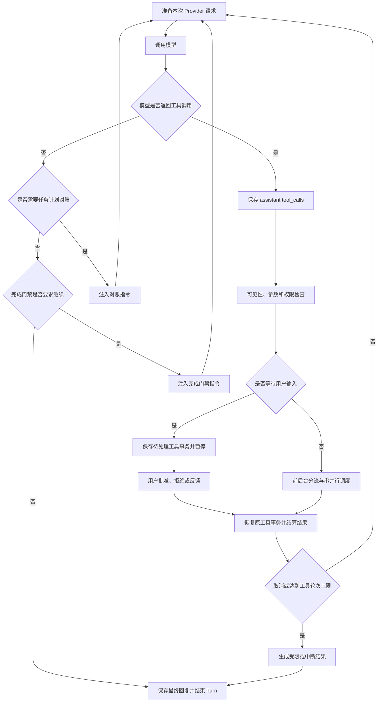
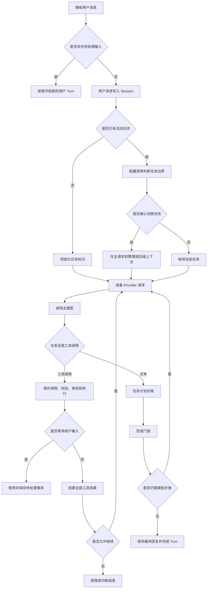
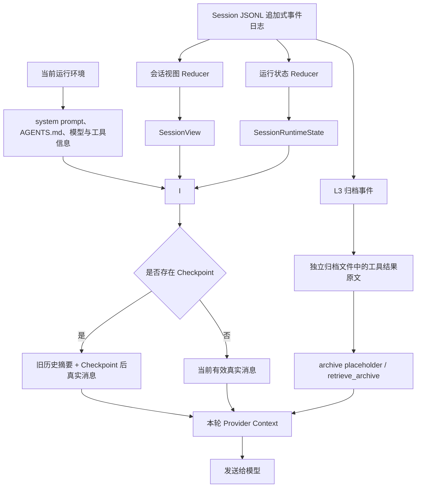
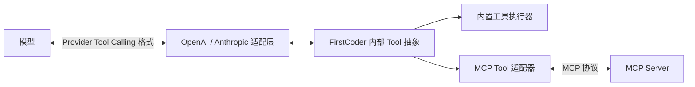

# Coding Agent面试题整理

# 一、适用于FirstCoder的问题

## 1. 项目介绍

### 1.1 请用一分钟介绍FirstCoder

面试表达：
> 我做了一个类似 Claude Code 和 Codex 的 Coding Agent，主要帮助开发者通过自然语言完成代码理解、文件修改、测试和命令执行。它不是简单地把问题转发给大模型，而是把模型、开发工具和本地项目连接成一套完整的执行流程：模型负责分析任务并提出操作，程序负责校验参数、检查权限、执行工具和返回结果。在启用写前审查且没有使用 bypass 模式时，文件修改还会先展示变更，再由用户确认。针对长时间任务，项目会用追加式事件记录会话事实，并通过上下文压缩控制模型输入长度；程序中断后，可以根据这些持久化记录恢复会话状态、修补未闭合的工具事务。此外，它还支持多模型、流式交互和任务规划。这个项目重点解决的是 Coding Agent 在真实开发场景中的安全性、连续性和可恢复性问题。

#### 可能的追问

1. FirstCoder 完成一次开发任务的整体流程是什么？

2. 为什么 Coding Agent 不能只依赖大模型直接生成代码？

3. 项目如何控制文件修改和命令执行带来的风险？

4. 程序意外退出后，为什么还能恢复之前的任务？

5. 长会话为什么需要上下文压缩，压缩后如何避免丢失关键信息？

6. 多模型支持给项目带来了哪些设计挑战？

7. 你认为 FirstCoder 当前最大的不足是什么？

### 1.2 请用三分钟介绍FirstCoder

面试表达：
> 我做了一个类似 Claude Code 和 Codex 的 Coding Agent。这个项目的目标，是让开发者直接在终端里通过自然语言完成代码阅读、问题定位、文件修改、测试验证和命令执行，把原来需要人工来回切换工具的开发流程串联起来。
> 
> 从业务流程上看，用户先描述一个开发任务，比如修复 Bug 或增加功能。系统会结合当前项目、历史会话和可用工具，把需求交给模型分析。模型不会直接操作电脑，而是提出下一步动作，例如读取文件、搜索代码、修改内容或者运行测试。系统会对这些动作进行参数校验、权限判断和路径限制，通过后才真正执行，再把执行结果反馈给模型。模型根据结果继续判断，直到任务完成。所以它本质上是一个“模型负责决策、程序负责安全执行”的循环。
> 
> 这个项目重点解决了三个实际问题。
> 
> 第一个是安全性。Coding Agent 能修改文件、执行命令，能力越强，误操作风险也越大。FirstCoder 把安全控制放在模型之外，通过权限策略判断操作是直接允许、需要确认还是拒绝。在启用写前审查且没有使用 bypass 模式时，支持预览的文件修改工具会在执行前展示真实变更。如果用户确认后文件又被其他程序修改，原来的预览就会失效，避免用户看到的是一个版本，实际执行的却是另一个版本。
> 
> 第二个是任务连续性。真实开发任务可能持续很长时间，也可能因为程序退出、网络异常或用户中断而暂停。FirstCoder 会记录用户消息、模型回复、工具调用、执行结果、与会话相关的权限事件和任务计划。重新打开会话后，系统可以根据这些持久化事实重建会话视图和可恢复的运行状态。对于已经记录了调用但没有终态结果的工具事务，恢复流程会补上一条中断结果，避免模型把它误认为成功。不过，这解决的是会话协议和状态一致性，不等同于对所有外部副作用提供严格的只执行一次保证。
> 
> 第三个是长上下文管理。开发过程中会产生大量源码、搜索结果、测试日志和代码差异，如果全部反复发送给模型，既容易超过上下文窗口，也会增加成本并干扰判断。FirstCoder 会保留完整的会话事实，但根据固定的压缩策略和消息结构，只把当前请求需要的内容投影给模型。旧内容可以被裁剪，较大的工具结果可以压缩或归档，压力更大时再生成 Checkpoint 摘要。这样既能控制输入长度，又能保留审计和恢复能力。
> 
> 除此之外，项目还支持多种模型服务、流式交互、任务计划、后台任务和子任务协作。不同模型的协议和错误形式会在系统边界统一处理，上层开发流程不需要跟某一家模型强绑定。
> 
> 我认为这个项目的核心价值，不是简单做一个能够调用大模型的终端聊天工具，而是把模型推理、工具执行、安全确认、状态恢复和上下文管理组合成一套真正能够持续工作的 Coding Agent。它让我重点理解了一个问题：Agent 的效果不仅取决于模型能力，还取决于工程系统能否保证执行安全、状态一致，以及任务在异常情况下仍然能够继续。

#### 可能的追问

1. 一次用户请求从输入到最终完成，内部会经历哪些阶段？

2. 为什么模型不能直接执行工具，必须由程序负责校验和执行？

3. 文件修改的写前审查如何避免用户确认内容与实际执行内容不一致？

4. 系统如何保证一次工具调用最终只有一个明确结果？

5. 会话恢复时需要恢复哪些状态，如何避免重复执行工具？

6. 完整会话记录和发送给模型的上下文有什么区别？

7. 上下文压缩如何判断哪些内容可以压缩、哪些内容必须保留？

8. 如果模型返回上下文超长错误，系统如何恢复？

9. 多模型适配时，如何屏蔽不同供应商之间的协议差异？

10. FirstCoder 当前还有哪些局限，下一步可以怎样改进？

## 2. 项目设计动机、行业对比与改进方向

### 2.1 为什么要自己实现一个 Coding Agent，而不是直接使用或改造开源项目？

面试表达：
> 我选择自己做一个 Coding Agent，主要有五个原因。第一，这类项目的开源资料和可参考实现比较多，适合系统学习 Agent 工程。第二，Coding Agent 涉及的上下文管理、记忆、权限、HITL 和评测等能力，并不只属于代码场景，将来做企业办公 Agent 或其他 Agent 也能复用这些经验。第三，它是我平时使用最多、也最容易感知实际价值的一类 Agent，所以我更容易从真实使用中发现问题。第四，我以前做过 PR Review 和 LangGraph Workflow，里面很多步骤都可以提前确定；Coding Agent 面对的任务更加开放，模型需要根据每次工具结果动态决定下一步，因此更考验模型决策和确定性程序之间的边界设计。第五，Coding Agent 有较成熟的公开 Benchmark，可以比较客观地验证项目，而不是只依赖自己设计的简单用例。对我来说，做这个项目的目的不只是实现一个终端工具，更重要的是借它完整学习一套可以迁移到其他 Agent 的工程方法。

补充素材：

有以下几个原因吧。
	1、Coding Agent 相较于别的智能体，学习资料比较多，比如 learn-claude-code、OpenCode、Claude Code 的源码等，方便我进行学习。
	2、我觉得 Agent 的技术是通用的，比如上下文管理、记忆管理、权限管理、HITL、测评等等。我做好一个这样的 Agent，可以让我在做其他 Agent 时都能用上。现在的 LLM 是输入文字、输出文字，不管什么 Agent，都要做上下文管理、长短期记忆、权限管理、审批等。在企业办公 Agent 中，不同的人能使用不同的东西，这是一种权限管理；对于主管需要审批，这是 HITL。所以我想亲自动手做一个 Coding Agent，来了解这些技术。毕竟对于现在的大模型来说，不管模型怎么更新，它的本质还是一个输入文字、输出文字的机器，上下文、记忆这些东西都少不了。
	3、Coding Agent 是我日常接触过程中使用最多的 Agent。不管是写代码，还是让它帮我工作，Coding Agent 是能作为成熟产品的，这也是我唯一会花钱使用的 Agent，能够让用户有付费意愿。当然，企业内部也有很多正在使用的 Agent，但是我接触得不多，所以我选择做一个 Coding Agent。
	4、Coding Agent 没有固定程序的编排，非常考验模型的控制能力，对 LLM 来说也是一种挑战。我之前做过一个简单的 PR Review Workflow Agent，它没有记忆，也没有权限管理。一开始我把它分成几个阶段，在提示词中告诉 Agent 按这几个阶段走：先判断这个 PR 是否适合自动审批，然后搜集信息，再根据我定义的规则，比如风险等级、小 Bug、可优化项等进行 PR 审批，最后根据审批结果采取行动。我还给了它一堆工具，包括获取 PR 信息的工具，例如 Diff、PR 描述，以及根据审批结果采取行动的工具。后来我发现没有必要，因为 PR 信息的采集是确定的。到了这个阶段，我直接把这个 PR 的所有信息发给 Agent，让 Agent 进行判断，这样不是更好吗？不仅节省了上下文，还能让 Agent 集中注意力，根据规则对 PR 进行 Review。最后阶段的几条支路也是确定的，也可以脱离模型的决策。包括我的第一个项目，我是用 LangGraph 搭建的。那个执行阶段也不太需要模型参与，直接根据计划，比如使用什么工具、什么参数，进行执行就好了。而 Coding Agent 不一样，所有的东西没有确定性，也就是 LangGraph 没有条件边，所以显得非常需要控制。我学会了控制一个 Coding Agent，那么在做一些有流程流转的 Agent 时，就能更好地判断哪些需要确定性，哪些需要模型来做决策，也能让我掌握如何更好地做一个 Agent。
	5、做 Coding Agent 项目还有一个原因，就是评测集和 Benchmark 比较多。我开发一个 Coding Agent，可以使用很多公开数据集进行评测，而不是自建数据集。自建数据集可能会比较简单、不够全面，同时也有时间成本。如果将来有机会，我可能会做一些其他方面的 Agent。

可能的追问：

1. 为什么不直接基于现有开源 Coding Agent 二次开发？
2. Coding Agent 中哪些能力可以迁移到企业办公 Agent？
3. PR Review Workflow 和 Coding Agent 在控制流上有什么区别？
4. 哪些步骤应该交给模型决策，哪些步骤应该由程序确定？
5. 你通过这个项目学到最多的模块是什么？
6. 你使用了哪些 Benchmark，评测结果怎么样？
7. 如果重新做一次，你会优先改进哪个部分？

### 2.2 FirstCoder 的特点、优势、局限，以及和行业主流 Coding Agent 的差异是什么？

### 2.3 项目开发过程中最大的挑战是什么？

### 2.4 在这个项目中学到最多的是什么？

### 2.5 FirstCoder、pico 与主流 Coding Agent 的上下文和记忆机制有什么差异？

考察范围包括历史记录如何进入上下文、上下文长度限制和过长问题、现有实现的改进空间，以及 Claude Code、Codex、Cursor、OpenCode 等主流产品或项目的相关方案。

### 2.6 如何用 autoresearch 的方式优化 System Prompt？

### 2.7 你平时会用这个项目运行复杂编码任务吗？一个任务大概需要多长时间？

## 3. 整体架构与Agent Loop

### 3.1 请从底层架构开始，介绍整个项目的运行流程

### 3.2 FirstCoder 的 Agent Loop 是怎么实现的？请结合一个完整 Turn 说明

面试表达：
> FirstCoder 的 Agent Loop 本质上是一个由程序控制的“模型决策—工具执行—结果反馈”循环。模型负责判断下一步做什么，但它不能直接操作文件、终端或网络，所有真实动作都必须经过 Agent Loop。一个新的 Turn 从接收用户消息开始：系统先确认没有悬挂的用户输入，把消息追加到 Session；第一条任务会初始化任务标识，后续消息则先通过隐藏的任务边界分类判断是在延续当前任务，还是切换到了新任务。确认切换时，可以在主 Agent 请求前先整理和压缩旧任务上下文。
>
> 进入主循环后，每次调用模型前，系统都会修补未闭合的工具事务、收集后台任务通知，根据 JSONL 重建 SessionView，并把系统提示词、AGENTS.md、当前可见工具、Checkpoint 摘要和最近消息投影成 Provider 请求；如果预计上下文超出预算，还会先执行压缩。模型返回工具调用后，系统先持久化 assistant 的调用记录，保证后面的 tool_result 有合法的前置调用，再依次完成工具可见性和参数校验、权限预检、前后台分流以及串并行调度。每个工具无论成功、失败、拒绝、跳过还是转入后台，都会得到明确结果并结算到 Session。只要没有等待用户输入、没有被取消、也没有达到工具轮次上限，系统就会带着这些结果重新调用模型，而不是由工具直接调用模型。
>
> 模型返回普通文本也不一定马上结束。如果当前存在任务计划，系统会先检查计划状态是否与实际执行结果一致；如果完成门禁认为还有后台任务、未完成计划或执行证据不足，还会追加运行时指令，让模型继续处理。只有这些检查都通过以后，最终回复才会保存，这个 Turn 才真正结束。权限审批会让当前 Turn 暂停，用户处理后继续原来的工具事务。流式和非流式请求共用同一套业务循环，区别主要在模型响应的接收方式，以及流式模式下会把同步工具执行放到工作线程，避免阻塞界面刷新。这样既保留了模型处理开放任务的灵活性，又把权限、状态一致性和终止条件掌握在确定性程序手里。

流程图：

完整 Turn 的执行顺序：

可能的追问：

1. 为什么必须先保存 assistant 的工具调用，再保存工具结果？
2. 任务边界判断为什么要放在主 Agent 请求之前？
3. 权限批准以后，原来的工具调用是怎样恢复的？
4. 一次返回多个工具调用时，系统怎样决定串行还是并行？
5. 工具失败为什么不能直接结束 Agent Loop？
6. 工具执行后、第二次模型调用前程序崩溃，恢复时如何处理？
7. 工具轮次和 Provider 调用次数有什么区别？
8. 任务计划对账和完成门禁分别解决什么问题？
9. 流式与非流式模式为什么可以共用同一套 Agent Loop？
10. Agent Loop 怎样处理取消、超时和工具轮次上限？

### 3.3 Agent 能感知哪些信息，怎样获得这些信息并继续决策？

应该是问如何拿到项目代码信息的

## 4. Session、记忆与上下文管理

### 4.1 记忆系统

面试表达：
> FirstCoder 没有单独引入向量数据库式的长期记忆，而是用“持久化事实源、运行时重建和按需上下文投影”实现会话记忆。每个 Session 对应一份追加式 JSONL 事件日志，记录用户消息、模型回复、工具调用与结果、任务计划、Checkpoint 和压缩事件。它只追加新事件，不会为了压缩上下文去原地删除旧事件，所以这份日志仍然可以用于审计和恢复。较大的工具结果如果进入 L3 归档，完整原文会保存在独立归档文件中，JSONL 里记录替换和归档相关事实。
>
> 程序启动、恢复会话或者准备请求时，会重放同一份事件日志，派生出两类状态：SessionView 保存模型消息、Checkpoint、Metadata 和当前任务计划；SessionRuntimeState 保存任务边界、已消费工具结果、自动压缩失败和最近压缩记录等可恢复的控制状态。它们不是另外两份长期记忆，而是事件日志在不同业务角度下的投影。真正调用模型时，系统也不会把 JSONL 全部塞进上下文，而是结合当前环境中的系统提示词、AGENTS.md、模型信息和可见工具，再从 SessionView 中选择有效历史。系统提示词、工具列表和 Provider 配置属于当前运行环境，长期权限规则则保存在独立的 permissions.json，它们都不能和 Session 事实混为一谈。如果存在 Checkpoint，就先放入旧历史摘要，再放入 Checkpoint 之后的真实消息；如果某个大型工具结果已经归档，上下文中只保留带 archive_id 的占位信息，模型确实需要原文时再调用 retrieve_archive。上下文继续增长时，还会依次使用旧任务裁剪、工具结果缩减、工具结果归档和语义 Checkpoint 等压缩层。
>
> 这个方案的取舍是，它特别适合 Coding Agent 的会话连续性和可审计性：事实不会因为模型上下文变短而丢失，程序重启后也能重建状态。但它当前没有跨 Session 的用户画像或知识记忆，也没有向量检索和 Top-K 自动召回。因此，FirstCoder 所说的“记忆召回”主要是最近消息直接投影、旧历史通过 Checkpoint 摘要进入上下文，以及模型根据占位符主动读取归档，而不是从向量库里自动搜索相似内容。

记忆与模型上下文的关系：

可能的追问：

1. SessionView 和 SessionRuntimeState 为什么要分开重建？
2. JSONL 一直追加会不会产生性能和容量问题？
3. Checkpoint 摘要怎样保证不切断工具调用和工具结果？
4. L1 到 L4 四层压缩分别处理什么内容？
5. 归档结果什么时候会重新进入模型上下文？
6. 如何评估 Checkpoint 的信息损失和归档召回准确率？
7. 为什么没有直接使用向量数据库做长期记忆？
8. 如果要增加跨 Session 记忆，应该怎样避免旧信息污染当前任务？
9. 为什么系统提示词、工具定义和 Provider 配置不属于 Session 记忆？
10. permissions.json 和 Session JSONL 的生命周期有什么区别？

#### 会话视图是什么？包括什么？怎么使用？怎么构建？

面试表达：
> SessionView 可以理解为 Session 事件日志在“当前业务状态”这个角度下的只读视图。JSONL 保存的是一条条发生过的事件，业务代码如果每次都自己解析事件会很复杂，所以系统会按顺序重放日志，把它归并成一个 SessionView。它有五个核心字段：session_id 标识属于哪个会话；messages 保存重建后的用户、assistant 和工具消息；checkpoints 保存已经生成的上下文检查点；metadata 保存标题、工作区和父子会话关联等会话属性；task_plan 保存当前最新版本的任务计划。
>
> 它主要在三类地方使用。第一，构造模型请求时，从 messages 中投影真正可见的历史；这里不是固定取最近几条，如果没有 Checkpoint，可以使用当前有效消息，如果有 Checkpoint，则使用摘要加 tail 部分的真实消息。第二，上下文管理会从 checkpoints 中选择最新的有效 Checkpoint，判断旧历史应该从哪里被摘要替代。第三，计划工具、任务计划对账和完成门禁会读取 task_plan，判断哪些任务还没有完成。metadata 更多用于会话目录、恢复、展示和父子关系等业务，不会简单地把整个字典原样发送给模型。
>
> 构建过程是先创建一个空视图，再按 JSONL 顺序遍历事件：消息事件追加到 messages，消息元数据更新事件修改对应的消息分片投影，Checkpoint 事件加入 checkpoints，会话元数据事件合并进 metadata，任务计划更新事件用经过版本校验的新快照替换 task_plan。这里的“修改”只是修改本次内存里的投影，原始 JSONL 仍然只追加、不回写。这样 SessionView 既方便上层读取，又保留了事件日志作为唯一事实来源。

可能的追问：

1. SessionView 和原始 JSONL 日志有什么区别？
2. messages 构造模型请求时到底会使用多少条？
3. 为什么 Checkpoint 不直接删除旧消息？
4. metadata 中哪些内容会发送给模型，哪些只供程序使用？
5. task_plan 为什么只保留最新快照，还需要 revision 校验？
6. 每次重建 SessionView 会不会有性能问题？
7. JSONL 中出现损坏或乱序的任务计划事件时怎样处理？

#### 会话运行状态是什么？包括什么？怎么使用？

#### 相关记忆什么时候进入模型上下文？为什么没有提供通用的向量记忆召回工具？

#### FirstCoder 是否做了多层记忆？应该如何准确描述？

### 4.2 上下文如何管理，怎样选择 History 放入模型请求？

#### Agent 上下文压缩机制是怎么做的？

#### prompt压缩如何实现的，剪裁哪些内容，怎么判断的

#### prompt被错误裁剪了怎么办

#### 压缩是怎么做的 压缩率是多少

### 4.3 Checkpoint 具体怎么恢复？

#### 恢复失败了，除了查历史记录外还有什么机制

### 4.4 图片的 Token 是怎样计算的？Base64 会带来什么影响？

### 4.5 FirstCoder 的记忆能力应该如何评测？

#### 如何评估 Agent 记忆召回的准确度？

#### FirstCoder没有 Top-K 检索，应该怎样定义它的 Recall 指标？

#### 如何区分“召回正确但模型回答错误”和“根本没有召回”？

#### 如何评估 Checkpoint摘要的信息损失率？

#### 怎样设计带信息更新和冲突的记忆测试集？

#### 归档工具的主动调用准确率应该怎样计算？

#### 为什么不能只使用最终任务成功率评估记忆能力？

#### 如何把记忆评测接入 CI，同时控制模型评测的随机性和成本？

#### 在线环境中可以用哪些指标监控记忆系统？

## 5. Session日志、持久化与恢复

### 5.1 你这个日志如果一直存的话 量会不会比较大

### 5.2 你这个日志是什么样子的 它的完整的数据起点和终点是什么？

## 6. 工具系统、调度与后台任务

### 6.1 FirstCoder 的工具系统是怎么实现的？为什么需要受控层，如何控制工具可见性？

#### 主 Agent 和不同子 Agent 分别能看到哪些工具？工具数量如何控制？

### 6.2 模型选错工具、参数错误或循环调用工具时如何处理？

面试表达：
> 我通常把工具调用错误分成三类：第一类是选错工具，比如应该搜索代码却选择了修改文件；第二类是参数错误，包括缺少必填参数、参数类型不对或者模型编造了不存在的字段；第三类是调用顺序错误，比如还没有读取文件就直接修改，或者依赖前一步结果的工具被过早调用。FirstCoder 的处理思路不是要求模型永远不犯错，而是在模型和真实环境之间增加一层确定性的工具运行时。
>
> 在请求模型之前，系统先根据当前 Agent 身份和运行状态筛选真正可见的工具，并把工具名称、用途和参数 Schema 发给模型，尽量从输入侧减少误选。模型生成工具调用以后，程序还会检查工具是否注册、当前是否允许模型调用、MCP 工具是否已经激活，以及参数能否被解析和执行。涉及文件、Shell、网络或 MCP 等操作时，还要经过权限预检；没有得到允许之前，不会产生真实副作用。某个调用即使校验失败、权限被拒绝或者执行时报错，也会被转换成与原 tool_call_id 对应的结构化 ToolResult，写入 Session 后再交给模型。模型看到“文件不存在”“参数缺失”或者“权限被拒绝”等证据，可以重新读取信息、修改参数、换用其他工具，或者向用户说明无法继续。
>
> 对一次响应里的多个工具，系统还要保证协议闭合：每个 tool_call 最终都必须有成功、失败、拒绝、跳过或中断结果，不能留下一半事务。出现权限等待时，当前调用会暂停，后续还没执行的调用会被明确跳过，避免恢复时顺序混乱。如果模型持续重复同一种无效操作，FirstCoder 会结合停滞检测、工具轮次上限、超时和取消机制结束循环。这个方案不能保证模型下一次一定选对工具，但能保证错误是可观察、可反馈、可终止的，不会让一个模型幻觉直接变成不可控操作。

可能的追问：

1. 工具可见性是在注册阶段控制，还是每次请求模型前动态控制？
2. 参数 Schema 校验失败后，错误以什么格式返回模型？
3. 为什么工具失败后不直接结束 Agent Loop？
4. 一批工具中有一个需要权限审批时，其他调用怎样结算？
5. 如何保证每个 tool_call 最终只有一个终态结果？
6. 停滞检测和工具轮次上限有什么区别？
7. 如果模型反复使用不同参数调用同一个错误工具，应该怎样识别？
8. 如何评测模型工具选择和参数生成的准确率？

### 6.3 后台任务机制

#### 为什么真实结果不能继续使用原来的 `tool_call_id`？

#### 后台任务完成后，为什么不会立即触发一次模型调用？

#### 如果 Agent 准备结束，但仍有后台任务运行，项目如何处理？

#### 后台任务取消后，底层线程一定会停止吗？

#### 为什么必须在提交后台任务之前完成权限校验？

#### 后台任务状态为什么没有直接写入 Session JSONL？

#### `task_id` 如何与 TaskPlan 联动，又如何避免覆盖较新的计划状态？

#### 如果后台任务执行成功，但结果通知一直没有被收集，会发生什么？

#### 后台执行和同一轮多个只读工具的并行执行有什么区别？

#### 如果要把它升级成可跨进程恢复的后台任务系统，应该如何改造？

## 7. 权限、安全与HITL

### 7.1 FirstCoder 如何通过权限系统和 HITL 保证工具执行安全？

#### Agent的安全问题：数据私密性怎么保证？

## 8. 多Agent与隔离

### 8.1 说一下你这个多agent怎么做的 隔离机制是什么

## 9. Provider、模型调用与异常处理

### 9.1 调用llm出现超时，报错情况如何处理。

### 9.2 你这个agent用的是什么模型？

## 10. MCP与Function Calling

### 10.1 MCP function call（tool call）区别

面试表达：
> Function Calling 和 MCP 解决的不是同一层问题。Function Calling，也叫 Tool Calling，解决的是模型和 Agent 宿主之间的结构化交互：宿主把工具名称、描述和参数 Schema 发给模型，模型返回要调用的工具名和参数，宿主真正执行以后，再把结果通过对应的 tool_call_id 返回模型。OpenAI 和 Anthropic 对工具定义、工具选择以及工具结果的消息格式并不完全相同，所以 FirstCoder 通过 Provider 适配层把内部统一格式转换成各家 API 需要的格式。
>
> MCP 解决的是另一个边界：Agent 宿主怎样用统一协议发现和调用外部工具服务。一个 MCP Server 可以暴露自己的工具目录和输入 Schema，FirstCoder 连接它以后，会把发现到的 MCP 工具适配成项目内部统一的 Tool。为了避免一次把大量 MCP Schema 全部暴露给模型，项目还提供 MCP 工具搜索和按当前 Turn 激活的机制；真正调用 MCP 工具时，它仍然会经过 FirstCoder 原有的工具校验、权限和结果结算链路。最后，这个内部 Tool 还是要通过 Provider 的 Function Calling 格式发送给模型。
>
> 所以它们不是二选一，而是一条链路上的两个协议层：Function Calling 负责“模型怎样提出调用”，MCP 负责“宿主怎样接入外部工具服务”。MCP 的价值主要是统一接入和复用边界，而不是自动提供安全性。MCP Server 可以是本地进程，也可以是远程服务；是否具备进程隔离、最小权限、网络限制和凭证保护，取决于实际部署。FirstCoder 会把 MCP 调用统一标记为 MCP 类型的权限请求，但这也不能代替 MCP Server 自身的安全设计。

两者在 FirstCoder 中的关系：

可能的追问：

1. 为什么说 MCP 和 Function Calling 不是替代关系？
2. MCP 工具如何转换成 FirstCoder 内部的 Tool？
3. 为什么还需要 Provider 适配层处理 OpenAI 和 Anthropic 的差异？
4. MCP 工具为什么要先搜索和激活，而不是全部发送给模型？
5. MCP 工具调用是否还会经过 FirstCoder 的权限系统？
6. 本地 stdio MCP 和远程 MCP 在部署与安全上有什么区别？
7. MCP Server 断开或返回错误时，Agent Loop 如何继续？
8. 为什么 MCP 本身不能保证进程隔离和最小权限？

#### 项目中哪里用了function call 和mcp

#### 开发一个新工具，涉及到数据库账号，用mcp还是function call 那个合适

面试表达：
> 这个问题首先要纠正一个前提：MCP 和 Function Calling 不是完全互斥的。即使数据库能力由 MCP Server 提供，模型侧通常仍然要通过 Function Calling 生成工具名和参数。真正需要做的架构选择，是把数据库能力直接实现成 FirstCoder 的内置工具，还是由独立的 MCP Server 提供，再接入 FirstCoder。
>
> 如果这个数据库工具只服务 FirstCoder，查询接口比较稳定，需要复用 FirstCoder 已有的权限、日志和错误处理，而且希望部署和调试尽量简单，我会优先选择内置工具。模型只看到类似“按用户编号查询订单”这样的受限参数，不会看到数据库账号；工具执行器在本地读取凭证、执行固定查询，再把经过裁剪和脱敏的结果返回模型。如果这个能力需要被多个 Agent、IDE 或团队共同使用，数据库团队希望独立维护查询逻辑，或者数据库只能在特定网络环境中访问，我会把它做成 MCP Server。FirstCoder 只负责发现和调用这个服务，数据库连接、连接池和查询策略由 MCP Server 管理。不过，这会增加服务部署、连接管理、版本兼容和故障排查的成本。
>
> 无论选择哪一种，我都不会把数据库账号、连接字符串或原始 SQL 交给模型，也不会仅仅因为使用 MCP 就认为系统更安全。真正的安全措施应该落在执行端：凭证放在环境变量或密钥管理服务中，使用只读或最小权限账号；优先提供面向业务的受限操作，而不是允许模型执行任意 SQL；对参数做类型和范围校验，限制查询时间、返回行数和字段范围；敏感信息要脱敏，同时记录调用人、查询类型和结果状态等审计信息。如果使用 MCP，这些职责主要由 MCP Server 承担；如果使用内置工具，就由 FirstCoder 的工具实现承担。最终我会根据复用范围、部署边界和运维成本来选择，而不会简单地把 MCP 和 Function Calling 当作安全性上的二选一。

可能的追问：

1. 为什么不能让模型直接生成并执行任意 SQL？
2. 数据库凭证应该保存在什么位置，如何轮换？
3. 内置工具和 MCP Server 分别怎样接入 FirstCoder 的权限系统？
4. 如何设计一个只能查询、不能修改数据的数据库工具？
5. 查询结果中包含身份证号或手机号时怎样脱敏？
6. MCP Server 被攻破以后，怎样限制它能够访问的数据范围？
7. 数据库超时、连接失败或返回结果过大时如何处理？
8. 如何测试这个工具没有越权查询和 SQL 注入问题？

## 11. Skill系统

### 11.1 如何判断模型意图调用Skill或者MCP的正确率？

## 12. 稳定性、运行效果与产品落地

### 12.1 Agent 的稳定性怎么保证？如何向甲方解释并管理不可避免的不稳定性？

#### 如果 Agent 存在 1%～5% 的不稳定性，如何说服甲方采用并控制风险？

### 12.2 有没有了解 Run Trace？为什么要自己记录，而没有直接使用已有工具？

## 13. Benchmark与Agent Harness

### 13.1 FirstCoder 做了哪些 Benchmark？评测是否有用？

### 13.2 Agent Harness 是什么，需要包含哪些内容？

# 二、不适用于FirstCoder当前实现的问题

## 1. 自进化机制 你的事件流里怎么确保你在进化之后 能拿到后续用户的反馈呢？

## 2. 你的日均token消耗量是多少。

## 3. Web 和浏览器解决的是两种不同的联网场景。

## 4. FTS5是什么？

## 5. openclaw底层的4个工具是什么？

## 6. 如果要记录文件到数据库，应该使用什么文件数据库？

## 7. 介绍一下transformer架构？
