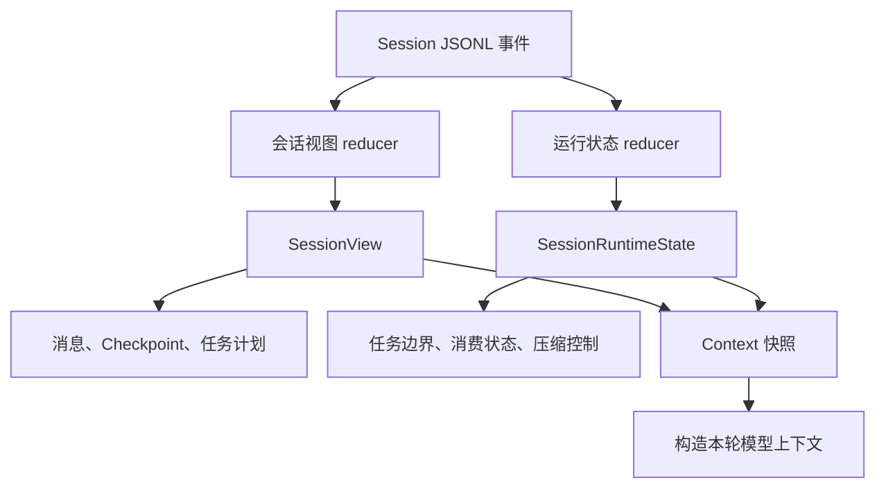
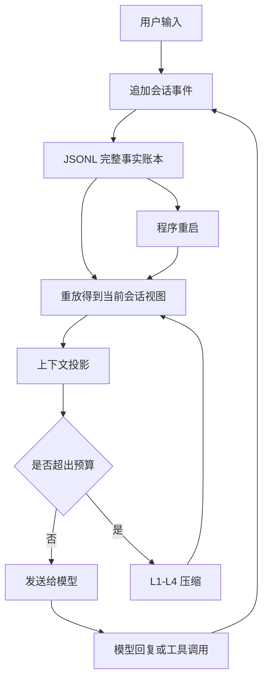

# 项目介绍

##  1、1分钟版本

面试表达：
> 我做了一个 Coding Agent，（类似于claude code，codex）主要帮助开发者通过自然语言完成代码理解、文件修改、测试和命令执行。它并不是简单地把问题转发给大模型，而是把模型、开发工具和本地项目连接成一套完整的执行流程。模型负责分析任务和提出操作，系统负责权限校验、工具执行和结果反馈；涉及文件修改等关键操作时，还会展示变更并让用户确认。针对长时间开发任务，项目会完整保存会话和执行结果，支持中断恢复，同时通过上下文压缩控制模型输入长度。此外，它还支持多种模型、流式交互和任务规划。整体上，这个项目重点解决的是 Coding Agent 在真实开发场景中的安全性、连续性和可恢复性问题。

可能的追问：
1. FirstCoder 完成一次开发任务的整体流程是什么？
2. 为什么 Coding Agent 不能只依赖大模型直接生成代码？
3. 项目如何控制文件修改和命令执行带来的风险？
4. 程序意外退出后，为什么还能恢复之前的任务？
5. 长会话为什么需要上下文压缩，压缩后如何避免丢失关键信息？
6. 多模型支持给项目带来了哪些设计挑战？
7. 你认为 FirstCoder 当前最大的不足是什么？


##  2、3分钟版本

面试表达：
> 我做了一个 Coding Agent，（类似于claude code，codex）。这个项目的目标，是让开发者直接在终端里通过自然语言完成代码阅读、问题定位、文件修改、测试验证和命令执行，把原来需要人工来回切换工具的开发流程串联起来。
> 
> 从业务流程上看，用户先描述一个开发任务，比如修复 Bug 或增加功能。系统会结合当前项目、历史会话和可用工具，把需求交给模型分析。模型不会直接操作电脑，而是提出下一步动作，例如读取文件、搜索代码、修改内容或者运行测试。系统会对这些动作进行参数校验、权限判断和路径限制，通过后才真正执行，再把执行结果反馈给模型。模型根据结果继续判断，直到任务完成。所以它本质上是一个“模型负责决策、程序负责安全执行”的循环。
> 
> 这个项目重点解决了三个实际问题。
> 
> 第一个是安全性。Coding Agent 能修改文件、执行命令，能力越强，误操作风险也越大。FirstCoder 把安全控制放在模型之外，通过权限策略判断操作是直接允许、需要确认还是拒绝。对于文件修改，还会在执行前展示真实变更，让用户确认自己到底会改什么。如果用户确认后文件又被其他程序修改，原来的确认就会失效，避免用户看到的是一个版本，实际覆盖的却是另一个版本。
> 
> 第二个是任务连续性。真实开发任务可能持续很长时间，也可能因为程序退出、网络异常或用户中断而暂停。FirstCoder 会完整记录用户消息、模型回复、工具调用、执行结果、权限状态和任务计划。重新打开会话后，系统可以根据这些记录恢复之前的进度。即使一次工具调用被中断，也会明确记录它的最终状态，避免恢复后重复执行或让模型误以为操作已经成功。
> 
> 第三个是长上下文管理。开发过程中会产生大量源码、搜索结果、测试日志和代码差异，如果全部反复发送给模型，既容易超过上下文窗口，也会增加成本并干扰判断。FirstCoder 会保留完整的会话事实，但只把当前任务真正需要的信息投影给模型。旧内容会根据价值逐步裁剪、压缩或归档，必要时生成阶段性总结。这样既能控制输入长度，又能保留审计和恢复能力。
> 
> 除此之外，项目还支持多种模型服务、流式交互、任务计划、后台任务和子任务协作。不同模型的协议和错误形式会在系统边界统一处理，上层开发流程不需要跟某一家模型强绑定。
> 
> 我认为这个项目的核心价值，不是简单做一个能够调用大模型的终端聊天工具，而是把模型推理、工具执行、安全确认、状态恢复和上下文管理组合成一套真正能够持续工作的 Coding Agent。它让我重点理解了一个问题：Agent 的效果不仅取决于模型能力，还取决于工程系统能否保证执行安全、状态一致，以及任务在异常情况下仍然能够继续。

可能的追问：
1. 一次用户请求从输入到最终完成，内部会经历哪些阶段？
2. 为什么模型不能直接执行工具，必须由程序负责校验和执行？
3. 文件修改的写前审查如何避免用户确认内容与实际执行内容不一致？
4. 系统如何保证一次工具调用最终只有一个明确结果？
5. 会话恢复时需要恢复哪些状态，如何避免重复执行工具？
6. 完整会话记录和发送给模型的上下文有什么区别？
7. 上下文压缩如何判断哪些内容可以压缩、哪些内容必须保留？
8. 如果模型返回上下文超长错误，系统如何恢复？
9. 多模型适配时，如何屏蔽不同供应商之间的协议差异？
10. FirstCoder 当前还有哪些局限，下一步可以怎样改进？


## 3、记忆系统
agent的记忆是  
设计一个组件，让模型不会什么都放进上下文，也不会没有上下午。（不会什么都记，也不会什么都忘）
结构化记忆怎么设计的，长期记忆什么时候更新，这个topic怎么理解

**记忆系统**
FirstCoder 本身没有独立的记忆系统。它以每个 Session 对应的追加式 JSONL 事件日志作为会话事实来源，里面记录用户消息、模型回复、工具调用、工具结果、任务计划、Checkpoint 和压缩事件等内容。旧事件不会被程序原地修改或删除。

程序运行时会重放 JSONL，派生出当前会话视图和必要的运行状态；调用模型前，再结合当前的 system prompt、AGENTS.md、工具定义、Provider 信息和模型上下文窗口，构造本轮真正发送给模型的上下文。这些都是派生结果，不是独立记忆。

当上下文需要压缩时，系统可能裁剪旧对话、压缩工具输出，或者把工具结果原文保存到归档文件，并在模型上下文中留下带 `archive_id` 的占位符；需要时再重新读取。更严重的上下文压力下，还会生成 Checkpoint 摘要，用摘要加最近真实消息继续任务。

**本项目没有记忆系统，而是Session 事实源，加上一组重放、投影、压缩和归档机制**

区分：
```
JSONL
    持久化的事实来源

SessionView
    JSONL 重放后得到的当前业务状态

SessionRuntimeState
    Agent 本次运行过程中的控制状态

Provider Context
    最终真正发送给模型的消息
```

通过重放jsonl，重放出会话视图和会话运行状态。



会话视图是什么？包括什么？怎么使用？怎么构建？

构建：
```
读取 JSONL
   ↓
创建空的 SessionView
   ↓
按顺序遍历每个事件
   ↓
根据事件类型更新视图
   ↓
得到当前 SessionView

```

怎么使用：


会话运行状态是什么？包括什么？怎么使用？


### memory具体存什么内容，如何工作


### 如何评估Agent记忆召回的准确度？


### 相关记忆什么时候做召回。为什么没考虑提供一个模型自主召回的工具


## 4、上下文怎么管理的

为什么 context window 不等于记忆、
怎么分层、怎么决定写入、
怎么检索、怎么淘汰、
以及这些决策出错时会发生什么。


## 5、Agent上下文压缩机制怎么做的？
### prompt压缩如何实现的，剪裁哪些内容，怎么判断的
### prompt被错误裁剪了怎么办
### 压缩是怎么做的 压缩率是多少


## 6、介绍一下工具部分怎么做的？

### 了解其他SOTA的上下文压缩和记忆模块怎么做的吗？
比如claude code  codex   openclaw  deepseek  harness 等？

## ckpt具体怎么恢复的
#### 恢复失败了，除了查历史记录外还有什么机制
## 调用llm出现超时，报错情况如何处理。
### 没有调对工具如何处理，给出常用的解决方案

分为三种情况：
**工具选择错误**(模型选了不合适的工具)、
**参数幻觉**(模型编造了不存在的参数)、
**调用顺序混乱**(复杂任务需要多步工具调用,模型容易在中间某一步出错)。


### 循环调用某个工具如何处理

## 介绍一下整个项目的运行流程

## Agent Loop是怎么实现的？


## 感知什么信息，怎么拿到这些信息，后续如何做决策

应该是问如何拿到项目代码信息的
## 说一下你这个多agent怎么做的 隔离机制是什么
## 安全怎么保证的？
### Agent的安全问题：数据私密性怎么保证？


## Agent的稳定性怎么保证？
## 如何说服甲方，agent有1%-5%的不稳定性，并且让他采用方案？


### MCP function call（tool call）区别
1. Function Calling 解决了“大模型知道该做什么”的问题。
2. MCP 解决了“工程上该如何规范地去做”的问题。

MCP适配不同Provider的格式差异，服务发现、进程隔离、热插拔、跨网络通信这些架构层面的能力，与Provider格式无关。即使所有API格式统一，你依然需要一个标准协议来让AI应用发现、隔离、热插拔、远程调用各种工具

### 项目中哪里用了function call 和mcp

### 开发一个新工具，涉及到数据库账号，用mcp还是function call 那个合适


```markdown
### 第一步：亮明核心观点（面试开头30秒）

> 面试官您好，关于这个问题，我的核心观点是：Function Call 和 MCP 都能处理数据库账号，但它们的安全管控模式和运维边界完全不同。选择哪个，本质上取决于这个数据库工具是**“紧耦合的内部能力”，还是“松耦合的共享服务”。

### 第二步：深度对比分析

#### 方案一：使用 Function Call（传统后端处理）

在这种模式下，数据库账号密码存放在**你自己的应用后端**（如环境变量或云厂商的密钥管理服务KMS中）。

- 执行流程：大模型只输出`tool_call`指令（如`query_database`），你的后端接收到指令后，由你自己的代码去读取密钥、建立连接、执行SQL。
- 优点（什么时候选它）：
  1. 极高的集中管控：密钥永远不会离开你的主服务器，审计日志、连接池、熔断降级都可以由你统一的后端服务控制。
  2. 极简架构：如果这个工具只服务于**这一个**AI应用，用Function Call代码量更少，运维更直接。
- 缺点：扩展性差。如果另一个团队（或另一个AI应用）也想用这个数据库工具，他们必须复制你的代码，或者调用你的API，增加了耦合。

#### 方案二：使用 MCP（独立服务进程）

在这种模式下，数据库账号密码存放在 **MCP Server 自己的环境变量**或配置中。

- **执行流程**：MCP Server作为一个独立的进程/容器运行。AI客户端（如Claude Desktop或你的Agent）通过MCP协议连接到它，Server内部自己处理鉴权和查库。
- **优点（什么时候强烈推荐它）**：
  1. **完美的“最小权限”隔离（零信任架构）**：这个MCP Server只能做“查数据库”这一件事。即使它被攻破，攻击者也拿不到你的主应用权限，因为它是独立沙箱。
  2. **跨团队/跨应用复用**：数据库团队可以独立维护这个MCP Server（更新驱动、打补丁），AI应用层**无需重启、无需改代码**就能享受到最新的数据库连接能力（热插拔）。
  3. **本地/远程灵活部署**：这个Server可以部署在数据库所在的专有网络内，通过跨网络通信（Streamable HTTP）让外部AI调用，避免数据库直接暴露在公网。
- **缺点**：增加了分布式运维的复杂度（需要管理MCP Server的进程生命周期）。
### 第三步：面试加分项——针对“数据库账号”的特殊安全考量

面试官问“涉及数据库账号”，实际是在考察你对凭证管理（Credential Management）的理解。你要主动提到以下两点，绝对惊艳全场：

1. 动态凭证（Dynamic Credentials）：无论用MCP还是Function Call，都不建议把账号密码写死在代码里。如果使用MCP，可以结合MCP的`initialize`握手过程，由客户端动态传递临时Token，或者MCP Server主动向Vault（密钥管理服务）拉取短期有效的数据库凭证。
2. 数据泄露边界**：Function Call中，数据库查询结果会经过你的后端再返回给模型，你可以在这层做脱敏（如隐藏身份证号）。MCP同样可以在Server端做脱敏。但注意，MCP让数据处理逻辑“下沉”到了工具侧，主应用更轻量了。
3. 
### 第四步：给出最终的决策建议（面试定音锤）

你可以这样总结，展现你的决策逻辑：

> 如果我是架构师，我会这样拍板：
>
> 1. 如果这个数据库工具仅供本项目内部使用，且查询逻辑不复杂**（比如只是查用户基础信息），我会选择 Function Call。把账号放在后端的KMS里，这样最快、最安全、最好调试。
>
> 2. 如果这个数据库工具未来要开放给多个AI Agent使用，或者涉及频繁变更（比如查报表、查库存），又或者我想把数据库访问权限与主应用彻底隔离，我会坚定不移地选择 MCP。把它封装成一个独立的MCP Server部署在DB所在的VPC内网，主应用通过MCP协议调用它，实现了权限边界的最小化和工具能力的最大复用。
>
> 两者没有绝对的好坏，Function Call更偏向于“单体应用内的内部函数”，MCP更偏向于“面向AI的微服务”。对于数据库这种敏感资产，我更倾向于用MCP进行物理/进程级别的隔离。

### 总结

这道题的回答核心在于：Function Call 处理的是“逻辑”（业务代码怎么跑），而 MCP 处理的是“边界”（代码跑在哪里，权限怎么给）。 涉及到数据库账号这种敏感信息，进程隔离（MCP）显然比纯代码封装（Function Call）更加健壮，但也要接受其运维成本的上升。
```


## 如何判断模型意图调用Skill或者MCP的正确率？

## 自用的agent 为什么要做工具受控层？具体是怎么做的 为什么这么做？

## 多agent场景下 你是怎么做好子agent的拆分的 硬约束？
### 有设计兜底机制吗 怎么解决这些子agent上下文污染的问题

### 你这个agent用的是什么模型？

## 你这个日志如果一直存的话 量会不会比较大

## 你这个日志是什么样子的 它的完整的数据起点和终点是什么？


### 自进化机制 你的事件流里怎么确保你在进化之后 能拿到后续用户的反馈呢？


##  Web 和浏览器解决的是两种不同的联网场景。

## 你的日均token消耗量是多少。
### benchmark做了哪些 有用吗？

autoresearch式地优化system prompt

1. harness是什么，需要包含哪些内容
    
2. 从底层开始是如何设计的？
    
3. 有没有了解run trace，为什么要自己做单独的记录工具，但没有用现在已有的工具？
    
4. openclaw底层的4个工具是什么？
    
5. 如果要记录文件到数据库，应该使用什么文件数据库？
    
6. 如何选择history放入，有没有改进空间？

7. 每个项目问的都是在这个项目学到最多的是什么。
    
8. 有没有改进空间，以及相关的行业SOTA和自己的实现之间的区别。
    
9. pico问了上下文管理里面，历史记录具体是如何放入的，有没有改进空间，有没有了解claude code、cursor等工具是如何管理上下文的？
    
10. pico的上下文管理和ClaudeCode等工具相比有什么优缺点？为什么会有上下文长度限制？上下文过长问题是什么？
    
11. 介绍一下transformer架构？
    
12. 为什么不使用GitHub上开源的而是要自己写一个？
13. 
14. 
15. 
FTS5是什么？
# 面试问题
## 1、为什么要自己做一个新的coding agent？
有以下几个原因吧。
	1、coding agent 相较于别的智能体，学习资料比较多。   比如learn-claude-code。opencode，claude code 的源码等。方便我进行学习
	2、我觉得agent的技术是通用的。比如上下文管理，记忆管理，权限管理，HIT，测评等等等，我做好一个这个agent，可以让我在做其他agent时都能用上。现在的llm是输入文字，输出文字，不管什么agent，他都要做上下文管理，长短期记忆，权限管理，审批等。在企业办公agent，不同的人能使用不同的东西，这是一种权限管理。对于主管需要审批，这是HIT。所以我想亲自动手做一个coding agent ，来了解这些技术。毕竟对于现在的大模型来说，不管模型怎么更新，他的本质还是一个输入文字，输出文字的机器。上下文，记忆这些东西都少不了。
	3、coding agent 是我日常接触过程中，使用的最多的agent。不管是写代码， 还是让他帮我工作，coding agent 是能作为成熟的产品的（这也是我唯一会花钱使用的agent，能够让用户有付费意愿），当然企业内部也有很多使用的agent，但是我接触的不多，所以我选择做一个coding agent。
	4、coding agent 没有固定程序的编排，（非常考验模型的控制能力）（对llm来说，但是也是一种挑战），我之前做过一个简单的pr review的workflow的agent 。它没有记忆，没有权限管理。一开始我给他分成几个阶段，提示词中告诉agent，你就按这几个阶段走，先判断这个pr是否适合自动审批，然后搜集信息，然后根据我定义的规则（什么风险等级，小bug，什么可优化等等），进行pr审批。然后根据审批结果，采取行动。给了它一堆工具，获取pr信息的工具（什么diff，pr的描述），以及根据审批结果采取行动的工具。后来我发现，没必要，因为pr信息的采集，这个东西是确定的，到了这个阶段，我直接将这个pr的所有信息发给agent，让agent进行判断，这个不更好了嘛。不仅节省了上下文，能让agent集中注意力根据规则对pr进行 review。以及最后阶段，几条支路是确定的。也可以脱离模型的决策。   包括我的第一个项目，我用langgraph搭建的。呢个执行阶段，它也不太需要模型的参与，直接根据计划（使用什么工具，什么参数），进行执行就好了。而coding agent 不一样，所有的东西没有确定性。也就是langgraph没有条件边。就显得非常的需要控制，我学会了控制一个coding agent，那么我做一些有流程流转的agent时，就能更好的判断，那些需要确定性，那些需要模型来做决策，也能让我掌握如何更好的做一个agent。
	5、做coding agent 项目，还有一个就是评测集比较多，benchmark比较多。我开发一个模型，可以用很多公开的数据集进行评测。而不是自建数据集（可能会比较简单，不够全面，也是时间问题，如果将来有机会，我可能会做一些其他方面的agent）

## 2、你这个coding agent 和其他agent的区别是什么？优势是什么？特点是什么？与行业的sota的区别


## 3、项目开发过程中最大的挑战是什么？


## 4、你测评过你这个coding agent 吗?


## 5、做了几层记忆？记忆模块是怎么做的？


## 6、给了多少工具，hitl是怎么做的?

## 你平时会用你们的项目跑具体复杂的编码任务吗？跑一个任务大概多长时间。


