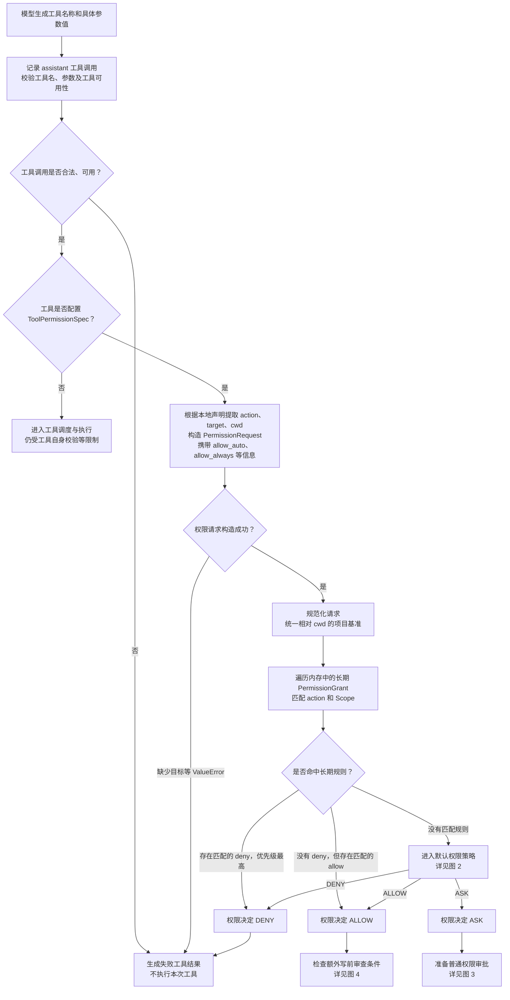
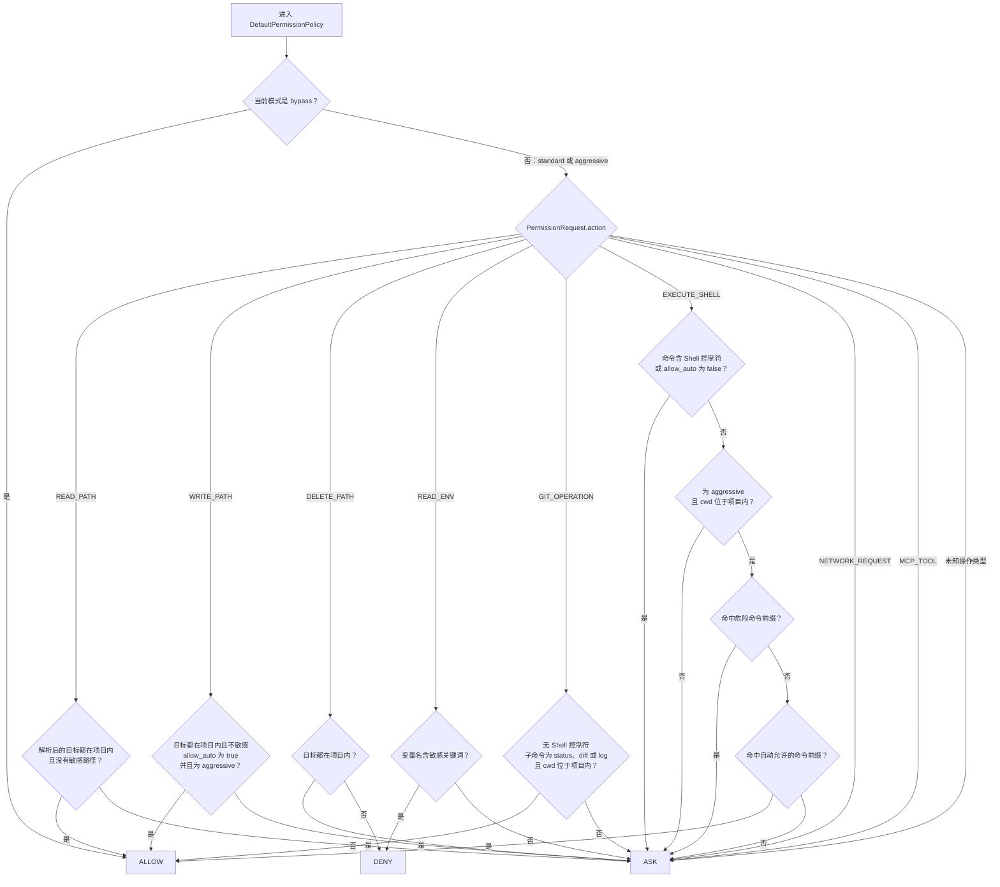
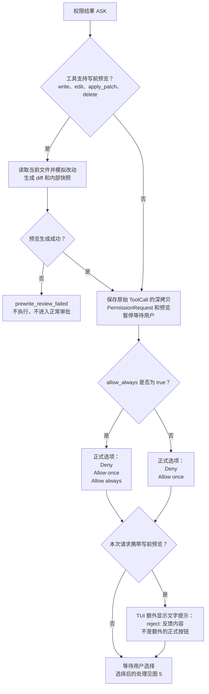
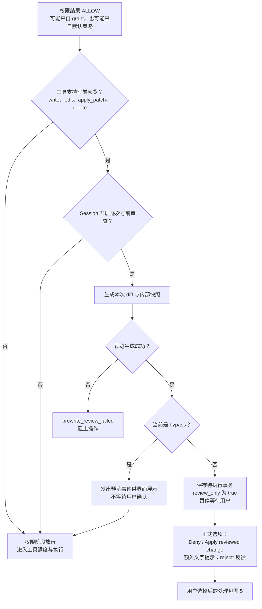
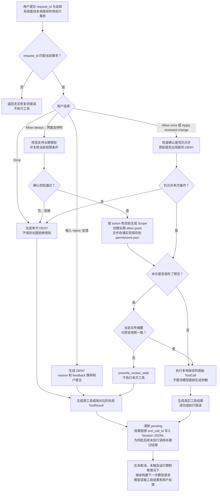

# Coder 工具权限与写前审查流程

阅读顺序：总流程 → 默认权限策略 → ASK 界面 → ALLOW 后的写前审查 → 用户选择后的恢复。

注意区分两层：`PermissionManager` 返回的 `ALLOW / ASK / DENY` 是权限判断；
Session 的工具权限适配器还可能将 `ALLOW` 转成需要确认的写前审查。因此“权限已经允许”不一定意味着马上执行。

## 1. 从模型调用到权限决定

长期规则匹配有三个分支：命中允许、命中拒绝、未命中。
命中 grant 时不进入模式的默认策略，所以bypass下的请求（也可能会deny）。
（**bypass 的自动允许不能覆盖已匹配的长期拒绝规则**。）

第三个分支，进入进一步的权限判断策略。

工具的 `ToolPermissionSpec` 是本地配置，不发送给模型。
`allow_always` 控制普通审批是否支持保存长期授权；
`allow_auto` 控制部分默认策略是否可以自动放行。两者都不是权限决定本身。

没有权限声明的工具包括：`think`、`ask_user`、`task_create`、`task_update`、`task_revise`、`task_list`、`task_boundary`、`load_skill`、`retrieve_archive`、`delegate`、`background_status`、`background_cancel`、`process_status`、`process_logs`、`process_stop`。
其中部分工具按配置注册，`task_boundary` 属于内部控制工具；`ask_user` 的用户提问不属于权限 ASK。

## 2. 未命中 grant 后，默认权限策略怎样决定

下图中的判断均发生在没有匹配的长期授权规则时。

| 检查项 | 当前规则 |
|---|---|
| 敏感路径 | 路径包含 `.git`，文件名为 `.env`，或扩展名为 `.pem`、`.key` |
| 敏感环境变量 | 变量名转为大写后包含 `KEY`、`TOKEN`、`SECRET`、`PASSWORD`、`COOKIE` |
| Shell 控制符 | `&&`、`\|\|`、`;`、管道、重定向、`$(`、反引号、换行等 |
| 危险 Shell 前缀 | `rm`、`sudo`、`curl`、`wget`、`chmod`、`chown`、`python -m pip`、`python3 -m pip`、`pip`、`pip3` |
| 自动允许的前缀 | `pytest`、`python -m pytest`、`python3 -m pytest`、`ruff`、`mypy`、`git status`、`git diff`、`git log`、`git apply`、`npm test`、`pnpm test`、`yarn test`、`go test`、`cargo test`、`make test` |

前缀匹配要求命令等于前缀，或以“前缀加空格”开头。白名单包含 `git apply`，因此不能把它概括成“全部是只读测试命令”，也不能称为绝对安全的命令。

Standard 和 Aggressive 的主要差异：后者额外允许满足条件的项目内普通写入，以及项目内白名单 Shell 命令。其他上述默认策略相同。危险 Shell 通常返回 ASK，不是直接 DENY；项目外删除和敏感环境变量读取才是这里明确的 DENY 分支。

`python_exec` 和 `apply_patch` 都设置了 `allow_auto=False`、`allow_always=False`：没有匹配 grant 时，在 Standard 和 Aggressive 中不能凭模式自动放行，也不能通过普通审批创建长期授权。Bypass 的默认 ALLOW 在这些检查之前。

## 3. 权限结果为 ASK：用户看到什么

**源码细节：权限本身为 ASK 时，只要工具支持预览，就会尝试生成预览，不依赖 Session 的逐次写前审查开关。** 这个开关控制的是权限已经 ALLOW 后的额外审查，见下一张图。

| 工具 | 普通权限 ASK 的正式选项 | TUI 是否额外提示 `reject: 反馈` |
|---|---|---|
| `write`、`edit`、`delete` | Deny / Allow once / Allow always | 预览成功并进入审批时显示 |
| `apply_patch` | Deny / Allow once | 预览成功并进入审批时显示 |
| `python_exec` | Deny / Allow once | 不主动展示该提示 |
| `shell`、`diagnostics`、`process_start` | Deny / Allow once / Allow always | 不主动展示该提示 |
| `ls`、`view`、`grep`、`glob`、`tree`、`read_multi` | Deny / Allow once / Allow always | 不主动展示该提示 |
| `git_status`、`git_diff`、`git_log` | Deny / Allow once / Allow always | 不主动展示该提示；项目内通常直接 ALLOW |
| `fetch`、`web_search`、动态 MCP 工具 | Deny / Allow once / Allow always | 不主动展示该提示 |

表格描述的是进入 ASK 后的界面，不意味着这些工具每次都要审批。底层输入解析器能在普通权限确认中识别 `reject: ...`，并没有限定只能用于四个文件工具；四个文件工具的区别是携带预览时 TUI 会主动展示这条提示。

## 4. 权限结果为 ALLOW：写前审查与 bypass 的分支

`Apply reviewed change` 对应的内部选择仍为 `allow_once`。它替换普通审批中的 Allow once 标签，并不和 Allow once 并列；这个界面也不提供 Allow always。

已有 Allow always 也可能在此暂停，因为它允许的是特定作用域中的操作，而逐次写前审查要求确认本次具体 diff。

Bypass 开启审查时仍会生成预览事件，但不会等用户选择；关闭审查时不走这段预览逻辑。工具自身的参数、路径等检查仍可能报错。切换到 bypass 还会把 Session 的沙箱访问模式同步为 unrestricted，但不能据此推断所有工具内部限制也被取消。

## 5. 用户选择以后，怎样恢复并返回模型

普通确认恢复时会再次检查已有 grant 和当前策略；如果它们已经产生一个确定决定，就采用该决定。因此 Allow always 分支只有在需要新授权时才真正追加规则。当前实现先保存新 grant，再检查预览是否过期；预览过期会阻止本次执行，但不会自动撤销刚保存的 grant。

用户拒绝不会回滚同批此前已经完成的工具操作。`Reject with feedback` 的反馈写入失败结果的正文和 `data.permission_feedback`，随原调用的工具结果进入后续请求，不要求模型把它当成一条新工具调用。

用户允许后不会再弹出第二遍相同的写前确认，而是复核已保存的预览快照，再执行原调用。快照校验与实际写入之间没有文件级原子事务，不能保证完全消除并发修改的时间窗口。

本图聚焦权限入口与人工确认恢复。无需等待用户的调用在权限放行后继续走工具调度，可能是前台串行、前台并行或后台执行；ALLOW 并不保证调用成功。子 Agent 当前没有这套人工确认的交互桥接，触发等待用户输入后，委托会以失败结束。

## 6. 最容易混淆的四种界面

| 场景 | 权限决定 | 后续用户可见内容 |
|---|---|---|
| Standard 首次写普通文件，没有 grant | ASK | diff；Deny / Allow once / Allow always；`reject: 反馈` |
| Aggressive 写普通文件，逐次审查开启 | ALLOW | diff；Deny / Apply reviewed change；`reject: 反馈` |
| Standard 或 Aggressive 调用 apply_patch，没有 grant | ASK | diff；Deny / Allow once；`reject: 反馈` |
| Bypass 写文件，逐次审查开启，没有 deny grant | ALLOW | 预览事件；不弹审批、不等待，预览成功后执行 |

上述文件场景都以预览能成功生成为前提。没有“永远拒绝”的正式选项；Reject with feedback 是文本输入功能；Apply reviewed change 是仅审查场景中的一次允许标签。

## 7. 源码依据

- [ToolPermissionSpec 定义](E:/agent/后端agent开发资料/FirstCoder/firstcoder/tools/domain/definition.py:23)：本地权限声明及默认字段。
- [权限请求构造](E:/agent/后端agent开发资料/FirstCoder/firstcoder/tools/application/permission/registry.py:113)：从声明和模型参数生成请求。
- [权限管理器](E:/agent/后端agent开发资料/FirstCoder/firstcoder/permissions/application/manager.py:62)：先匹配 grant，未命中才进入默认策略；构造并解析用户选项。
- [Grant 匹配](E:/agent/后端agent开发资料/FirstCoder/firstcoder/permissions/domain/grants.py:23)：遍历、action 和 Scope 匹配、deny 优先。
- [默认策略](E:/agent/后端agent开发资料/FirstCoder/firstcoder/permissions/domain/policy.py:64)：三种模式与各类操作的完整分流。
- [Session 权限适配器](E:/agent/后端agent开发资料/FirstCoder/firstcoder/session/application/runtime/permissions.py:208)：ASK、review_only、bypass_review 和预览失败分支。
- [预览实现](E:/agent/后端agent开发资料/FirstCoder/firstcoder/tools/infrastructure/filesystem/review/service.py:41)：四类工具的预览、diff 与快照。
- [TUI 选项展示](E:/agent/后端agent开发资料/FirstCoder/firstcoder/app/tui/views/permission.py:43)：正式选项与 reject 文字提示。
- [权限恢复执行](E:/agent/后端agent开发资料/FirstCoder/firstcoder/tools/application/execution/resume.py:46)：匹配 pending、执行原调用、结算结果和跳过后续调用。

相关测试：`test_permissions_policy.py` 覆盖模式分流；`test_permissions_manager.py` 覆盖授权与选项；`test_agent_context_loop.py` 覆盖写前审查、bypass、反馈返回模型和预览过期；`test_prewrite_review.py` 覆盖预览实现。本次为文档整理，没有修改生产代码或运行测试。
